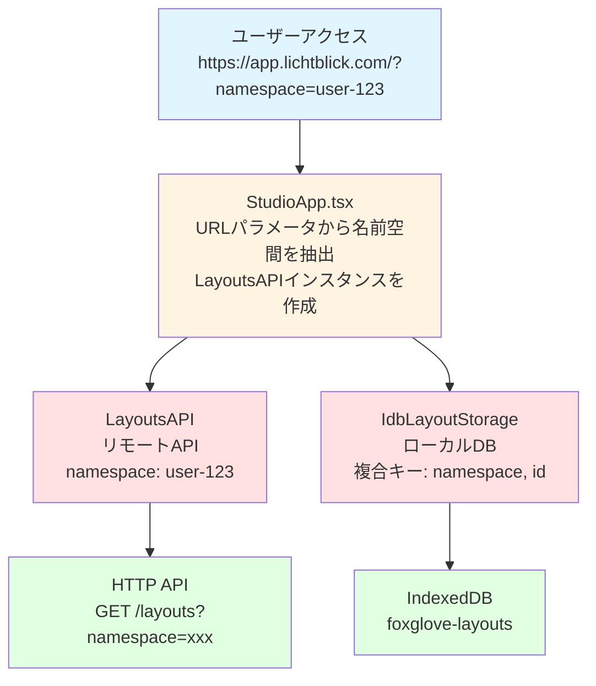
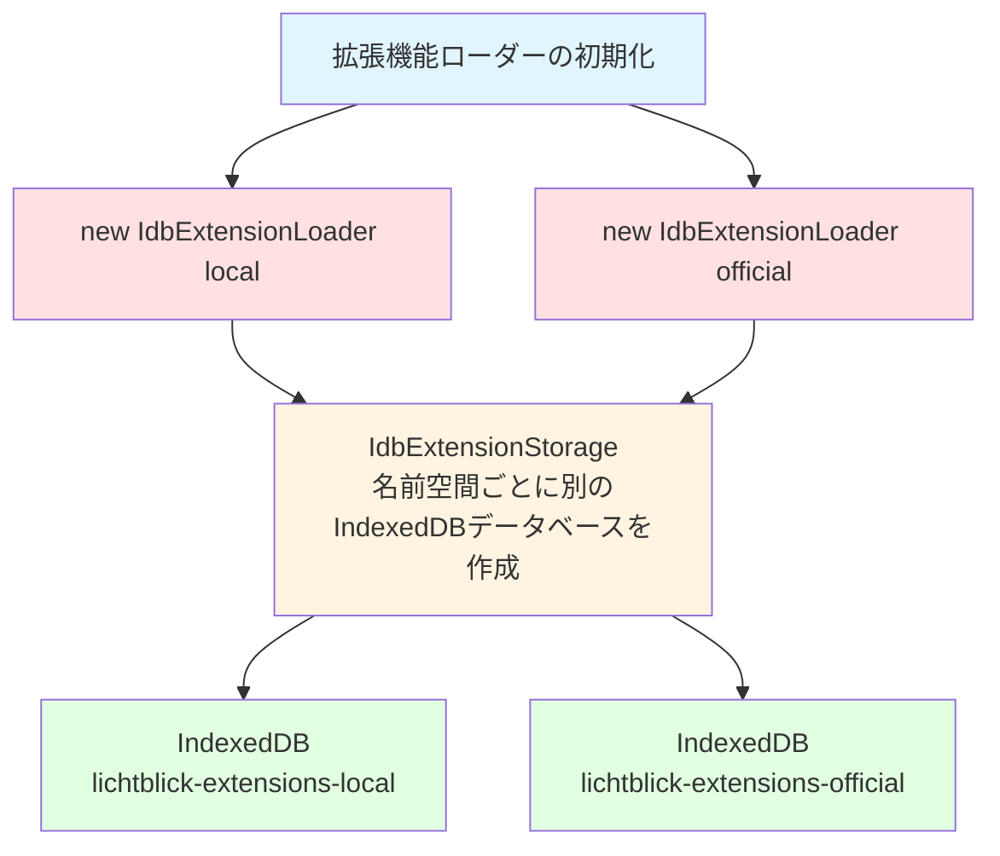
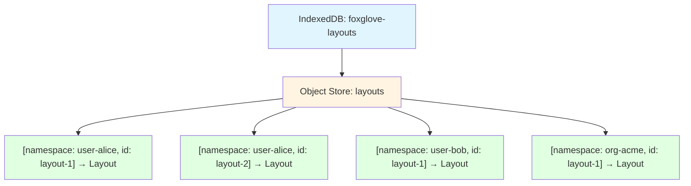
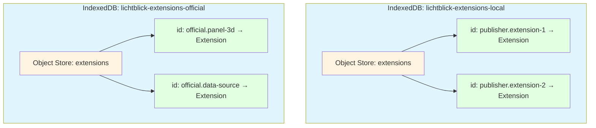

# Lichtblick v1.20.0 名前空間（Namespace）実装 詳細調査レポート

## 📋 ドキュメント情報

- **作成日**: 2025年10月5日
- **対象バージョン**: Lichtblick v1.20.0
- **調査範囲**: Layout API および拡張機能システムにおける名前空間の実装
- **関連PR**: [#695 - Lichtblick Layouts API](https://github.com/lichtblick-suite/lichtblick/pull/695)

---

## 🎯 概要

このドキュメントは、Lichtblick v1.20.0で導入されたLayout APIにおける**名前空間（Namespace）**機能と、既存の拡張機能システムでの名前空間実装について、実際のソースコードを調査した結果をまとめたものです。

### 名前空間とは

名前空間（Namespace）は、**データを論理的に分離・整理するための識別子**です。Lichtblickでは以下の目的で使用されます：

- **データの分離**: 異なるユーザー・組織のデータを混在させない
- **衝突の防止**: 同じIDのレイアウトや拡張機能が上書きされない
- **アクセス制御**: 特定の名前空間に紐づいたデータのみを操作
- **マルチテナント対応**: 複数のユーザー環境を単一システムで管理

---

## 🏗️ Layout APIにおける名前空間実装

### 1. アーキテクチャ概要



### 2. LayoutsAPI クラスの実装

**ファイルパス**: `packages/suite-base/src/api/layouts/LayoutsAPI.ts`

```typescript
export class LayoutsAPI implements IRemoteLayoutStorage {
  public readonly namespace: string;
  public readonly baseUrl: string = "layouts";

  /**
   * コンストラクタ
   * @param namespace - ユーザーまたは組織を識別する名前空間
   */
  public constructor(namespace: string) {
    this.namespace = namespace;
  }

  /**
   * レイアウト一覧を取得
   * HTTPリクエストのクエリパラメータに名前空間を含める
   */
  public async getLayouts(): Promise<RemoteLayout[]> {
    const { data: layoutData } = await HttpService.get<LayoutApiResponse[]>(this.baseUrl, {
      namespace: this.namespace, // ← 名前空間をクエリパラメータとして送信
    });

    // サーバーレスポンスをクライアント用の型に変換
    return layoutData.map((layout) => ({
      id: layout.layoutId,
      externalId: layout.id,
      name: layout.name,
      data: layout.data,
      permission: layout.permission,
      savedAt: layout.updatedBy as ISO8601Timestamp | undefined,
    }));
  }

  /**
   * 新規レイアウトを保存
   */
  public async saveNewLayout(params: SaveNewLayoutParams): Promise<RemoteLayout> {
    const requestPayload: CreateLayoutRequest = {
      layoutId: params.id,
      namespace: this.namespace, // ← 名前空間をリクエストボディに含める
      data: params.data,
      name: params.name,
      permission: params.permission,
    };

    const { data: layoutData } = await HttpService.post<LayoutApiResponse>(
      this.baseUrl,
      requestPayload,
    );

    // レスポンスを変換して返す
    return {
      id: layoutData.layoutId,
      externalId: layoutData.id,
      name: layoutData.name,
      data: layoutData.data,
      permission: layoutData.permission,
      savedAt: layoutData.updatedBy as ISO8601Timestamp | undefined,
    };
  }

  /**
   * レイアウトを更新
   */
  public async updateLayout(params: UpdateLayoutRequest): Promise<UpdateLayoutResponse> {
    const requestBody: UpdateLayoutRequestBody = {
      name: params.name,
      data: params.data,
      permission: params.permission,
    };

    // 名前空間は既にコンストラクタで設定されているため、
    // エンドポイントはexternalIdのみで指定
    const { data: layoutData } = await HttpService.put<LayoutApiResponse>(
      `${this.baseUrl}/${params.externalId}`,
      requestBody,
    );

    const newLayout: RemoteLayout = {
      id: layoutData.layoutId,
      externalId: layoutData.id,
      name: layoutData.name,
      data: layoutData.data,
      permission: layoutData.permission,
      savedAt: layoutData.updatedBy as ISO8601Timestamp | undefined,
    };

    return { status: "success", newLayout };
  }

  /**
   * レイアウトを削除
   */
  public async deleteLayout(id: string): Promise<boolean> {
    const deletedLayout = await HttpService.delete<RemoteLayout | undefined>(
      `${this.baseUrl}/${id}`,
    );
    return deletedLayout.data != undefined;
  }
}
```

### 3. StudioAppでの名前空間の初期化

**ファイルパス**: `packages/suite-base/src/StudioApp.tsx`

```typescript
export default function StudioApp(props: StudioAppProps): React.JSX.Element {
  // ... 他のコード

  // URLクエリパラメータから名前空間を取得
  const url = new URL(window.location.href);
  const namespace = url.searchParams.get("namespace");

  // 名前空間とAPIのURLが両方設定されている場合のみ
  // リモートレイアウトストレージを作成
  const remoteLayoutStorage = useMemo(() => {
    if (namespace && APP_CONFIG.apiUrl) {
      return new LayoutsAPI(namespace);
    }
    return undefined;
  }, [namespace]);

  // リモートストレージが利用可能な場合、プロバイダーに追加
  if (remoteLayoutStorage) {
    providers.unshift(
      <RemoteLayoutStorageContext.Provider value={remoteLayoutStorage} />
    );
  }

  // ... 他のコード
}
```

**使用例**:

```
# ユーザー固有の名前空間
https://app.lichtblick.com/?namespace=user-alice-123

# 組織の名前空間
https://app.lichtblick.com/?namespace=org-acme-corp

# チームの名前空間
https://app.lichtblick.com/?namespace=team-engineering
```

### 4. IndexedDBでの名前空間管理

**ファイルパス**: `packages/suite-base/src/IdbLayoutStorage.ts`

#### データベーススキーマ

```typescript
/**
 * IndexedDBのスキーマ定義
 *
 * レイアウトは名前空間とレイアウトIDの複合キーで管理される
 */
interface LayoutsDB extends IDB.DBSchema {
  layouts: {
    /** 複合プライマリキー: [名前空間, レイアウトID] */
    key: [namespace: string, id: LayoutID];

    /** 保存される値 */
    value: {
      /** レイアウトが属する名前空間 */
      namespace: string;
      /** レイアウトデータ本体 */
      layout: Layout;
    };

    /** 検索用インデックス */
    indexes: {
      /** 名前空間での検索を高速化するインデックス */
      namespace: string;
    };
  };
}
```

#### 実装

````typescript
export class IdbLayoutStorage implements ILayoutStorage {
  /**
   * IndexedDBデータベースへの接続
   */
  #db = IDB.openDB<LayoutsDB>(DATABASE_NAME, 1, {
    upgrade(db) {
      // オブジェクトストアを作成
      const store = db.createObjectStore(OBJECT_STORE_NAME, {
        // 複合キー[namespace, layout.id]を指定
        keyPath: ["namespace", "layout.id"],
      });

      // 名前空間での高速検索のためのインデックスを作成
      store.createIndex("namespace", "namespace");
    },
  });

  /**
   * 指定された名前空間のすべてのレイアウトを取得
   *
   * @param namespace - レイアウトの名前空間
   * @returns レイアウトの配列
   *
   * @example
   * ```typescript
   * // 個人レイアウトを取得
   * const personalLayouts = await storage.list('user-alice-123');
   *
   * // 組織レイアウトを取得
   * const orgLayouts = await storage.list('org-acme-corp');
   * ```
   */
  public async list(namespace: string): Promise<readonly Layout[]> {
    const results: Layout[] = [];

    // 名前空間インデックスを使用して効率的に検索
    const records = await (
      await this.#db
    ).getAllFromIndex(OBJECT_STORE_NAME, "namespace", namespace);

    // 各レコードを移行処理を通してから結果に追加
    for (const record of records) {
      try {
        results.push(migrateLayout(record.layout));
      } catch (err: unknown) {
        log.error(err);
      }
    }

    return results;
  }

  /**
   * 指定されたレイアウトを取得
   *
   * @param namespace - レイアウトの名前空間
   * @param id - レイアウトID
   * @returns レイアウト、存在しない場合は`undefined`
   *
   * @example
   * ```typescript
   * const layout = await storage.get('user-alice-123', 'my-layout-id');
   * if (layout) {
   *   console.log('レイアウト名:', layout.name);
   * }
   * ```
   */
  public async get(namespace: string, id: LayoutID): Promise<Layout | undefined> {
    // 複合キー[namespace, id]で直接取得
    const record = await (await this.#db).get(OBJECT_STORE_NAME, [namespace, id]);
    return record == undefined ? undefined : migrateLayout(record.layout);
  }

  /**
   * レイアウトを保存（新規作成または更新）
   *
   * @param namespace - レイアウトの名前空間
   * @param layout - 保存するレイアウト
   * @returns 保存されたレイアウト
   *
   * @example
   * ```typescript
   * const newLayout = {
   *   id: 'my-layout',
   *   name: 'My Custom Layout',
   *   data: { /* ... */ }
   * };
   * await storage.put('user-alice-123', newLayout);
   * ```
   */
  public async put(namespace: string, layout: Layout): Promise<Layout> {
    // 名前空間とレイアウトをペアで保存
    await (await this.#db).put(OBJECT_STORE_NAME, { namespace, layout });
    return layout;
  }

  /**
   * レイアウトを削除
   *
   * @param namespace - レイアウトの名前空間
   * @param id - 削除するレイアウトID
   *
   * @example
   * ```typescript
   * await storage.delete('user-alice-123', 'unused-layout-id');
   * ```
   */
  public async delete(namespace: string, id: LayoutID): Promise<void> {
    // 複合キー[namespace, id]で削除
    await (await this.#db).delete(OBJECT_STORE_NAME, [namespace, id]);
  }

  /**
   * 古い名前空間なしレイアウトを新しい名前空間に移行
   *
   * @param namespace - 移行先の名前空間
   *
   * @remarks
   * v1.20.0以前のバージョンから移行する際に使用
   */
  public async migrateUnnamespacedLayouts(namespace: string): Promise<void> {
    // 実装の詳細は省略
    // 古いLocalStorageからIndexedDBへの移行処理
  }
}
````

### 5. ILayoutStorage インターフェース

**ファイルパス**: `packages/suite-base/src/services/ILayoutStorage.ts`

```typescript
/**
 * レイアウトストレージの抽象インターフェース
 *
 * すべてのメソッドは名前空間をパラメータとして受け取る
 */
export interface ILayoutStorage {
  /**
   * 指定された名前空間のすべてのレイアウトを一覧表示
   */
  list(namespace: string): Promise<readonly Layout[]>;

  /**
   * 指定された名前空間とIDのレイアウトを取得
   */
  get(namespace: string, id: LayoutID): Promise<Layout | undefined>;

  /**
   * 指定された名前空間にレイアウトを保存
   */
  put(namespace: string, layout: Layout): Promise<Layout>;

  /**
   * 指定された名前空間からレイアウトを削除
   */
  delete(namespace: string, id: LayoutID): Promise<void>;

  /**
   * 名前空間なしのレガシーレイアウトを新しい名前空間に移行
   * （オプショナルメソッド）
   */
  migrateUnnamespacedLayouts?(namespace: string): Promise<void>;
}
```

### 6. IRemoteLayoutStorage インターフェース

**ファイルパス**: `packages/suite-base/src/services/IRemoteLayoutStorage.ts`

```typescript
/**
 * リモートサーバーに保存されたレイアウトを管理するインターフェース
 */
export interface IRemoteLayoutStorage {
  /**
   * ログインユーザーに対応する名前空間
   *
   * @remarks
   * LayoutManagerがディスク上のキャッシュレイアウトを整理するために使用
   */
  readonly namespace: string;

  /**
   * レイアウト一覧を取得
   */
  getLayouts: () => Promise<readonly RemoteLayout[]>;

  /**
   * 特定のレイアウトを取得
   */
  getLayout: (id: LayoutID) => Promise<RemoteLayout | undefined>;

  /**
   * 新規レイアウトを保存
   */
  saveNewLayout: (params: SaveNewLayoutParams) => Promise<RemoteLayout>;

  /**
   * 既存レイアウトを更新
   */
  updateLayout: (params: UpdateLayoutRequest) => Promise<UpdateLayoutResponse>;

  /**
   * レイアウトを削除
   * @returns レイアウトが存在して削除された場合true、存在しなかった場合false
   */
  deleteLayout: (id: string) => Promise<boolean>;
}
```

---

## 🔌 拡張機能システムにおける名前空間実装

### 1. アーキテクチャ概要



### 2. IdbExtensionStorage クラスの実装

**ファイルパス**: `packages/suite-base/src/services/extension/IdbExtensionStorage.ts`

```typescript
/**
 * IndexedDBスキーマ定義
 */
interface ExtensionsDB extends IDB.DBSchema {
  metadata: {
    key: string;
    value: ExtensionInfo;
  };
  extensions: {
    key: string;
    value: StoredExtension;
  };
}

/**
 * 拡張機能をIndexedDBに保存するストレージ実装
 *
 * レイアウトとは異なり、名前空間ごとに別のデータベースを作成
 */
export class IdbExtensionStorage implements IExtensionStorage {
  #db: Promise<IDB.IDBPDatabase<ExtensionsDB>>;
  public namespace: string;

  /**
   * コンストラクタ
   * @param namespace - 拡張機能の名前空間（例: "local", "official", "community"）
   */
  public constructor(namespace: string) {
    this.namespace = namespace;

    // データベース名に名前空間を組み込む
    // 例: "lichtblick-extensions-local", "lichtblick-extensions-official"
    this.#db = IDB.openDB<ExtensionsDB>([DATABASE_BASE_NAME, namespace].join("-"), 1, {
      upgrade: (db) => {
        log.debug("Creating extension object stores");

        // メタデータストア
        db.createObjectStore(METADATA_STORE_NAME, {
          keyPath: "id",
        });

        // 拡張機能ストア
        db.createObjectStore(EXTENSION_STORE_NAME, {
          keyPath: "info.id",
        });
      },
    });
  }

  /**
   * インストール済み拡張機能の一覧を取得
   */
  public async list(): Promise<ExtensionInfo[]> {
    const start = performance.now();
    const records = await (await this.#db).getAll(METADATA_STORE_NAME);

    log.debug(
      `Loaded ${records.length} extensions in`,
      (performance.now() - start).toFixed(1),
      "ms",
    );

    return records;
  }

  /**
   * 特定の拡張機能を取得
   */
  public async get(id: string): Promise<undefined | StoredExtension> {
    const start = performance.now();
    const extension = await (await this.#db).get(EXTENSION_STORE_NAME, id);
    log.debug("Getting extension", id, "took", (performance.now() - start).toFixed(1), "ms");
    return extension;
  }

  /**
   * 拡張機能を保存
   */
  public async put(extension: StoredExtension): Promise<StoredExtension> {
    const start = performance.now();

    const transaction = (await this.#db).transaction(
      [METADATA_STORE_NAME, EXTENSION_STORE_NAME],
      "readwrite",
    );

    await Promise.all([
      transaction.db.put(METADATA_STORE_NAME, extension.info),
      transaction.db.put(EXTENSION_STORE_NAME, extension),
      transaction.done,
    ]);

    log.debug(
      "Stored extension",
      { extension },
      "in",
      (performance.now() - start).toFixed(1),
      "ms",
    );

    return extension;
  }

  /**
   * 拡張機能を削除
   */
  public async delete(id: string): Promise<void> {
    const start = performance.now();

    const transaction = (await this.#db).transaction(
      [METADATA_STORE_NAME, EXTENSION_STORE_NAME],
      "readwrite",
    );

    await Promise.all([
      transaction.db.delete(METADATA_STORE_NAME, id),
      transaction.db.delete(EXTENSION_STORE_NAME, id),
      transaction.done,
    ]);

    log.debug("Deleted extension", id, "in", (performance.now() - start).toFixed(1), "ms");
  }
}
```

### 3. IdbExtensionLoader クラスの実装

**ファイルパス**: `packages/suite-base/src/services/extension/IdbExtensionLoader.ts`

```typescript
/**
 * IndexedDBから拡張機能をロードするローダー実装
 */
export class IdbExtensionLoader implements IExtensionLoader {
  readonly #storage: IExtensionStorage;
  public readonly namespace: Namespace;
  public readonly type: TypeExtensionLoader = "browser";

  /**
   * コンストラクタ
   * @param namespace - 拡張機能の名前空間
   */
  public constructor(namespace: Namespace) {
    this.namespace = namespace;
    this.#storage = new IdbExtensionStorage(namespace);
  }

  /**
   * 特定の拡張機能を取得
   */
  public async getExtension(id: string): Promise<ExtensionInfo | undefined> {
    log.debug("[IndexedDB] Get extension", id);
    const storedExtension = await this.#storage.get(id);
    return storedExtension?.info;
  }

  /**
   * インストール済み拡張機能の一覧を取得
   */
  public async getExtensions(): Promise<ExtensionInfo[]> {
    log.debug("[IndexedDB] Listing extensions");
    return await this.#storage.list();
  }

  /**
   * 拡張機能のソースコードをロード
   */
  public async loadExtension(id: string): Promise<LoadedExtension> {
    log.debug("[IndexedDB] Load extension", id);
    const storedExtension = await this.#storage.get(id);

    if (!storedExtension) {
      throw new Error(`Extension ${id} not found`);
    }

    return {
      info: storedExtension.info,
      sourceCode: new TextDecoder().decode(storedExtension.sourceCode),
    };
  }

  /**
   * 拡張機能をインストール
   */
  public async installExtension({
    foxeFileData,
    externalId,
  }: InstallExtensionProps): Promise<ExtensionInfo> {
    // 拡張機能パッケージを解析
    const rawInfo = parseExtensionInfo(foxeFileData);

    // 拡張機能IDを生成
    const baseId = `${normalizedPublisher}.${rawInfo.name}`;

    // 拡張機能情報を作成
    const info: ExtensionInfo = {
      ...rawInfo,
      id: baseId,
      namespace: this.namespace, // ← 名前空間を設定
      qualifiedName: baseId,
    };

    // ストレージに保存
    await this.#storage.put({
      info,
      sourceCode: extractSourceCode(foxeFileData),
      externalId,
    });

    log.info(`[IndexedDB] Installed extension ${info.id} in namespace ${this.namespace}`);

    return info;
  }

  /**
   * 拡張機能をアンインストール
   */
  public async uninstallExtension(id: string): Promise<void> {
    log.debug("[IndexedDB] Uninstall extension", id);
    await this.#storage.delete(id);
  }
}
```

### 4. ExtensionInfo 型での名前空間

**ファイルパス**: `packages/suite-base/src/types/Extensions.ts`

```typescript
/**
 * 拡張機能のメタデータ
 */
export type ExtensionInfo = {
  /** 拡張機能の一意識別子 */
  id: string;

  /** 拡張機能の説明 */
  description: string;

  /** 拡張機能の表示名 */
  displayName: string;

  /** 拡張機能のホームページURL */
  homepage: string;

  /** 検索用のキーワード配列 */
  keywords: string[];

  /** ライセンス情報 */
  license: string;

  /** 拡張機能の名前 */
  name: string;

  /**
   * 名前空間（オプショナル）
   *
   * @remarks
   * - "local": ユーザーが手動でインストールした拡張機能
   * - "official": 公式マーケットプレイスからの拡張機能
   * - "community": コミュニティ提供の拡張機能
   * - カスタム値: 組織固有の名前空間
   */
  namespace?: Namespace;

  /** 発行者名 */
  publisher: string;

  /** 完全修飾名（通常は "publisher.name" の形式） */
  qualifiedName: string;

  /** バージョン文字列（セマンティックバージョニング推奨） */
  version: string;

  /** README文書（Markdown形式） */
  readme?: string;

  /** 変更履歴（Markdown形式） */
  changelog?: string;
};
```

### 5. ExtensionsAPI での名前空間

**ファイルパス**: `packages/suite-base/src/api/extensions/ExtensionsAPI.ts`

```typescript
/**
 * リモート拡張機能APIクライアント
 */
class ExtensionsAPI implements IExtensionAPI {
  public readonly remoteNamespace: string;
  private readonly extensionEndpoint = "extensions";

  /**
   * コンストラクタ
   * @param namespace - リモートAPI用の名前空間
   */
  public constructor(namespace: string) {
    this.remoteNamespace = namespace;
  }

  /**
   * リモートサーバーから拡張機能一覧を取得
   */
  public async list(): Promise<ExtensionInfo[]> {
    const { data } = await HttpService.get<ExtensionInfo[]>(this.extensionEndpoint, {
      namespace: this.remoteNamespace, // ← 名前空間をクエリパラメータで送信
    });
    return data;
  }

  /**
   * 特定の拡張機能を取得
   */
  public async get(id: string): Promise<StoredExtension | undefined> {
    const { data } = await HttpService.get<StoredExtension>(`${this.extensionEndpoint}/${id}`, {
      namespace: this.remoteNamespace,
    });
    return data;
  }

  /**
   * 拡張機能を作成または更新
   */
  public async createOrUpdate(extension: ExtensionInfoSlug, file: File): Promise<StoredExtension> {
    const formData = new FormData();
    formData.append("file", file);
    formData.append("namespace", this.remoteNamespace);

    const { data } = await HttpService.post<StoredExtension>(this.extensionEndpoint, formData);
    return data;
  }

  /**
   * 拡張機能を削除
   */
  public async remove(id: string): Promise<boolean> {
    const { data } = await HttpService.delete<{ success: boolean }>(
      `${this.extensionEndpoint}/${id}`,
      {
        namespace: this.remoteNamespace,
      },
    );
    return data.success;
  }
}
```

---

## 🔄 レイアウトと拡張機能の名前空間の比較

### 共通点

| 特徴              | レイアウト                        | 拡張機能                             |
| ----------------- | --------------------------------- | ------------------------------------ |
| **データ分離**    | ✅ ユーザーごとにレイアウトを分離 | ✅ 名前空間ごとに拡張機能を分離      |
| **IndexedDB使用** | ✅ `foxglove-layouts`             | ✅ `foxglove-extensions-{namespace}` |
| **HTTP API統合**  | ✅ クエリパラメータで送信         | ✅ クエリパラメータで送信            |
| **型安全性**      | ✅ TypeScriptで厳密に型付け       | ✅ TypeScriptで厳密に型付け          |

### 相違点

| 項目                 | レイアウト                             | 拡張機能                         |
| -------------------- | -------------------------------------- | -------------------------------- |
| **名前空間の取得元** | URLクエリパラメータ (`?namespace=xxx`) | コンテキストまたは固定値         |
| **値の例**           | `user-alice-123`, `org-acme-corp`      | `local`, `official`, `community` |
| **データベース構造** | 単一DB + 複合キー `[namespace, id]`    | 名前空間ごとに別DB               |
| **主な目的**         | ユーザー・組織の識別                   | インストール元の分類             |
| **動的/静的**        | 動的（ユーザーによって変わる）         | 静的（固定値が一般的）           |
| **移行機能**         | `migrateUnnamespacedLayouts()` あり    | なし                             |
| **権限管理**         | `LayoutPermission` で管理              | 名前空間による分類のみ           |

### データベース構造の違い

#### レイアウト



#### 拡張機能



---

## 🎯 名前空間で実現できること

### 1. マルチユーザー環境

```typescript
// ユーザーAのレイアウト
const userALayouts = await layoutStorage.list("user-alice-123");
console.log(userALayouts.length); // 5

// ユーザーBのレイアウト
const userBLayouts = await layoutStorage.list("user-bob-456");
console.log(userBLayouts.length); // 3

// 互いに干渉しない
// ユーザーAとユーザーBは同じレイアウトIDを使用できる
```

### 2. 組織単位の管理

```typescript
// 組織Aのレイアウト
const orgALayouts = await layoutStorage.list("org-acme-corp");

// 組織Bのレイアウト
const orgBLayouts = await layoutStorage.list("org-beta-inc");

// 組織共有レイアウトと個人レイアウトの併用
const allLayouts = [
  ...(await layoutStorage.list("user-alice-123")), // 個人用
  ...(await layoutStorage.list("org-acme-corp")), // 組織共有
];
```

### 3. 環境分離（開発・ステージング・本番）

```typescript
// 開発環境
const devLayouts = await layoutStorage.list("env-development");

// ステージング環境
const stagingLayouts = await layoutStorage.list("env-staging");

// 本番環境
const prodLayouts = await layoutStorage.list("env-production");
```

### 4. 拡張機能の分類

```typescript
// ローカルにインストールした拡張機能
const localExtensions = await new IdbExtensionLoader("local").getExtensions();

// 公式マーケットプレイスの拡張機能
const officialExtensions = await new IdbExtensionLoader("official").getExtensions();

// サードパーティの拡張機能
const thirdPartyExtensions = await new IdbExtensionLoader("community").getExtensions();
```

### 5. チーム別のレイアウト管理

```typescript
// エンジニアリングチーム
const engLayouts = await layoutStorage.list("team-engineering");

// データサイエンスチーム
const dsLayouts = await layoutStorage.list("team-data-science");

// 品質保証チーム
const qaLayouts = await layoutStorage.list("team-qa");
```

---

## 💡 実装例: 名前空間を使った実際のワークフロー

### シナリオ1: 企業でのLichtblick利用

```typescript
/**
 * ユーザーログイン時のワークフロー
 */
class UserSession {
  private userId: string;
  private organizationId: string;
  private userNamespace: string;
  private orgNamespace: string;

  constructor(userId: string, organizationId: string) {
    this.userId = userId;
    this.organizationId = organizationId;

    // 名前空間を生成
    this.userNamespace = `user-${userId}`;
    this.orgNamespace = `org-${organizationId}`;
  }

  /**
   * アプリケーションを起動
   */
  public launchApp(): void {
    // URLに名前空間を含めてアプリケーションを起動
    const appUrl = new URL("https://app.lichtblick.com");
    appUrl.searchParams.set("namespace", this.userNamespace);

    window.location.href = appUrl.toString();
    // → https://app.lichtblick.com/?namespace=user-alice-123
  }

  /**
   * ユーザー専用レイアウトを取得
   */
  public async getUserLayouts(): Promise<Layout[]> {
    const layoutManager = getLayoutManager();
    return await layoutManager.getLayouts();
    // → 自動的にuserNamespaceのレイアウトのみ取得
  }

  /**
   * 組織共有レイアウトを取得
   */
  public async getOrganizationLayouts(): Promise<Layout[]> {
    const layoutStorage = getLayoutStorage();
    return await layoutStorage.list(this.orgNamespace);
  }

  /**
   * すべてのレイアウトを取得（個人+組織）
   */
  public async getAllLayouts(): Promise<Layout[]> {
    const [userLayouts, orgLayouts] = await Promise.all([
      this.getUserLayouts(),
      this.getOrganizationLayouts(),
    ]);

    return [...userLayouts, ...orgLayouts];
  }

  /**
   * 新規レイアウトを作成
   */
  public async createLayout(name: string, data: LayoutData): Promise<Layout> {
    const layoutManager = getLayoutManager();

    return await layoutManager.saveNewLayout({
      name,
      data,
      permission: "CREATOR_WRITE",
    });
    // → 自動的にuserNamespace配下に保存される
  }
}

/**
 * 使用例
 */
async function main() {
  // ログイン処理
  const session = new UserSession("alice-123", "acme-corp");

  // アプリケーション起動
  session.launchApp();

  // レイアウト管理
  const userLayouts = await session.getUserLayouts();
  const orgLayouts = await session.getOrganizationLayouts();

  console.log(`個人レイアウト: ${userLayouts.length}個`);
  console.log(`組織レイアウト: ${orgLayouts.length}個`);
}
```

### シナリオ2: 拡張機能のインストールと分類

```typescript
/**
 * 拡張機能マネージャー
 */
class ExtensionManager {
  private localLoader: IExtensionLoader;
  private officialLoader: IExtensionLoader;
  private communityLoader: IExtensionLoader;

  constructor() {
    // 各名前空間用のローダーを初期化
    this.localLoader = new IdbExtensionLoader("local");
    this.officialLoader = new IdbExtensionLoader("official");
    this.communityLoader = new IdbExtensionLoader("community");
  }

  /**
   * ローカルファイルから拡張機能をインストール
   */
  public async installFromFile(file: File): Promise<ExtensionInfo> {
    const fileData = new Uint8Array(await file.arrayBuffer());

    return await this.localLoader.installExtension({
      foxeFileData: fileData,
    });
    // → "local" 名前空間にインストール
  }

  /**
   * 公式マーケットプレイスからインストール
   */
  public async installFromMarketplace(extensionId: string): Promise<ExtensionInfo> {
    // マーケットプレイスからダウンロード
    const fileData = await downloadFromMarketplace(extensionId);

    return await this.officialLoader.installExtension({
      foxeFileData: fileData,
      externalId: extensionId,
    });
    // → "official" 名前空間にインストール
  }

  /**
   * インストール済み拡張機能の一覧を取得
   */
  public async getAllExtensions(): Promise<CategorizedExtensions> {
    const [local, official, community] = await Promise.all([
      this.localLoader.getExtensions(),
      this.officialLoader.getExtensions(),
      this.communityLoader.getExtensions(),
    ]);

    return {
      local,
      official,
      community,
    };
  }

  /**
   * 拡張機能をアンインストール
   */
  public async uninstall(id: string, namespace: Namespace): Promise<void> {
    switch (namespace) {
      case "local":
        await this.localLoader.uninstallExtension(id);
        break;
      case "official":
        await this.officialLoader.uninstallExtension(id);
        break;
      case "community":
        await this.communityLoader.uninstallExtension(id);
        break;
    }
  }
}

interface CategorizedExtensions {
  local: ExtensionInfo[];
  official: ExtensionInfo[];
  community: ExtensionInfo[];
}

/**
 * 使用例
 */
async function main() {
  const manager = new ExtensionManager();

  // ローカルファイルからインストール
  const file = await selectFile();
  const localExt = await manager.installFromFile(file);
  console.log(`インストール完了: ${localExt.name} (local)`);

  // 公式マーケットプレイスからインストール
  const officialExt = await manager.installFromMarketplace("official.3d-panel");
  console.log(`インストール完了: ${officialExt.name} (official)`);

  // すべての拡張機能を取得
  const extensions = await manager.getAllExtensions();
  console.log(`ローカル: ${extensions.local.length}個`);
  console.log(`公式: ${extensions.official.length}個`);
  console.log(`コミュニティ: ${extensions.community.length}個`);
}
```

---

## 🔐 セキュリティとアクセス制御

### レイアウトの権限管理

```typescript
/**
 * レイアウトの権限タイプ
 */
export type LayoutPermission =
  | "CREATOR_WRITE" // 作成者のみ編集可能
  | "ORG_READ" // 組織メンバーは読み取りのみ
  | "ORG_WRITE"; // 組織メンバーも編集可能

/**
 * 権限チェックの例
 */
async function checkLayoutAccess(
  layoutId: LayoutID,
  userId: string,
  organizationId: string,
): Promise<boolean> {
  const layout = await layoutStorage.get(`user-${userId}`, layoutId);

  if (!layout) {
    return false;
  }

  switch (layout.permission) {
    case "CREATOR_WRITE":
      // 作成者のみアクセス可能
      return layout.namespace === `user-${userId}`;

    case "ORG_READ":
    case "ORG_WRITE":
      // 組織メンバーもアクセス可能
      return layout.namespace === `user-${userId}` || layout.namespace === `org-${organizationId}`;

    default:
      return false;
  }
}
```

### 名前空間の検証

```typescript
/**
 * 名前空間のバリデーション
 */
function validateNamespace(namespace: string): boolean {
  // 名前空間の形式をチェック
  const namespacePattern = /^(user|org|team|env)-[a-zA-Z0-9-]+$/;
  return namespacePattern.test(namespace);
}

/**
 * ユーザーが名前空間にアクセスする権限があるかチェック
 */
async function canAccessNamespace(userId: string, namespace: string): Promise<boolean> {
  // ユーザー自身の名前空間
  if (namespace === `user-${userId}`) {
    return true;
  }

  // 組織の名前空間
  if (namespace.startsWith("org-")) {
    const orgId = namespace.replace("org-", "");
    return await isUserInOrganization(userId, orgId);
  }

  // チームの名前空間
  if (namespace.startsWith("team-")) {
    const teamId = namespace.replace("team-", "");
    return await isUserInTeam(userId, teamId);
  }

  return false;
}
```

---

## 📈 パフォーマンスの考慮事項

### IndexedDBのインデックス活用

```typescript
/**
 * レイアウト: 名前空間インデックスによる高速検索
 */
export class IdbLayoutStorage implements ILayoutStorage {
  #db = IDB.openDB<LayoutsDB>(DATABASE_NAME, 1, {
    upgrade(db) {
      const store = db.createObjectStore(OBJECT_STORE_NAME, {
        keyPath: ["namespace", "layout.id"],
      });

      // 名前空間での検索を高速化
      store.createIndex("namespace", "namespace");
    },
  });

  public async list(namespace: string): Promise<readonly Layout[]> {
    // インデックスを使用した効率的な検索
    // O(log n) の時間複雑度
    const records = await (
      await this.#db
    ).getAllFromIndex(OBJECT_STORE_NAME, "namespace", namespace);

    return records.map((record) => record.layout);
  }
}
```

### キャッシュ戦略

```typescript
/**
 * レイアウトキャッシュの実装例
 */
class LayoutCache {
  private cache = new Map<string, Map<LayoutID, Layout>>();

  /**
   * キャッシュからレイアウトを取得
   */
  public get(namespace: string, id: LayoutID): Layout | undefined {
    return this.cache.get(namespace)?.get(id);
  }

  /**
   * キャッシュにレイアウトを追加
   */
  public set(namespace: string, layout: Layout): void {
    if (!this.cache.has(namespace)) {
      this.cache.set(namespace, new Map());
    }
    this.cache.get(namespace)!.set(layout.id, layout);
  }

  /**
   * 特定の名前空間のキャッシュをクリア
   */
  public clearNamespace(namespace: string): void {
    this.cache.delete(namespace);
  }

  /**
   * すべてのキャッシュをクリア
   */
  public clearAll(): void {
    this.cache.clear();
  }
}
```

### メモリ使用量の最適化

```typescript
/**
 * 拡張機能: 名前空間ごとに別DBで分離
 * メリット: 不要な名前空間のデータはメモリに読み込まれない
 */

// "local" 名前空間のみをロード（"official" はロードされない）
const localLoader = new IdbExtensionLoader("local");
const localExtensions = await localLoader.getExtensions();

// 必要に応じて "official" をロード
const officialLoader = new IdbExtensionLoader("official");
const officialExtensions = await officialLoader.getExtensions();
```

---

## 🚀 将来の拡張可能性

### 1. 階層的名前空間

```typescript
/**
 * 将来的な階層構造のサポート
 */
interface HierarchicalNamespace {
  root: string; // "org-acme"
  department?: string; // "engineering"
  team?: string; // "robotics"
}

// 例: "org-acme/engineering/robotics"
function buildNamespace(hierarchy: HierarchicalNamespace): string {
  const parts = [hierarchy.root];
  if (hierarchy.department) parts.push(hierarchy.department);
  if (hierarchy.team) parts.push(hierarchy.team);
  return parts.join("/");
}
```

### 2. 名前空間のエイリアス

```typescript
/**
 * 名前空間のエイリアス機能
 */
interface NamespaceAlias {
  alias: string; // "my-workspace"
  target: string; // "user-alice-123"
}

class NamespaceResolver {
  private aliases = new Map<string, string>();

  public registerAlias(alias: string, target: string): void {
    this.aliases.set(alias, target);
  }

  public resolve(namespace: string): string {
    return this.aliases.get(namespace) ?? namespace;
  }
}
```

### 3. 動的名前空間の切り替え

```typescript
/**
 * ユーザーが複数の名前空間を切り替えられる機能
 */
class NamespaceSwitcher {
  private currentNamespace: string;
  private availableNamespaces: string[];

  constructor(userId: string, organizationIds: string[]) {
    this.currentNamespace = `user-${userId}`;
    this.availableNamespaces = [
      `user-${userId}`,
      ...organizationIds.map((orgId) => `org-${orgId}`),
    ];
  }

  /**
   * 名前空間を切り替え
   */
  public async switchNamespace(namespace: string): Promise<void> {
    if (!this.availableNamespaces.includes(namespace)) {
      throw new Error(`Access denied to namespace: ${namespace}`);
    }

    this.currentNamespace = namespace;

    // URLを更新
    const url = new URL(window.location.href);
    url.searchParams.set("namespace", namespace);
    window.history.pushState({}, "", url.toString());

    // レイアウトを再読み込み
    await reloadLayouts();
  }

  /**
   * 利用可能な名前空間の一覧を取得
   */
  public getAvailableNamespaces(): string[] {
    return [...this.availableNamespaces];
  }
}
```

---

## 📚 ベストプラクティス

### 1. 名前空間の命名規則

```typescript
/**
 * 推奨される名前空間の命名パターン
 */
const NAMESPACE_PATTERNS = {
  // ユーザー個人用
  USER: (userId: string) => `user-${userId}`,

  // 組織用
  ORGANIZATION: (orgId: string) => `org-${orgId}`,

  // チーム用
  TEAM: (teamId: string) => `team-${teamId}`,

  // 環境用
  ENVIRONMENT: (env: "dev" | "staging" | "prod") => `env-${env}`,

  // プロジェクト用
  PROJECT: (projectId: string) => `project-${projectId}`,
};

/**
 * 使用例
 */
const userNamespace = NAMESPACE_PATTERNS.USER("alice-123");
// → "user-alice-123"

const orgNamespace = NAMESPACE_PATTERNS.ORGANIZATION("acme-corp");
// → "org-acme-corp"
```

### 2. エラーハンドリング

```typescript
/**
 * 名前空間関連のカスタムエラー
 */
class NamespaceError extends Error {
  constructor(
    message: string,
    public readonly namespace: string,
    public readonly code: string,
  ) {
    super(message);
    this.name = "NamespaceError";
  }
}

/**
 * 安全な名前空間アクセス
 */
async function safeGetLayouts(namespace: string): Promise<Layout[]> {
  try {
    // 名前空間のバリデーション
    if (!validateNamespace(namespace)) {
      throw new NamespaceError(
        `Invalid namespace format: ${namespace}`,
        namespace,
        "INVALID_FORMAT",
      );
    }

    // アクセス権限のチェック
    const hasAccess = await canAccessNamespace(getCurrentUserId(), namespace);
    if (!hasAccess) {
      throw new NamespaceError(
        `Access denied to namespace: ${namespace}`,
        namespace,
        "ACCESS_DENIED",
      );
    }

    // レイアウトを取得
    return await layoutStorage.list(namespace);
  } catch (error) {
    if (error instanceof NamespaceError) {
      log.error(`Namespace error [${error.code}]:`, error.message);
      // ユーザーにフレンドリーなエラーメッセージを表示
      showErrorNotification(error.message);
    } else {
      log.error("Unexpected error:", error);
    }
    return [];
  }
}
```

### 3. テストでの名前空間利用

```typescript
/**
 * テスト用の名前空間を使用
 */
describe("LayoutStorage", () => {
  const testNamespace = "test-" + Date.now();
  let storage: IdbLayoutStorage;

  beforeEach(async () => {
    storage = new IdbLayoutStorage();
  });

  afterEach(async () => {
    // テスト後にクリーンアップ
    const layouts = await storage.list(testNamespace);
    for (const layout of layouts) {
      await storage.delete(testNamespace, layout.id);
    }
  });

  it("should save and retrieve layout in test namespace", async () => {
    const layout: Layout = {
      id: "test-layout",
      name: "Test Layout",
      data: {
        /* ... */
      },
    };

    await storage.put(testNamespace, layout);
    const retrieved = await storage.get(testNamespace, "test-layout");

    expect(retrieved).toEqual(layout);
  });
});
```

---

## 🎓 まとめ

### レイアウトの名前空間

**特徴**:

- ✅ URLパラメータから動的に取得
- ✅ ユーザー・組織の識別に使用
- ✅ 単一のIndexedDBで複合キー管理
- ✅ リモートAPIとの同期に対応
- ✅ 権限管理との統合

**主な用途**:

- マルチユーザー環境でのデータ分離
- 組織・チーム単位でのレイアウト共有
- 環境（開発/本番）の分離

### 拡張機能の名前空間

**特徴**:

- ✅ 固定値または設定で指定
- ✅ インストール元の分類に使用
- ✅ 名前空間ごとに別のIndexedDB
- ✅ ローカル/公式/コミュニティの分離
- ✅ メタデータとして保存

**主な用途**:

- 拡張機能のインストール元の管理
- ローカル・公式・サードパーティの分離
- 拡張機能の検索・フィルタリング

### 共通認識

**質問**: 拡張機能でも名前空間は使用されていますが、レイアウトと同じ使い方という認識で良いのでしょうか？

**回答**: **基本的な概念は同じですが、使い方と目的が異なります**

- **共通点**: データの論理的な分離、IndexedDBでの管理、HTTP APIでの送信
- **相違点**:
  - **レイアウト**: 動的・ユーザー依存・セキュリティ重視
  - **拡張機能**: 静的・分類目的・管理の便宜

どちらも「データの衝突を防ぎ、整理する」という本質的な役割は同じですが、レイアウトはより動的でユーザー中心、拡張機能はより静的で管理中心の設計となっています。

---

## 📎 参考リンク

### ソースコード

- **LayoutsAPI**: `packages/suite-base/src/api/layouts/LayoutsAPI.ts`
- **IdbLayoutStorage**: `packages/suite-base/src/IdbLayoutStorage.ts`
- **IdbExtensionStorage**: `packages/suite-base/src/services/extension/IdbExtensionStorage.ts`
- **IdbExtensionLoader**: `packages/suite-base/src/services/extension/IdbExtensionLoader.ts`
- **StudioApp**: `packages/suite-base/src/StudioApp.tsx`

### 関連ドキュメント

- [v1.20.0 Layout API 詳細分析レポート](./v1.20.0-layout-api-detailed-analysis.md)
- [PR #695 - Lichtblick Layouts API](https://github.com/lichtblick-suite/lichtblick/pull/695)

---

_このドキュメントは、実際のソースコード調査に基づいて作成されています。技術的な詳細は、該当するソースコードを参照してください。_

**最終更新**: 2025年10月5日
