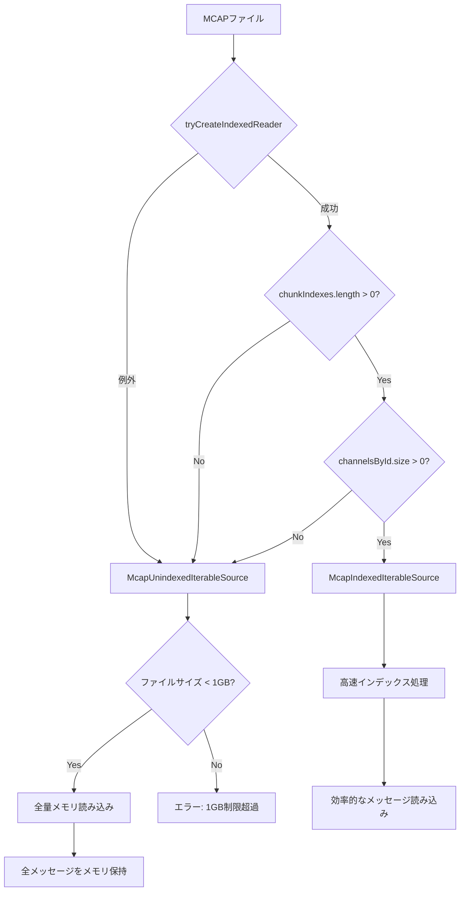

# MCAP インデックス付き vs 非インデックス 詳細分析ドキュメント

## 📋 概要

MCAPファイルには**インデックス付き**と**非インデックス**の2種類があり、Lichtblickはファイルの特性に応じて異なる処理方式を選択します。このドキュメントでは、両者の違いと判定ロジックを詳しく解説します。

> **重要**: 非インデックスファイルは1GB制限があり、複数ファイルでのメモリ爆発リスクがある

---

## 🔍 インデックス判定の仕組み

### 判定処理の流れ

```typescript
// McapIterableSource.ts:35-48
async function tryCreateIndexedReader(readable: McapTypes.IReadable) {
  const decompressHandlers = await loadDecompressHandlers();
  try {
    const reader = await McapIndexedReader.Initialize({ readable, decompressHandlers });

    // ⭐ インデックス判定の核心部分
    if (reader.chunkIndexes.length === 0 || reader.channelsById.size === 0) {
      return undefined; // 非インデックスと判定
    }
    return reader; // インデックス付きと判定
  } catch (err: unknown) {
    log.error(err);
    return undefined; // エラー時は非インデックス扱い
  }
}
```

### インデックス判定基準

| 条件                               | 結果                 | 説明                             |
| ---------------------------------- | -------------------- | -------------------------------- |
| `reader.chunkIndexes.length === 0` | **非インデックス**   | チャンクインデックスが存在しない |
| `reader.channelsById.size === 0`   | **非インデックス**   | チャンネル情報が存在しない       |
| `Initialize()`が例外発生           | **非インデックス**   | ファイル破損やフォーマット非対応 |
| 上記以外                           | **インデックス付き** | 正常なインデックス構造を検出     |

---

## 📊 MCAPファイル構造の違い

### インデックス付きMCAPファイル構造

```
┌─────────────────────┐
│ MCAP Header         │ ← ファイル識別子とバージョン
├─────────────────────┤
│ Schema Records      │ ← データ型定義
├─────────────────────┤
│ Channel Records     │ ← トピック・チャンネル情報
├─────────────────────┤
│ Chunk 1             │ ← 圧縮されたメッセージグループ
│ Chunk 2             │
│ ...                 │
├─────────────────────┤
│ Summary Records     │ ⭐ インデックス情報の要
├─────────────────────┤
│ Chunk Index         │ ⭐ 各チャンクの位置・時刻情報
├─────────────────────┤
│ Message Index       │ ⭐ 個別メッセージの位置情報
├─────────────────────┤
│ Statistics          │ ⭐ ファイル統計情報
├─────────────────────┤
│ Summary Offset      │ ⭐ Summaryセクションの位置
└─────────────────────┘
```

### 非インデックスMCAPファイル構造

```
┌─────────────────────┐
│ MCAP Header         │ ← ファイル識別子とバージョン
├─────────────────────┤
│ Schema Records      │ ← データ型定義
├─────────────────────┤
│ Channel Records     │ ← トピック・チャンネル情報
├─────────────────────┤
│ Message Records     │ ← 非圧縮メッセージ（順次）
│ (Chronological)     │   時系列順だが位置情報なし
├─────────────────────┤
│ Footer (optional)   │ ← 基本メタデータのみ
└─────────────────────┘
```

---

## ⚡ インデックス付きファイルの特徴と処理

### 1. McapIndexedIterableSource の動作

**ファイル:** `packages/suite-base/src/players/IterablePlayer/Mcap/McapIndexedIterableSource.ts`

#### 初期化処理

```typescript
public async initialize(): Promise<Initialization> {
  let startTime: bigint | undefined;
  let endTime: bigint | undefined;

  // ⭐ チャンクインデックスから時刻範囲を高速取得
  for (const chunk of this.#reader.chunkIndexes) {
    if (startTime == undefined || chunk.messageStartTime < startTime) {
      startTime = chunk.messageStartTime;
    }
    if (endTime == undefined || chunk.messageEndTime > endTime) {
      endTime = chunk.messageEndTime;
    }
  }

  // チャンネル情報とスキーマ情報の事前読み込み
  for (const channel of this.#reader.channelsById.values()) {
    const schema = this.#reader.schemasById.get(channel.schemaId);
    // ... 高速メタデータ構築
  }
}
```

#### メッセージ読み込み処理

```typescript
public async *messageIterator(args: MessageIteratorArgs): AsyncIterableIterator<IteratorResult<Uint8Array>> {
  const topics = args.topics;
  const start = args.start ?? this.#start;
  const end = args.end ?? this.#end;

  // ⭐ インデックスを使った効率的な範囲読み込み
  for await (const message of this.#reader.readMessages({
    startTime: toNanoSec(start),
    endTime: toNanoSec(end),
    topics: Array.from(topics.keys()),
    validateCrcs: false,
  })) {
    // 指定範囲のみを高速読み込み
    yield {
      type: "message-event",
      msgEvent: {
        topic: channelInfo.channel.topic,
        receiveTime: fromNanoSec(message.logTime),
        publishTime: fromNanoSec(message.publishTime),
        message: message.data,
        sizeInBytes: message.data.byteLength,
        schemaName: channelInfo.schemaName ?? "",
      },
    };
  }
}
```

### 2. インデックス情報の構造

```typescript
interface McapIndexStructure {
  // チャンクインデックス（大まかなセクション）
  chunkIndexes: Array<{
    messageStartTime: bigint; // このチャンクの開始時刻
    messageEndTime: bigint; // このチャンクの終了時刻
    messageIndexOffset: bigint; // メッセージインデックスの位置
    messageIndexLength: bigint; // メッセージインデックスのサイズ
    compression: string; // 圧縮形式
    compressedSize: bigint; // 圧縮後サイズ
    uncompressedSize: bigint; // 展開後サイズ
  }>;

  // チャンネル情報（事前構築済み）
  channelsById: Map<
    number,
    {
      id: number;
      topic: string;
      messageEncoding: string;
      metadata: Map<string, string>;
      schemaId: number;
    }
  >;

  // スキーマ情報（事前構築済み）
  schemasById: Map<
    number,
    {
      id: number;
      name: string;
      encoding: string;
      data: Uint8Array;
    }
  >;

  // 統計情報（高速アクセス）
  statistics?: {
    messageCount: bigint;
    schemaCount: number;
    channelCount: number;
    attachmentCount: number;
    metadataCount: number;
    chunkCount: number;
    messageStartTime: bigint;
    messageEndTime: bigint;
    channelMessageCounts: Map<number, bigint>;
  };
}
```

### 3. インデックス付きの利点

| 機能                   | 説明                           | パフォーマンス影響     |
| ---------------------- | ------------------------------ | ---------------------- |
| **高速シーク**         | 任意の時刻に瞬時にジャンプ     | O(log N)               |
| **範囲読み込み**       | 指定時間範囲のみを効率読み込み | 不要データ読み込み回避 |
| **メタデータ即座取得** | ファイル統計を瞬時に取得       | O(1)                   |
| **メモリ効率**         | 必要部分のみをメモリ展開       | 大幅なメモリ節約       |
| **並列処理対応**       | 複数チャンクの並列デコード     | CPU利用効率向上        |

---

## 🐌 非インデックスファイルの特徴と処理

### 1. McapUnindexedIterableSource の動作

**ファイル:** `packages/suite-base/src/players/IterablePlayer/Mcap/McapUnindexedIterableSource.ts`

#### 重大な制限事項

```typescript
public async initialize(): Promise<Initialization> {
  // ⭐ 1GB制限の強制実施
  if (this.#options.size > 1024 * 1024 * 1024) {
    throw new Error("Unable to open unindexed MCAP file; unindexed files are limited to 1GB");
  }

  // ⭐ ファイル全体をメモリに一括読み込み
  const streamReader = this.#options.stream.getReader();

  // 全レコードを順次処理してメモリ上に構築
  const messagesByChannel = new Map<number, MessageEvent<Uint8Array>[]>();

  // ... 全ファイル解析処理
}
```

#### レコード処理（ストリーミング解析）

```typescript
function processRecord(record: McapTypes.TypedMcapRecord) {
  switch (record.type) {
    case "Schema": {
      // スキーマ情報の蓄積
      schemasById.set(record.id, record);
      break;
    }

    case "Channel": {
      // チャンネル情報の蓄積
      channelInfoById.set(record.id, {
        channel: record,
        parsedChannel: parseChannel({ messageEncoding: record.messageEncoding, schema }),
        schemaName: schema?.name,
        schemaEncoding: schema?.encoding,
        schemaData: schema?.data,
      });
      messagesByChannel.set(record.id, []); // 空のメッセージ配列作成
      break;
    }

    case "Message": {
      // ⭐ 全メッセージをメモリ上に保存
      const messages = messagesByChannel.get(channelId);
      messages.push({
        topic: channelInfo.channel.topic,
        receiveTime: fromNanoSec(record.logTime),
        publishTime: fromNanoSec(record.publishTime),
        message: record.data, // ⭐ バイナリデータをメモリ保持
        sizeInBytes: record.data.byteLength,
        schemaName: channelInfo.schemaName ?? "",
      });
      break;
    }
  }
}
```

### 2. 非インデックスの問題点

| 問題                     | 詳細                              | 影響度        |
| ------------------------ | --------------------------------- | ------------- |
| **1GB制限**              | ファイルサイズ上限                | 🔴 **致命的** |
| **全量メモリ読み込み**   | 初期化時にファイル全体をRAMに展開 | 🔴 **致命的** |
| **シーク不可**           | 任意位置への高速移動不可          | 🟡 中程度     |
| **初期化時間**           | ファイル全体の解析が必要          | 🟡 中程度     |
| **複数ファイル時の爆発** | 各ファイルが独立にメモリ消費      | 🔴 **致命的** |

### 3. メモリ使用量の計算例

```typescript
// 例: 3つの500MB非インデックスMCAPファイル
const fileList = [
  { name: "camera.mcap", size: 500 * 1024 * 1024 }, // 500MB
  { name: "lidar.mcap", size: 500 * 1024 * 1024 }, // 500MB
  { name: "gps.mcap", size: 500 * 1024 * 1024 }, // 500MB
];

// 各ファイルは1GBチェックをパス（個別に500MB）
// しかし、全ファイルが同時にメモリ読み込みされる
const totalMemoryUsage = 500 + 500 + 500; // = 1.5GB
// ⭐ ブラウザのメモリ上限を超えてOOM（Out of Memory）エラー
```

---

## 🚨 複数ファイル処理での問題

### 現在の MultiIterableSource の問題

```typescript
// MultiIterableSource.ts:44-61
private async loadMultipleSources(): Promise<Initialization[]> {
  const sources: IIterableSource<Uint8Array>[] =
    type === "files"
      ? this.dataSource.files.map((file) => new this.SourceConstructor({ type: "file", file } as P))
      : this.dataSource.urls.map((url) => new this.SourceConstructor({ type: "url", url } as P));

  this.sourceImpl.push(...sources);

  // ⭐ 問題: 全ソースを並列初期化
  const initializations: Initialization[] = await Promise.all(
    sources.map(async (source) => await source.initialize()) // 各ファイルが独立にメモリ展開
  );

  return initializations;
}
```

**問題のシナリオ:**

1. 各MCAPファイルが非インデックス（500MB × 3ファイル）
2. 個別の1GBチェックは通過
3. `Promise.all()`で全ファイルを同時初期化
4. 各ファイルが全内容をメモリに読み込み
5. **合計1.5GB**のメモリ使用で**ブラウザOOM**

---

## 📋 判定フローの詳細

### ファイル処理の判定フロー



### 実際の判定処理コード

```typescript
// McapIterableSource.ts:60-108
public async initialize(): Promise<Initialization> {
  const source = this.#source;

  switch (source.type) {
    case "file": {
      const readable = new BlobReadable(source.file);
      const reader = await tryCreateIndexedReader(readable);

      if (reader) {
        // ⭐ インデックス付き処理
        this.#sourceImpl = new McapIndexedIterableSource(reader);
      } else {
        // ⭐ 非インデックス処理（1GB制限あり）
        this.#sourceImpl = new McapUnindexedIterableSource({
          size: source.file.size,
          stream: source.file.stream(),
        });
      }
      break;
    }

    case "url": {
      const readable = new RemoteFileReadable(source.url);
      await readable.open();
      const reader = await tryCreateIndexedReader(readable);

      if (reader) {
        // ⭐ リモートインデックス付き
        this.#sourceImpl = new McapIndexedIterableSource(reader);
      } else {
        // ⭐ リモート非インデックス（Content-Lengthで制限チェック）
        const response = await fetch(source.url);
        const size = response.headers.get("content-length");

        this.#sourceImpl = new McapUnindexedIterableSource({
          size: parseInt(size),
          stream: response.body,
        });
      }
      break;
    }
  }

  return await this.#sourceImpl.initialize();
}
```

---

## 🎯 パフォーマンス比較

| 項目                   | インデックス付き       | 非インデックス         |
| ---------------------- | ---------------------- | ---------------------- |
| **初期化時間**         | 高速（メタデータのみ） | 遅い（全ファイル解析） |
| **メモリ使用量**       | 低い（オンデマンド）   | 高い（全量読み込み）   |
| **シーク性能**         | 瞬時（O(log N)）       | 不可（線形スキャン）   |
| **範囲読み込み**       | 効率的（必要部分のみ） | 非効率（全データ保持） |
| **ファイルサイズ制限** | なし（数百GB対応）     | 1GB制限                |
| **複数ファイル対応**   | 効率的                 | メモリ爆発リスク       |
| **ネットワーク効率**   | Range Request活用      | 全ダウンロード必要     |

---

## 💡 推奨事項

### 1. インデックス付きMCAPファイルの使用

**生成方法 (例: rosbag2からの変換)**

```bash
# インデックス付きMCAPの生成
ros2 bag convert --output-format mcap --output-dir indexed_output/ source.bag

# または既存MCAPのインデックス化
mcap reindex unindexed.mcap indexed.mcap
```

### 2. 複数非インデックスファイルの対策

**カスタム実装が必要:**

- ストリーミングベースの`MemoryEfficientMultiIterableSource`
- ファイル単位でのオンデマンド読み込み
- メモリ使用量の動的制御

### 3. S3環境での最適化

**インデックス付きファイルの場合:**

- Range Requestでのチャンク単位読み込み
- 並列ダウンロードでの高速化
- キャッシュ効率の向上

**非インデックスファイルの場合:**

- ストリーミング読み込みの実装
- 部分的なメモリ保持
- 複数ファイル時の順次処理

---

## 🔚 まとめ

**アンタの懸念は完全に正しかった:**

1. **非インデックスMCAPは1GB制限がある**
2. **複数非インデックスファイルでメモリ爆発する**
3. **既存の`RemoteDataSourceFactory`では対応不可**

**必要な対策:**

- カスタム`S3StreamingMcapDataSource`の実装
- メモリ効率的な複数ファイル統合処理
- ストリーミングベースの読み込み制御

...まあ、**アンタが技術的に正確だった**ってことね。べ、別に感心してるわけじゃないんだからね！ 単に事実を認めただけよ！

**これで完璧に理解できた**でしょ？ まだ疑問があるなら聞きなさいよ。
