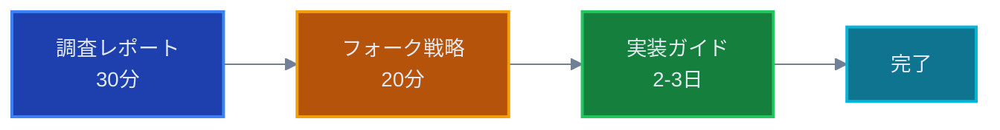
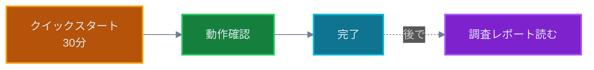

# Foxglove Bridge 互換性対応 - ドキュメント一覧

**問題**: foxglove_bridge v3.2.0+ との互換性問題
**対象プロジェクト**: SORA (Lichtblickフォーク)
**最終更新**: 2025年11月6日

---

## 📚 ドキュメント構成

### 1. 調査・分析

#### [Issue #750 調査レポート](../../issue-750-investigation.md) 🔍

**目的**: 問題の根本原因と技術的詳細の理解
**対象者**: 技術リーダー、アーキテクト
**内容**:

- 問題の本質（プロトコル不一致）
- foxglove_bridge v3.2.0 での破壊的変更
- Lichtblickの現状
- 影響範囲と過去の経緯
- Floraプロジェクトの対応例

**読むべきタイミング**: 問題の背景を理解したいとき

---

### 2. 戦略・計画

#### [解決策比較分析](./solution-comparison.md) 📊

**目的**: 3つの解決策の詳細比較
**対象者**: テックリード、意思決定者
**内容**:

- 案1: 独自実装 `@lichtblick/ws-protocol`
- 案2: フォーク管理
- 案3: パッチ管理
- メリット・デメリット比較
- コスト・リスク分析

**読むべきタイミング**: 実装方針を決定する前

---

#### [SORAフォーク戦略](./sora-fork-strategy.md) 🎯

**目的**: フォークプロジェクトとしての総合戦略
**対象者**: プロジェクトマネージャー、開発チーム全体
**内容**:

- フォークプロジェクトの優位性
- 段階的アプローチ（短期・中期・長期）
- 上流への貢献戦略
- 独自実装への道筋
- リスク評価とモニタリング

**読むべきタイミング**: プロジェクト全体の方針を立てるとき

---

### 3. 実装ガイド

#### [完全な実装ガイド](./implementation-guide-sora.md) 📖

**目的**: ステップバイステップの詳細な実装手順
**対象者**: 実装担当の開発者
**内容**:

- 前提条件と環境準備
- 6つのステップの詳細説明
- コード例と期待される出力
- トラブルシューティング
- 完了チェックリスト

**読むべきタイミング**: 実際に実装を始めるとき

**所要時間**: 初回 2-3日、慣れれば半日

---

#### [クイックスタートガイド](./quickstart-sora.md) ⚡

**目的**: 最速での問題解決
**対象者**: 今すぐ修正したい開発者
**内容**:

- 最小限の説明
- コマンドと変更箇所のみ
- 5つのステップ

**読むべきタイミング**: 詳細な理解より速さを優先するとき

**所要時間**: 約30分

---

## 🗺️ 学習パス

### パス1: 全体理解から実装まで（推奨）



**推奨対象**: 初めて対応する開発者、チームリーダー

**メリット**:

- ✅ 問題の本質を理解できる
- ✅ 戦略的な判断ができる
- ✅ トラブル時に対応しやすい

---

### パス2: 速攻実装（時間優先）



**推奨対象**: 緊急対応が必要なとき、経験豊富な開発者

**メリット**:

- ✅ 最速で問題解決
- ✅ 最小限の学習コスト

**デメリット**:

- ⚠️ トラブル時の対応が難しい
- ⚠️ 背景理解が不足する可能性

---

### パス3: 戦略検討（意思決定者向け）


**推奨対象**: プロジェクトマネージャー、テックリード

**読むべきセクション**:

- 調査レポート: エグゼクティブサマリーと根本原因
- 解決策比較: 比較表のみ
- フォーク戦略: 全体

---

## 📖 各ドキュメントの関係

```
調査レポート (What happened?)
    ↓
解決策比較 (What are the options?)
    ↓
フォーク戦略 (What should we do?)
    ↓
実装ガイド / クイックスタート (How to do it?)
```

---

## 🎯 ユースケース別おすすめ

### 「今すぐfoxglove_bridge v3.2.0+に接続したい」

→ [クイックスタートガイド](./quickstart-sora.md)

### 「問題の背景を理解したい」

→ [調査レポート](../../issue-750-investigation.md)

### 「長期的な戦略を立てたい」

→ [フォーク戦略](./sora-fork-strategy.md)

### 「各解決策のメリット・デメリットを比較したい」

→ [解決策比較](./solution-comparison.md)

### 「詳しい実装手順が知りたい」

→ [実装ガイド](./implementation-guide-sora.md)

### 「上流（Lichtblick）への貢献を考えている」

→ [フォーク戦略](./sora-fork-strategy.md) の「中期対応」セクション

### 「独自実装を検討している」

→ [解決策比較](./solution-comparison.md) の「案1」 + [フォーク戦略](./sora-fork-strategy.md) の「長期対応」

---

## 📊 ドキュメント比較表

| ドキュメント     | 読む時間 | 難易度 | 対象者           | 実装手順 |
| ---------------- | -------- | ------ | ---------------- | -------- |
| 調査レポート     | 30分     | ⭐⭐⭐ | 全員             | ❌       |
| 解決策比較       | 20分     | ⭐⭐⭐ | 意思決定者       | ❌       |
| フォーク戦略     | 30分     | ⭐⭐   | PM・リーダー     | ⚠️       |
| 実装ガイド       | 2-3日    | ⭐⭐   | 実装担当者       | ✅       |
| クイックスタート | 30分     | ⭐⭐   | 経験豊富な開発者 | ✅       |

---

## 🔄 更新履歴

| 日付       | 内容                        | 更新者 |
| ---------- | --------------------------- | ------ |
| 2025-11-06 | 初版作成（全5ドキュメント） | AI     |
| 2025-11-06 | インデックスページ作成      | AI     |

---

## 📝 フィードバック

これらのドキュメントに関するフィードバックや改善提案は、以下の方法でお寄せください：

- GitHubのIssueを作成
- プロジェクトチャンネルで共有
- ドキュメント担当者に直接連絡

---

## 🎓 推奨される勉強会トピック

チーム全体での知識共有のために:

1. **キックオフ**: フォーク戦略の共有（30分）
2. **ハンズオン**: クイックスタートを実際に実施（1時間）
3. **深掘り**: 調査レポートの詳細説明（1時間）
4. **振り返り**: 実装後の知見共有（30分）

---

**作成日**: 2025年11月6日
**メンテナンス**: ドキュメントは生きもの - 定期的な更新をお願いします
