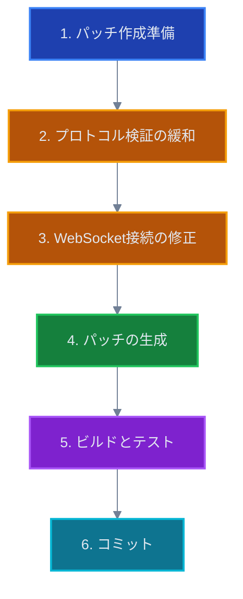

# SORA: Foxglove Bridge互換性問題 実装ガイド

**対象**: SORA開発チーム
**実装日**: 2025年11月6日〜
**難易度**: ⭐⭐ (中級)
**所要時間**: 2-3日

---

## 📋 前提条件

### 必要な環境

- Node.js 20以上
- pnpm（Yarnでも可）
- Git
- ROS 2環境（テスト用）
- foxglove_bridge v3.2.0以上（テスト用）

### 必要な知識

- TypeScript基礎
- WebSocketプロトコルの基本理解
- pnpmパッチの使用経験（なくても可）

---

## 🎯 実装の全体像

### 修正対象ファイル

```
lichtblick/ (SORA)
├── packages/
│   └── suite-base/
│       └── src/
│           └── players/
│               └── FoxgloveWebSocketPlayer/
│                   └── index.ts                    # ✏️ 修正
├── patches/
│   └── @foxglove__ws-protocol@0.7.2.patch          # 🆕 新規作成
└── package.json                                     # 🔄 自動更新
```

### 変更の流れ



---

## 📝 ステップ1: パッチ作成の準備

### 1.1 現在のバージョン確認

```bash
# プロジェクトルートで実行
cd /Users/sugaiakimasa/apps/lichtblick

# @foxglove/ws-protocol のバージョンを確認
pnpm list @foxglove/ws-protocol

# 期待される出力:
# @foxglove/ws-protocol 0.7.2
```

### 1.2 パッチ作成の開始

```bash
# パッケージを編集可能にする
pnpm patch @foxglove/ws-protocol

# 出力例:
# You can now edit the following folder: /private/var/folders/.../T/xxxxx
#
# Once you're done with your changes, run:
#   pnpm patch-commit /private/var/folders/.../T/xxxxx
```

**重要**: 出力されたパスをメモしておく（例: `/tmp/foxglove-ws-protocol-xxxxx`）

---

## 🔧 ステップ2: プロトコル検証の緩和

### 2.1 対象ファイルを開く

```bash
# パッチディレクトリに移動
cd /tmp/foxglove-ws-protocol-xxxxx  # 👈 実際のパスに置き換え

# ファイル構造を確認
ls -la src/

# 期待される出力:
# FoxgloveClient.ts
# index.ts
# ...
```

### 2.2 FoxgloveClient.ts の編集

エディタで `src/FoxgloveClient.ts` を開き、`onopen` イベントハンドラーを探す。

**変更前** (約60-70行目あたり):

```typescript
this.#ws.onopen = (_event) => {
  if (this.#ws.protocol !== FoxgloveClient.SUPPORTED_SUBPROTOCOL) {
    throw new Error(
      `Expected subprotocol ${FoxgloveClient.SUPPORTED_SUBPROTOCOL}, got '${this.#ws.protocol}'`,
    );
  }
  this.#emitter.emit("open");
};
```

**変更後**:

```typescript
this.#ws.onopen = (_event) => {
  // Support both legacy and new Foxglove protocols
  const acceptedProtocols = [
    FoxgloveClient.SUPPORTED_SUBPROTOCOL, // "foxglove.websocket.v1"
    "foxglove.sdk.v1", // New protocol from foxglove_bridge v3.2.0+
  ];

  if (!acceptedProtocols.includes(this.#ws.protocol)) {
    throw new Error(
      `Expected subprotocol ${acceptedProtocols.join(" or ")}, got '${this.#ws.protocol}'`,
    );
  }

  this.#emitter.emit("open");
};
```

**変更のポイント**:

- ✅ 配列で複数プロトコルを受け入れる
- ✅ エラーメッセージも更新
- ✅ コメントで意図を明確化

### 2.3 変更の保存

```bash
# ファイルを保存してエディタを閉じる
# Git diffで変更を確認
git diff src/FoxgloveClient.ts
```

---

## 🔌 ステップ3: WebSocket接続の修正

### 3.1 対象ファイルを開く

```bash
# プロジェクトルートに戻る
cd /Users/sugaiakimasa/apps/lichtblick

# 対象ファイルを開く
code packages/suite-base/src/players/FoxgloveWebSocketPlayer/index.ts
```

### 3.2 WebSocket接続部分を探す

`index.ts` の約179-183行目あたりを探す。

**目印となるコード**:

```typescript
this.#client = new FoxgloveClient({
  ws:
    typeof Worker !== "undefined"
      ? new WorkerSocketAdapter(this.#url, [FoxgloveClient.SUPPORTED_SUBPROTOCOL])
      : new WebSocket(this.#url, [FoxgloveClient.SUPPORTED_SUBPROTOCOL]),
});
```

### 3.3 コードの置き換え

**変更前** (179-183行目):

```typescript
this.#client = new FoxgloveClient({
  ws:
    typeof Worker !== "undefined"
      ? new WorkerSocketAdapter(this.#url, [FoxgloveClient.SUPPORTED_SUBPROTOCOL])
      : new WebSocket(this.#url, [FoxgloveClient.SUPPORTED_SUBPROTOCOL]),
});
```

**変更後**:

```typescript
// Support both legacy and new Foxglove protocols
const SUPPORTED_PROTOCOLS = [
  FoxgloveClient.SUPPORTED_SUBPROTOCOL, // "foxglove.websocket.v1"
  "foxglove.sdk.v1", // New protocol from foxglove_bridge v3.2.0+
];

this.#client = new FoxgloveClient({
  ws:
    typeof Worker !== "undefined"
      ? new WorkerSocketAdapter(this.#url, SUPPORTED_PROTOCOLS)
      : new WebSocket(this.#url, SUPPORTED_PROTOCOLS),
});
```

**変更のポイント**:

- ✅ `SUPPORTED_PROTOCOLS` 配列を定義
- ✅ 両方のWorkerSocketAdapterとWebSocketで同じ配列を使用
- ✅ コメントで意図を明記

### 3.4 変更の保存と確認

```bash
# 変更を保存してファイルを閉じる

# Gitで変更を確認
git diff packages/suite-base/src/players/FoxgloveWebSocketPlayer/index.ts
```

---

## 📦 ステップ4: パッチの生成

### 4.1 パッチのコミット

```bash
# ステップ1.2でメモしたパスを使用
pnpm patch-commit /tmp/foxglove-ws-protocol-xxxxx

# 成功すると以下のようなメッセージが表示される:
# ✔ Patch created
# patches/@foxglove__ws-protocol@0.7.2.patch
```

### 4.2 パッチファイルの確認

```bash
# パッチファイルが作成されたことを確認
ls -la patches/

# ファイル内容を確認
cat patches/@foxglove__ws-protocol@0.7.2.patch
```

**期待される内容**:

```diff
diff --git a/src/FoxgloveClient.ts b/src/FoxgloveClient.ts
index xxxxx..yyyyy 100644
--- a/src/FoxgloveClient.ts
+++ b/src/FoxgloveClient.ts
@@ -xx,x +xx,xx @@
   this.#ws.onopen = (_event) => {
-    if (this.#ws.protocol !== FoxgloveClient.SUPPORTED_SUBPROTOCOL) {
-      throw new Error(
-        `Expected subprotocol ${FoxgloveClient.SUPPORTED_SUBPROTOCOL}, got '${this.#ws.protocol}'`,
-      );
-    }
+    // Support both legacy and new Foxglove protocols
+    const acceptedProtocols = [
+      FoxgloveClient.SUPPORTED_SUBPROTOCOL, // "foxglove.websocket.v1"
+      "foxglove.sdk.v1",                    // New protocol from foxglove_bridge v3.2.0+
+    ];
+
+    if (!acceptedProtocols.includes(this.#ws.protocol)) {
+      throw new Error(
+        `Expected subprotocol ${acceptedProtocols.join(" or ")}, got '${this.#ws.protocol}'`,
+      );
+    }
     this.#emitter.emit("open");
   };
```

### 4.3 package.jsonの更新確認

```bash
# package.jsonにパッチ情報が追加されたことを確認
cat package.json | grep -A3 patchedDependencies
```

**期待される内容**:

```json
"pnpm": {
  "patchedDependencies": {
    "@foxglove/ws-protocol@0.7.2": "patches/@foxglove__ws-protocol@0.7.2.patch"
  }
}
```

---

## 🏗️ ステップ5: ビルドとテスト

### 5.1 依存関係の再インストール

```bash
# パッチを適用した状態で再インストール
pnpm install

# パッチが適用されたことを確認
# 出力に以下のようなメッセージが表示される:
# Progress: resolved xxx, reused xxx, downloaded 0, added 0
# Applying patch for @foxglove/ws-protocol@0.7.2 from patches/@foxglove__ws-protocol@0.7.2.patch
```

### 5.2 ビルドの実行

```bash
# パッケージのビルド
pnpm run build:packages

# Web版のビルド（開発モード）
pnpm run web:build:dev

# または Desktop版のビルド
pnpm run desktop:build:dev
```

**期待される結果**: エラーなくビルドが完了する

### 5.3 動作確認の準備

#### ROS環境の準備

```bash
# 別のターミナルでROS 2を起動
source /opt/ros/humble/setup.bash  # または使用しているROSバージョン

# foxglove_bridgeを起動
ros2 launch foxglove_bridge foxglove_bridge_launch.xml port:=8765

# 以下のようなメッセージが表示されることを確認:
# [foxglove_bridge]: WebSocket server listening on port 8765
# [foxglove_bridge]: Using protocol: foxglove.sdk.v1
```

### 5.4 SORA アプリでの接続テスト

#### 開発サーバーの起動

```bash
# Web版の場合
pnpm run web:serve

# Desktop版の場合
pnpm run desktop:serve
# 別ターミナルで
pnpm run desktop:start
```

#### 接続手順

1. **SORAアプリを開く**

   - ブラウザで `http://localhost:8080` にアクセス（Web版）
   - または Electronアプリを起動（Desktop版）

2. **Foxglove WebSocketを選択**

   - 左サイドバーから "Open connection" をクリック
   - "Foxglove WebSocket" を選択

3. **接続URLを入力**

   ```
   ws://localhost:8765
   ```

4. **接続ボタンをクリック**

### 5.5 接続成功の確認

✅ **成功のサイン**:

- エラーメッセージが表示されない
- 接続ステータスが "Connected" になる
- トピックリストが表示される
- データが受信できる

❌ **失敗のサイン**:

```
Check that the WebSocket server at ws://localhost:8765 is reachable
and supports protocol version foxglove.websocket.v1.
```

→ この場合は、パッチが正しく適用されていない可能性があります。

### 5.6 詳細な検証

#### ブラウザの開発者ツールで確認

```javascript
// Console タブで WebSocket のプロトコルを確認
// 以下のようなログが表示されるはず:
// WebSocket connection to 'ws://localhost:8765/' established
// Protocol: foxglove.sdk.v1
```

#### 旧バージョンのbridgeとの互換性確認

```bash
# ROS側で古いバージョンをインストール
sudo apt install ros-humble-foxglove-bridge=3.1.*

# 再起動して接続テスト
ros2 launch foxglove_bridge foxglove_bridge_launch.xml port:=8765
```

✅ **両方のバージョンで接続できることを確認**

---

## 📝 ステップ6: コミットとドキュメント化

### 6.1 変更をステージング

```bash
# 変更されたファイルを確認
git status

# 期待される出力:
# modified:   packages/suite-base/src/players/FoxgloveWebSocketPlayer/index.ts
# modified:   package.json
# new file:   patches/@foxglove__ws-protocol@0.7.2.patch
```

### 6.2 コミットの作成

```bash
# すべての変更をステージング
git add packages/suite-base/src/players/FoxgloveWebSocketPlayer/index.ts
git add patches/@foxglove__ws-protocol@0.7.2.patch
git add package.json

# コミットメッセージを作成
git commit -m "fix: Add support for foxglove.sdk.v1 protocol

- Add patch for @foxglove/ws-protocol to accept both protocols
- Update FoxgloveWebSocketPlayer to propose multiple subprotocols
- Fixes compatibility with foxglove_bridge v3.2.0+
- Maintains backward compatibility with foxglove_bridge v3.1.x

Resolves: #750
Related: Lichtblick-suite/lichtblick#750"
```

### 6.3 作業ログの作成

```bash
# 今日の日付でログディレクトリを作成
mkdir -p docs/05_logs/2025_11/20251106

# 作業ログを作成
touch docs/05_logs/2025_11/20251106/01_foxglove-sdk-v1-support.md
```

**ログの内容例**:

```markdown
# 作業ログ: Foxglove SDK v1 プロトコル対応

**日付**: 2025年11月6日
**作業者**: [名前]
**所要時間**: 約3時間

## 実施内容

1. `@foxglove/ws-protocol` へのパッチ作成

   - プロトコル検証の緩和
   - `foxglove.sdk.v1` を受け入れるように修正

2. `FoxgloveWebSocketPlayer` の修正

   - 複数サブプロトコルの提案
   - 後方互換性の維持

3. テストと検証
   - foxglove_bridge v3.1.x との接続成功
   - foxglove_bridge v3.2.0+ との接続成功

## 成果物

- パッチファイル: `patches/@foxglove__ws-protocol@0.7.2.patch`
- 修正ファイル: `packages/suite-base/src/players/FoxgloveWebSocketPlayer/index.ts`
- ドキュメント: `docs/03_plans/foxglove-websocket-compatibility/`

## 参照

- 戦略ドキュメント: docs/03_plans/foxglove-websocket-compatibility/sora-fork-strategy.md
- 実装ガイド: docs/03_plans/foxglove-websocket-compatibility/implementation-guide-sora.md
```

---

## ✅ 完了チェックリスト

### 実装

- [ ] パッチの作成と適用
- [ ] FoxgloveWebSocketPlayer の修正
- [ ] ビルド成功
- [ ] foxglove_bridge v3.2.0+ との接続成功
- [ ] foxglove_bridge v3.1.x との接続成功（後方互換性）

### ドキュメント

- [ ] 作業ログの作成
- [ ] README の更新（必要に応じて）
- [ ] チーム内での共有

### バージョン管理

- [ ] パッチファイルのコミット
- [ ] 変更のコミット
- [ ] ブランチのプッシュ（該当する場合）

---

## 🔧 トラブルシューティング

### 問題1: パッチが適用されない

**症状**:

```
Error: Failed to apply patch for @foxglove/ws-protocol@0.7.2
```

**解決方法**:

```bash
# node_modules を削除して再インストール
rm -rf node_modules
pnpm install
```

### 問題2: ビルドエラー

**症状**:

```
Type error: Property 'protocol' does not exist on type 'WebSocket'
```

**解決方法**:

```bash
# TypeScript の型定義を確認
# WebSocket の型定義が正しくインポートされているか確認
```

### 問題3: 接続は成功するがデータが受信できない

**症状**:

- 接続ステータスは "Connected"
- トピックリストが空
- データが表示されない

**解決方法**:

```bash
# ROS側でトピックが配信されているか確認
ros2 topic list
ros2 topic echo /your_topic

# foxglove_bridge のログを確認
# トピックが正しくアドバタイズされているか確認
```

### 問題4: 旧バージョンとの互換性が失われた

**症状**:

- foxglove_bridge v3.1.x との接続に失敗

**解決方法**:

- パッチファイルの内容を確認
- `acceptedProtocols` 配列に `foxglove.websocket.v1` が含まれているか確認

---

## 📚 参考資料

### 内部ドキュメント

- [Issue #750 調査レポート](../../issue-750-investigation.md)
- [SORA フォーク戦略](./sora-fork-strategy.md)
- [解決策比較](./solution-comparison.md)

### 外部リソース

- [pnpm patch documentation](https://pnpm.io/cli/patch)
- [Foxglove WebSocket Protocol](https://github.com/foxglove/ws-protocol)
- [Foxglove SDK](https://github.com/foxglove/foxglove-sdk)
- [Flora PR #97](https://github.com/flora-suite/flora/pull/97) - 参考実装

---

## 🎉 完了後のステップ

### 1. チームへの共有

- 実装内容を Slack/Discord で共有
- デモを実施

### 2. 本番環境への展開計画

- ステージング環境でのテスト
- ユーザーへの告知
- ロールバック手順の確認

### 3. 上流への貢献準備

- Lichtblick へのPR準備（次のフェーズ）
- コードのクリーンアップ
- テスト結果のドキュメント化

---

**作成日**: 2025年11月6日
**最終更新**: 2025年11月6日
**ステータス**: 実装準備完了

<function_calls>
<invoke name="read_file">
<parameter name="filePath">/Users/sugaiakimasa/apps/lichtblick/packages/suite-base/src/players/FoxgloveWebSocketPlayer/index.ts
