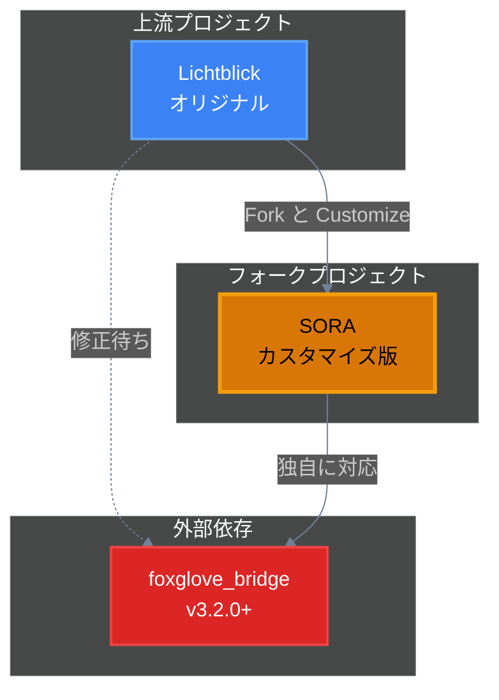
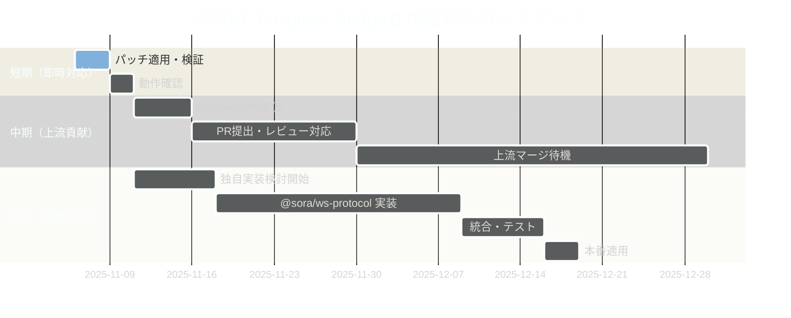
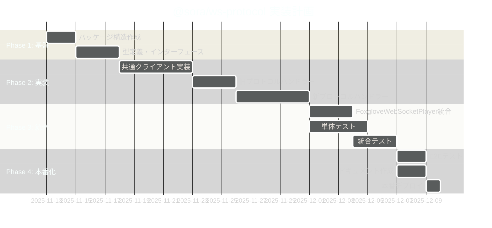

# SORAアプリ: Foxglove Bridge互換性問題 対応戦略

**対応日**: 2025年11月6日
**対象Issue**: [Lichtblick #750](https://github.com/lichtblick-suite/lichtblick/issues/750)
**プロジェクト**: SORA (Lichtblickフォーク)

---

## 📋 エグゼクティブサマリー

### 問題の本質

foxglove_bridge v3.2.0以降が新プロトコル `foxglove.sdk.v1` を使用するようになったため、旧プロトコル `foxglove.websocket.v1` のみをサポートするLichtblick（およびそのフォークであるSORA）との互換性が失われています。

### フォークプロジェdクトとしての立ち位置

SORAはLichtblickをフォークしたプロジェクトであり、以下の特性を持ちます：



### 推奨戦略: **段階的アプローチ**

1. **即時対応（短期）**: パッチ適用 → 迅速な問題解決
2. **上流貢献（中期）**: Lichtblick本体への貢献
3. **独自実装（長期）**: SORA独自のWebSocketクライアント実装

---

## 🎯 戦略的選択: フォークプロジェクトの優位性

### フォークプロジェクトの特権

Lichtblick本体はコミュニティ合意やレビュープロセスが必要ですが、SORAは以下の利点があります：

| 観点                 | Lichtblick本体           | SORAフォーク             |
| -------------------- | ------------------------ | ------------------------ |
| **意思決定速度**     | 遅い（コミュニティ合意） | 速い（独自判断）         |
| **実装の自由度**     | 制限あり（保守性重視）   | 高い（カスタマイズ可能） |
| **リリースサイクル** | 定期的（安定性優先）     | 柔軟（必要に応じて）     |
| **実験的機能**       | 慎重（本番環境考慮）     | 積極的（独自ニーズ対応） |
| **上流への貢献**     | 直接的（本体開発）       | 間接的（PR提出）         |

### 推奨される対応順序



---

## 📦 短期対応: パッチ適用（即時実装）

### 目的

- ✅ 最小限の変更で即座に問題を解決
- ✅ foxglove_bridge v3.2.0+ との接続を可能にする
- ✅ 上流（Lichtblick）への貢献の足がかりとする

### 実装方法: pnpmパッチの使用

#### ステップ1: パッチファイルの作成

```bash
# 1. 対象パッケージを編集可能にする
pnpm patch @foxglove/ws-protocol

# 2. 出力されたディレクトリで編集
# 例: /tmp/foxglove-ws-protocol-0.7.2-abc123/
```

#### ステップ2: コード修正

**ファイル1**: `src/FoxgloveClient.ts` （プロトコル検証の緩和）

```typescript
// 変更前
this.#ws.onopen = (_event) => {
  if (this.#ws.protocol !== FoxgloveClient.SUPPORTED_SUBPROTOCOL) {
    throw new Error(
      `Expected subprotocol ${FoxgloveClient.SUPPORTED_SUBPROTOCOL}, got '${this.#ws.protocol}'`,
    );
  }
  this.#emitter.emit("open");
};

// 変更後
this.#ws.onopen = (_event) => {
  const acceptedProtocols = [
    FoxgloveClient.SUPPORTED_SUBPROTOCOL, // "foxglove.websocket.v1"
    "foxglove.sdk.v1", // 新プロトコルを追加
  ];

  if (!acceptedProtocols.includes(this.#ws.protocol)) {
    throw new Error(
      `Expected subprotocol ${acceptedProtocols.join(" or ")}, got '${this.#ws.protocol}'`,
    );
  }

  this.#emitter.emit("open");
};
```

**ファイル2**: `packages/suite-base/src/players/FoxgloveWebSocketPlayer/index.ts`

```typescript
// 変更前（約180行目）
this.#client = new FoxgloveClient({
  ws:
    typeof Worker !== "undefined"
      ? new WorkerSocketAdapter(this.#url, [FoxgloveClient.SUPPORTED_SUBPROTOCOL])
      : new WebSocket(this.#url, [FoxgloveClient.SUPPORTED_SUBPROTOCOL]),
});

// 変更後
const SUPPORTED_PROTOCOLS = [
  FoxgloveClient.SUPPORTED_SUBPROTOCOL, // "foxglove.websocket.v1"
  "foxglove.sdk.v1", // 新プロトコル
];

this.#client = new FoxgloveClient({
  ws:
    typeof Worker !== "undefined"
      ? new WorkerSocketAdapter(this.#url, SUPPORTED_PROTOCOLS)
      : new WebSocket(this.#url, SUPPORTED_PROTOCOLS),
});
```

#### ステップ3: パッチの生成と適用

```bash
# 3. パッチを生成
pnpm patch-commit /tmp/foxglove-ws-protocol-0.7.2-abc123/

# 4. パッチが自動適用されることを確認
# → patches/@foxglove__ws-protocol@0.7.2.patch が作成される
```

#### ステップ4: ビルドと検証

```bash
# 依存関係の再インストール（パッチ適用）
pnpm install

# ビルド
pnpm run build

# 動作確認
# 1. ROS環境でfoxglove_bridge v3.2.0+を起動
# 2. SORAで接続テスト
```

### 期待される結果

- ✅ foxglove_bridge v3.1.x以前との接続維持（後方互換性）
- ✅ foxglove_bridge v3.2.0+との接続成功（新プロトコル対応）
- ✅ パッチファイルはバージョン管理される（`patches/`ディレクトリ）

### パッチ管理のベストプラクティス

```json
// package.json に記録される
{
  "pnpm": {
    "patchedDependencies": {
      "@foxglove/ws-protocol@0.7.2": "patches/@foxglove__ws-protocol@0.7.2.patch"
    }
  }
}
```

**重要**: パッチファイルは必ずGitにコミットすること

```bash
git add patches/@foxglove__ws-protocol@0.7.2.patch
git commit -m "fix: Add foxglove.sdk.v1 protocol support via patch"
```

---

## 🤝 中期対応: 上流（Lichtblick）への貢献

### 目的

- ✅ SORA独自の修正を上流にフィードバック
- ✅ コミュニティ全体の利益に貢献
- ✅ 将来的なメンテナンスコストの削減

### アプローチ

#### オプションA: パッチベースのPR（推奨）

**メリット**:

- 最小限の変更
- レビューが容易
- マージされやすい

**実装内容**:

1. **プルリクエストの作成**

```markdown
# LichtblickリポジトリへのPR

## タイトル

fix: Add support for foxglove.sdk.v1 protocol (Issue #750)

## 説明

Adds support for the new `foxglove.sdk.v1` protocol used by
foxglove_bridge v3.2.0+, while maintaining backward compatibility
with the legacy `foxglove.websocket.v1` protocol.

## Changes

- Modified `FoxgloveWebSocketPlayer` to propose multiple subprotocols
- Updated protocol validation to accept both protocols

## Testing

- ✅ Tested with foxglove_bridge v3.1.x (legacy protocol)
- ✅ Tested with foxglove_bridge v3.2.0+ (new protocol)
- ✅ Both connections successful

## References

- Fixes #750
- Related to #604
- Inspired by [Flora PR #97](https://github.com/flora-suite/flora/pull/97)
```

2. **修正内容**

SORAで適用したパッチと同じ変更を、Lichtblickの該当ファイルに適用。

#### オプションB: 独自実装のPR（野心的）

もし将来的に `@lichtblick/ws-protocol` を実装する場合、それもPRとして提案可能。

### PR戦略のポイント

| フェーズ         | アクション                           | 期間    |
| ---------------- | ------------------------------------ | ------- |
| **準備**         | 動作確認済みのコードをクリーンアップ | 1-2日   |
| **PR作成**       | 丁寧な説明とテスト結果を添付         | 1日     |
| **レビュー対応** | メンテナーからのフィードバックに対応 | 1-2週間 |
| **マージ待機**   | 上流でのマージとリリースを待つ       | 不定    |
| **同期**         | 上流の変更をSORAに取り込む           | 半日    |

---

## 🚀 長期対応: SORA独自のWebSocketクライアント実装

### 目的

- ✅ 完全な自律性の確保
- ✅ SORA固有のニーズへの最適化
- ✅ 外部依存の最小化

### 実装戦略: `@sora/ws-protocol`

#### パッケージ構造

```
packages/
  └── sora-ws-protocol/
      ├── src/
      │   ├── client/
      │   │   ├── SoraWebSocketClient.ts    # メインクライアント
      │   │   ├── ProtocolNegotiator.ts     # プロトコル選択ロジック
      │   │   └── MessageHandler.ts         # メッセージ処理
      │   ├── protocols/
      │   │   ├── FoxgloveWebSocketV1.ts    # 旧プロトコル実装
      │   │   ├── FoxgloveSdkV1.ts          # 新プロトコル実装
      │   │   └── ProtocolInterface.ts      # 共通インターフェース
      │   ├── types/
      │   │   ├── messages.ts
      │   │   ├── channels.ts
      │   │   └── index.ts
      │   ├── utils/
      │   │   ├── serialization.ts
      │   │   ├── validation.ts
      │   │   └── logger.ts
      │   └── index.ts
      ├── tests/
      │   ├── unit/
      │   └── integration/
      ├── package.json
      ├── tsconfig.json
      └── README.md
```

#### 核心実装例

```typescript
// packages/sora-ws-protocol/src/client/SoraWebSocketClient.ts

export class SoraWebSocketClient extends EventEmitter {
  // 両プロトコルをサポート
  static SUPPORTED_PROTOCOLS = ["foxglove.websocket.v1", "foxglove.sdk.v1"] as const;

  private protocol: (typeof SoraWebSocketClient.SUPPORTED_PROTOCOLS)[number] | null = null;
  private protocolHandler: IProtocolHandler | null = null;

  constructor(options: SoraWebSocketClientOptions) {
    super();
    this.#initialize(options);
  }

  #initialize(options: SoraWebSocketClientOptions) {
    const ws = new WebSocket(options.url, SoraWebSocketClient.SUPPORTED_PROTOCOLS);

    ws.onopen = () => {
      // サーバーが選択したプロトコルを取得
      this.protocol = ws.protocol as (typeof SoraWebSocketClient.SUPPORTED_PROTOCOLS)[number];

      // プロトコルに応じたハンドラーを選択
      this.protocolHandler = this.#createProtocolHandler(this.protocol);

      this.emit("open", { protocol: this.protocol });
    };

    ws.onmessage = (event) => {
      if (!this.protocolHandler) {
        throw new Error("Protocol handler not initialized");
      }

      // プロトコル固有の処理を委譲
      const message = this.protocolHandler.parseMessage(event.data);
      this.emit("message", message);
    };
  }

  #createProtocolHandler(protocol: string): IProtocolHandler {
    switch (protocol) {
      case "foxglove.websocket.v1":
        return new FoxgloveWebSocketV1Handler();
      case "foxglove.sdk.v1":
        return new FoxgloveSdkV1Handler();
      default:
        throw new Error(`Unsupported protocol: ${protocol}`);
    }
  }
}
```

#### プロトコルハンドラーインターフェース

```typescript
// packages/sora-ws-protocol/src/protocols/ProtocolInterface.ts

export interface IProtocolHandler {
  /**
   * プロトコルバージョン
   */
  readonly version: string;

  /**
   * メッセージのパース
   */
  parseMessage(data: ArrayBuffer | string): ParsedMessage;

  /**
   * メッセージのシリアライズ
   */
  serializeMessage(message: OutgoingMessage): ArrayBuffer;

  /**
   * サブスクリプション管理
   */
  subscribe(channelId: number): void;
  unsubscribe(subscriptionId: number): void;

  /**
   * パブリッシュ
   */
  publish(topic: string, data: Uint8Array): void;
}
```

### 実装フェーズ



### 実装の優先度判定

| 条件                            | 独自実装の優先度 |
| ------------------------------- | ---------------- |
| SORA固有の機能拡張が必要        | ⭐⭐⭐⭐⭐       |
| 上流の修正が3ヶ月以上見込めない | ⭐⭐⭐⭐         |
| パッチ管理が複雑化している      | ⭐⭐⭐           |
| 開発リソースに余裕がある        | ⭐⭐⭐           |
| 上流への貢献PRがマージ済み      | ⭐⭐             |

**現状の推奨**: 中優先度（上流の動向を見ながら検討）

---

## 📊 各アプローチの比較

### 総合比較表

| 項目                     | パッチ適用（短期）   | 上流貢献（中期）         | 独自実装（長期） |
| ------------------------ | -------------------- | ------------------------ | ---------------- |
| **実装期間**             | 2-3日                | 1-2週間（+マージ待機）   | 3-4週間          |
| **技術的難易度**         | 低 ⭐                | 中 ⭐⭐                  | 高 ⭐⭐⭐⭐      |
| **メンテナンスコスト**   | 低 ⭐                | 低 ⭐（マージ後）        | 中 ⭐⭐⭐        |
| **自律性**               | 中 ⭐⭐              | 低 ⭐（上流依存）        | 高 ⭐⭐⭐⭐      |
| **将来の拡張性**         | 限定的 ⭐            | 限定的 ⭐⭐              | 最高 ⭐⭐⭐⭐⭐  |
| **コミュニティ貢献**     | なし                 | 高 ⭐⭐⭐⭐⭐            | 間接的 ⭐⭐      |
| **バージョンアップ対応** | 手動（パッチ再適用） | 自動（上流から取り込み） | 独自（影響なし） |

### リスク評価

#### パッチ適用のリスク

| リスク                             | 発生確率 | 影響度 | 対策                              |
| ---------------------------------- | -------- | ------ | --------------------------------- |
| パッケージ更新時のパッチ破損       | 中 🟡    | 中 🟡  | バージョン固定、CI/CDでの自動検証 |
| 上流の大幅な変更によるコンフリクト | 低 🟢    | 高 🔴  | 定期的な上流の監視、早期の対応    |

#### 独自実装のリスク

| リスク                   | 発生確率 | 影響度 | 対策                               |
| ------------------------ | -------- | ------ | ---------------------------------- |
| 実装バグ                 | 中 🟡    | 高 🔴  | 十分なテストカバレッジ、段階的導入 |
| プロトコル仕様の変更     | 低 🟢    | 中 🟡  | Foxgloveの動向監視、柔軟な設計     |
| メンテナンスコストの増加 | 高 🔴    | 中 🟡  | 明確なドキュメント、テスト自動化   |

---

## 🎬 推奨される実行プラン

### フェーズ1: 即時対応（今週中）

**目標**: foxglove_bridge v3.2.0+ との接続を可能にする

```bash
# DAY 1-2: パッチ適用
- [ ] pnpmパッチの作成
- [ ] FoxgloveWebSocketPlayerの修正
- [ ] ローカル動作確認

# DAY 3: 検証とデプロイ
- [ ] 複数バージョンのbridgeでテスト
- [ ] パッチファイルをGitにコミット
- [ ] 開発環境へのデプロイ
```

**成果物**:

- ✅ 動作するSORAアプリ
- ✅ パッチファイル（`patches/@foxglove__ws-protocol@0.7.2.patch`）
- ✅ 検証レポート

### フェーズ2: 上流貢献（今月中）

**目標**: Lichtblickコミュニティへの貢献

```bash
# WEEK 1: PR準備
- [ ] コードのクリーンアップ
- [ ] 詳細なテスト結果の作成
- [ ] PRドキュメントの作成

# WEEK 2-3: PR提出とレビュー対応
- [ ] Lichtblickリポジトリへのフォーク
- [ ] PRの提出
- [ ] メンテナーからのフィードバックへの対応

# WEEK 4+: マージ待機
- [ ] 定期的なステータス確認
- [ ] 必要に応じて追加の修正
```

**成果物**:

- ✅ Lichtblickへのプルリクエスト
- ✅ コミュニティとの関係構築

### フェーズ3: 長期戦略（3ヶ月後評価）

**目標**: 独自実装の必要性を再評価

```bash
# 評価基準
IF (上流PRがマージされた) THEN
  → 独自実装は不要、上流の変更を定期的に取り込む

ELSE IF (SORA固有の機能が必要になった) THEN
  → @sora/ws-protocol の実装を開始

ELSE
  → パッチ管理を継続、定期的に再評価
```

---

## 📝 実装チェックリスト

### 短期対応（パッチ適用）

#### 技術的タスク

- [ ] pnpmパッチ環境の準備
- [ ] `@foxglove/ws-protocol` のパッチ作成
  - [ ] `FoxgloveClient.ts` のプロトコル検証修正
  - [ ] 複数プロトコル対応の実装
- [ ] `FoxgloveWebSocketPlayer/index.ts` の修正
  - [ ] SUPPORTED_PROTOCOLS配列の定義
  - [ ] WebSocket接続部分の更新
- [ ] パッチファイルの生成と確認

#### 検証タスク

- [ ] 開発環境でのビルド成功確認
- [ ] foxglove_bridge v3.1.x との接続テスト
- [ ] foxglove_bridge v3.2.0+ との接続テスト
- [ ] データ受信の正常性確認
- [ ] エラーハンドリングの確認

#### ドキュメント

- [ ] パッチ適用手順のドキュメント化
- [ ] トラブルシューティングガイドの作成
- [ ] チーム内での知識共有

### 中期対応（上流貢献）

- [ ] Lichtblickリポジトリのフォーク
- [ ] ブランチの作成（例: `fix/foxglove-sdk-v1-support`）
- [ ] 変更のクリーンアップ
- [ ] テスト結果の文書化
- [ ] PRテンプレートの準備
- [ ] PRの提出
- [ ] レビュー対応

### 長期対応（独自実装）

- [ ] 要件定義
- [ ] 設計ドキュメントの作成
- [ ] プロトタイプ実装
- [ ] テスト戦略の策定
- [ ] 段階的な実装とテスト
- [ ] 本番環境への移行計画

---

## 🔍 モニタリングとメンテナンス

### 継続的な監視項目

1. **上流（Lichtblick）の動向**

   - Issue #750のステータス
   - 関連PRのマージ状況
   - リリースノートの確認

2. **Foxglove SDKの変更**

   - 新しいプロトコルバージョンのリリース
   - 破壊的変更の有無
   - セキュリティアップデート

3. **パッチの健全性**
   - パッケージ更新時の自動テスト
   - パッチ適用の成功率
   - コンフリクトの早期検出

### メンテナンス頻度

| 項目                   | 頻度       | 担当         |
| ---------------------- | ---------- | ------------ |
| 上流リポジトリの確認   | 週次       | 開発リーダー |
| パッチの健全性チェック | リリース毎 | QAチーム     |
| 依存パッケージの更新   | 月次       | 開発チーム   |
| 独自実装の必要性再評価 | 四半期毎   | テックリード |

---

## 📚 参考資料

### 関連ドキュメント

- [Issue #750 調査レポート](../issue-750-investigation.md)
- [解決策比較分析](./solution-comparison.md)
- [Lichtblick Issue #750](https://github.com/lichtblick-suite/lichtblick/issues/750)
- [Flora PR #97](https://github.com/flora-suite/flora/pull/97) - 実装の参考例

### 外部リソース

- [Foxglove SDK Documentation](https://docs.foxglove.dev/sdk)
- [Foxglove SDK GitHub](https://github.com/foxglove/foxglove-sdk)
- [@foxglove/ws-protocol npm](https://www.npmjs.com/package/@foxglove/ws-protocol)
- [pnpm patch documentation](https://pnpm.io/cli/patch)

### 技術仕様

- [WebSocket Protocol RFC 6455](https://tools.ietf.org/html/rfc6455)
- [Foxglove WebSocket Protocol Spec](https://github.com/foxglove/ws-protocol/blob/main/docs/spec.md)

---

## 🤔 意思決定のガイドライン

### いつパッチを適用すべきか？

✅ **パッチ適用が適切な場合**:

- 即座に問題を解決する必要がある
- 変更が最小限で済む
- 上流の修正を待てない

❌ **パッチを避けるべき場合**:

- 変更が大規模になる
- 複数のパッケージに影響する
- 長期的なメンテナンスが困難

### いつ独自実装を始めるべきか？

✅ **独自実装が適切な場合**:

- SORA固有の機能拡張が必要
- 上流の方向性と異なる最適化が必要
- 完全な制御が必要
- 開発リソースが十分にある

❌ **独自実装を避けるべき場合**:

- 上流のマージが近い将来期待できる
- リソースが限られている
- 標準的な機能で十分

---

## 💡 結論

### SORA プロジェクトとしての推奨戦略

```
Phase 1 (今週):   パッチ適用で即座に問題解決 ✅
Phase 2 (今月):   上流への貢献でコミュニティに還元 🤝
Phase 3 (3ヶ月後): 状況に応じて独自実装を検討 🚀
```

**最大のポイント**:

1. **スピード重視**: パッチで即座に解決
2. **コミュニティ貢献**: 上流へのPRで長期的な解決
3. **柔軟性維持**: 必要に応じて独自実装へ移行可能

この段階的アプローチにより、SORAプロジェクトは以下を実現できます：

- ✅ ユーザーへの迅速な価値提供
- ✅ Lichtblickコミュニティへの貢献
- ✅ 将来の独自進化への道筋
- ✅ 技術的負債の最小化

---

**作成日**: 2025年11月6日
**最終更新**: 2025年11月6日
**ステータス**: 実装準備完了
