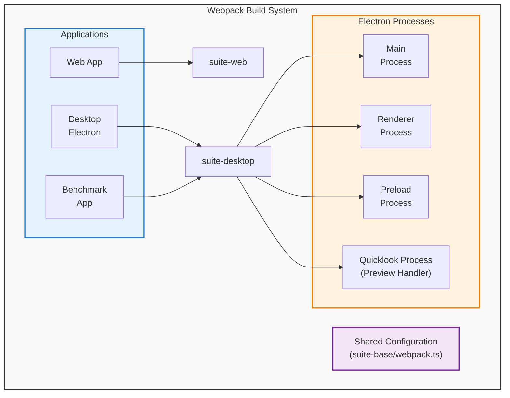
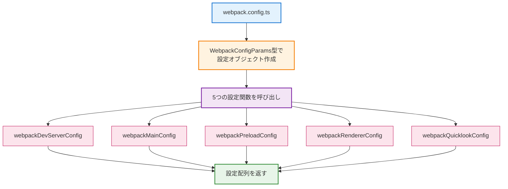

# Lichtblick Webpack ビルドプロセス完全ガイド

このドキュメントは、LichtblickプロジェクトにおけるWebpackのビルドプロセスの詳細な流れを解説します。複数の環境（Web、Desktop）に対応した構成について、エントリーポイントからビルド出力までの全体像を示します。

## 目次

1. [アーキテクチャ概要](#アーキテクチャ概要)
2. [設定フロー](#設定フロー)
3. [環境別ビルド設定](#環境別ビルド設定)
4. [ビルドプロセスの詳細](#ビルドプロセスの詳細)
5. [プラグイン・ローダーの役割](#プラグインローダーの役割)
6. [ビルド最適化](#ビルド最適化)
7. [トラブルシューティング](#トラブルシューティング)

## アーキテクチャ概要

### マルチターゲット構成

Lichtblickは複数のターゲット環境に対応しています。



## 設定フロー

### 1. エントリーポイント

Webpackのビルド設定は各プロジェクトルートの`webpack.config.ts`から開始します。

#### Web版: `/web/webpack.config.ts`

```typescript
import { devServerConfig, mainConfig } from "@lichtblick/suite-web/src/webpackConfigs";

const params: ConfigParams = {
  outputPath: path.resolve(__dirname, ".webpack"),
  contextPath: path.resolve(__dirname, "src"),
  entrypoint: "./entrypoint.tsx",
  prodSourceMap: "source-map",
  version: packageJson.version,
};

export default [devServerConfig(params), mainConfig(params)];
```

**流れ:**



```mermaid
flowchart TD
    A[webpack.config.ts] --> B[ConfigParams型で<br/>設定オブジェクト作成]
    B --> C[devServerConfig&#40;&#41; + mainConfig&#40;&#41;<br/>の組み合わせ]
    C --> D[Webpack設定配列を返す]

    style A fill:#e3f2fd,stroke:#1976d2,stroke-width:2px
    style B fill:#fff3e0,stroke:#f57c00,stroke-width:2px
    style C fill:#f3e5f5,stroke:#7b1fa2,stroke-width:2px
    style D fill:#e8f5e9,stroke:#388e3c,stroke-width:2px
```

#### Desktop版: `/desktop/webpack.config.ts`

```typescript
import { WebpackConfigParams } from "@lichtblick/suite-desktop/src/WebpackConfigParams";
import { webpackDevServerConfig } from "@lichtblick/suite-desktop/src/webpackDevServerConfig";
import { webpackMainConfig } from "@lichtblick/suite-desktop/src/webpackMainConfig";
import { webpackPreloadConfig } from "@lichtblick/suite-desktop/src/webpackPreloadConfig";
import { webpackQuicklookConfig } from "@lichtblick/suite-desktop/src/webpackQuicklookConfig";
import { webpackRendererConfig } from "@lichtblick/suite-desktop/src/webpackRendererConfig";

const params: WebpackConfigParams = {
  packageJson,
  outputPath: path.resolve(__dirname, ".webpack"),
  rendererContext: path.resolve(__dirname, "renderer"),
  rendererEntrypoint: "./index.ts",
  mainContext: path.resolve(__dirname, "main"),
  mainEntrypoint: "./index.ts",
  preloadContext: path.resolve(__dirname, "preload"),
  preloadEntrypoint: "./index.ts",
  quicklookContext: path.resolve(__dirname, "quicklook"),
  quicklookEntrypoint: "./index.ts",
};

export default [
  webpackDevServerConfig(params),
  webpackMainConfig(params),
  webpackPreloadConfig(params),
  webpackRendererConfig(params),
  webpackQuicklookConfig(params),
];
```

**流れ:**



### 2. WebpackConfigParams の構造

```typescript
export type WebpackConfigParams = {
  packageJson: {
    productName: string;
    name: string;
    version: string;
    description: string;
    productDescription: string;
    license: string;
    author: { name: string; email: string };
    homepage: string;
  };

  // Renderer プロセス用
  rendererContext: string; // ソースディレクトリ
  rendererEntrypoint: string; // エントリーファイル

  // Main プロセス用
  mainContext: string;
  mainEntrypoint: string;

  // Quicklook 用
  quicklookContext: string;
  quicklookEntrypoint: string;

  // Preload 用
  preloadContext: string;
  preloadEntrypoint: string;

  outputPath: string; // ビルド出力ディレクトリ
  prodSourceMap: string | false; // プロダクションSourceMap設定
};
```

### 3. 設定関数の高階関数パターン

すべての設定関数は、**高階関数パターン** を使用しています。

```typescript
export const webpackMainConfig =
  (params: WebpackConfigParams) =>
  (_: unknown, argv: WebpackArgv): Configuration => {
    // 設定を返す
  };
```

**理由:**

- 第1引数: `params` - 静的な設定情報
- 第2引数: `argv` - Webpack CLI引数（`--mode`, `--env`など）
- 戻り値: Webpack Configuration オブジェクト

このパターンにより、同じパラメータで複数の異なるビルド設定を生成できます。

## 環境別ビルド設定

### Desktop 版の5つのビルド設定

#### 1. DevServer 設定

**ファイル:** `packages/suite-desktop/src/webpackDevServerConfig.ts`

**目的:** Electron開発サーバー用の設定

```typescript
export const webpackDevServerConfig =
  (params: WebpackConfigParams) =>
  (_: unknown, argv: WebpackArgv): Configuration => {
    const isRelease = argv.mode === "production";
    const productName = isRelease
      ? params.packageJson.productName
      : `${params.packageJson.productName} Dev`;

    return {
      entry: {}, // 空（他の設定に委譲）
      output: {
        publicPath: "",
        path: params.outputPath,
      },
      devServer: {
        static: { directory: params.outputPath },
        devMiddleware: {
          writeToDisk: (filePath) => {
            // mainおよびextensionsディレクトリをディスクに書き込み
            return /\.webpack[\\/]((main|extensions)[\\/](?!.*hot-update)|package\.json)/.test(
              filePath,
            );
          },
        },
        hot: true,
        allowedHosts: "all",
        headers: {
          "cross-origin-opener-policy": "same-origin",
          "cross-origin-embedder-policy": "credentialless",
        },
      },
      plugins: [new CleanWebpackPlugin()],
    };
  };
```

**重要なポイント:**

- 開発サーバーのみの設定（通常のビルド対象ではない）
- `writeToDisk` オプション: Electronが必要とするファイルのみディスクに書き込み
- CORS設定: クロスオリジン分離を有効化
- ホットリロード有効

#### 2. Main プロセス設定

**ファイル:** `packages/suite-desktop/src/webpackMainConfig.ts`

**目的:** Electronメインプロセスのビルド

```typescript
export const webpackMainConfig =
  (params: WebpackConfigParams) =>
  (_: unknown, argv: WebpackArgv): Configuration => {
    const isServe = argv.env?.WEBPACK_SERVE ?? false;
    const isDev = argv.mode === "development";

    // 開発サーバー vs ファイルシステム
    const rendererEntry = isServe
      ? `"http://${argv.host ?? "localhost"}:8080/renderer/index.html"`
      : "`file://${require('path').join(__dirname, '..', 'renderer', 'index.html')}`";

    return {
      context: params.mainContext,
      entry: params.mainEntrypoint,
      target: "electron-main",
      devtool: isDev ? "eval-cheap-module-source-map" : params.prodSourceMap,
      output: {
        publicPath: "",
        path: path.join(params.outputPath, "main"),
      },
      module: {
        rules: [
          {
            test: /\.tsx?$/,
            exclude: /node_modules/,
            use: {
              loader: "ts-loader",
              options: {
                transpileOnly: true,
                onlyCompileBundledFiles: true,
                projectReferences: true,
              },
            },
          },
        ],
      },
      plugins: [
        new DefinePlugin({
          MAIN_WINDOW_WEBPACK_ENTRY: rendererEntry,
          LICHTBLICK_SUITE_VERSION: JSON.stringify(params.packageJson.version),
          // 他の定義...
        }),
        new ForkTsCheckerWebpackPlugin(),
      ],
    };
  };
```

**重要な特徴:**

- `target: "electron-main"` - Electronメインプロセス用のビルド
- TypeScript型チェック: `ForkTsCheckerWebpackPlugin` で並行処理
- DefinePlugin: メインプロセスが参照する定数を注入

#### 3. Renderer プロセス設定

**ファイル:** `packages/suite-desktop/src/webpackRendererConfig.ts`

**目的:** Electronレンダラープロセスのビルド

```typescript
export const webpackRendererConfig =
  (params: WebpackConfigParams) =>
  (env: unknown, argv: WebpackArgv): Configuration => {
    const isDev = argv.mode === "development";
    const isServe = argv.env?.WEBPACK_SERVE ?? false;
    const allowUnusedVariables = isDev;

    const appWebpackConfig = makeConfig(env, argv, {
      allowUnusedVariables,
      version: params.packageJson.version,
    });

    return {
      ...appWebpackConfig,
      target: "web", // ブラウザ環境として扱う
      context: params.rendererContext,
      entry: params.rendererEntrypoint,
      output: {
        publicPath: isServe ? "/renderer/" : "",
        path: path.join(params.outputPath, "renderer"),
      },
      plugins: [
        new ReactRefreshPlugin(), // HMR対応
        new HtmlWebpackPlugin({
          // HTML生成
        }),
      ],
    };
  };
```

**重要な特徴:**

- `target: "web"` - ブラウザ環境として扱う
- `makeConfig()` で共通設定を継承
- React Fast Refresh対応
- HTMLテンプレート自動生成

#### 4. Preload スクリプト設定

**ファイル:** `packages/suite-desktop/src/webpackPreloadConfig.ts`

**目的:** Electron Preload スクリプトのビルド

```typescript
export const webpackPreloadConfig =
  (params: WebpackConfigParams) =>
  (_: unknown, argv: WebpackArgv): Configuration => {
    const isDev = argv.mode === "development";

    return {
      context: params.preloadContext,
      entry: params.preloadEntrypoint,
      target: "electron-preload", // 特別なターゲット
      devtool: isDev ? "eval-cheap-module-source-map" : params.prodSourceMap,
      output: {
        publicPath: "",
        filename: "preload.js",
        path: path.join(params.outputPath, "main"), // mainディレクトリに出力
      },
      plugins: [
        new DefinePlugin({
          API_URL: process.env.API_URL ? JSON.stringify(process.env.API_URL) : undefined,
          DEV_WORKSPACE: process.env.DEV_WORKSPACE
            ? JSON.stringify(process.env.DEV_WORKSPACE)
            : undefined,
        }),
        new ForkTsCheckerWebpackPlugin(),
      ],
    };
  };
```

**重要な特徴:**

- `target: "electron-preload"` - Preload専用ターゲット
- 出力ファイル: `preload.js`
- メインプロセスと同じディレクトリに出力される

#### 5. Quicklook 設定

**ファイル:** `packages/suite-desktop/src/webpackQuicklookConfig.ts`

**目的:** macOS Quick Look プレビュー拡張機能

```typescript
export const webpackQuicklookConfig =
  (params: WebpackConfigParams) =>
  (_env: unknown, argv: WebpackArgv): Configuration => {
    const isDev = argv.mode === "development";
    const isServe = argv.env?.WEBPACK_SERVE ?? false;

    return {
      name: "quicklook",
      context: params.quicklookContext,
      entry: params.quicklookEntrypoint,
      target: "web",
      output: {
        publicPath: isServe ? "/quicklook/" : "",
        path: path.join(params.outputPath, "quicklook"),
      },
      // 他の設定...
    };
  };
```

## ビルドプロセスの詳細

### 実行フロー図

```mermaid
flowchart TD
    Start["npm run build コマンド実行"] --> Load["webpack.config.ts ロード<br/>(設定オブジェクト生成)"]
    Load --> Execute["各設定関数を実行<br/>(高階関数パターン)"]
    Execute --> Config["5つのWebpack設定オブジェクトを取得"]

    subgraph Configs["設定オブジェクト"]
        Config1["1. DevServer"]
        Config2["2. Main Process"]
        Config3["3. Renderer Process"]
        Config4["4. Preload Script"]
        Config5["5. Quicklook"]
    end

    Config --> Configs
    Configs --> Dotenv["dotenv.config&#40;&#41; 実行<br/>環境変数読み込み"]
    Dotenv --> BuildStart["各設定ごとにビルド実行"]

    BuildStart --> MainProc["Main<br/>Process"]
    BuildStart --> RenderProc["Renderer<br/>Process"]
    BuildStart --> PreloadScript["Preload<br/>Script"]
    BuildStart --> QuickLook["Quick<br/>Look"]
    BuildStart --> DevServer["DevServer<br/>Config"]
    BuildStart --> ThemeConfig["Theme<br/>Config"]

    MainProc --> Parallel["各ビルドを並行処理<br/>(設定配列のため)"]
    RenderProc --> Parallel
    PreloadScript --> Parallel
    QuickLook --> Parallel
    DevServer --> Parallel
    ThemeConfig --> Parallel

    Parallel --> Out1[".webpack/main/"]
    Parallel --> Out2[".webpack/renderer/"]
    Parallel --> Out3[".webpack/extensions/"]
    Parallel --> Out4[".webpack/quicklook/"]
    Parallel --> Out5[".webpack/preload.js"]

    Out1 --> Complete["ビルド完了<br/>出力ファイル整理"]
    Out2 --> Complete
    Out3 --> Complete
    Out4 --> Complete
    Out5 --> Complete

    style Start fill:#e3f2fd,stroke:#1976d2,stroke-width:3px
    style Load fill:#fff3e0,stroke:#f57c00,stroke-width:2px
    style Execute fill:#f3e5f5,stroke:#7b1fa2,stroke-width:2px
    style Config fill:#e1f5fe,stroke:#0277bd,stroke-width:2px
    style Configs fill:#f1f8e9,stroke:#558b2f,stroke-width:2px
    style Dotenv fill:#fce4ec,stroke:#c2185b,stroke-width:2px
    style BuildStart fill:#fff9c4,stroke:#f57f17,stroke-width:2px
    style Parallel fill:#e0f2f1,stroke:#00695c,stroke-width:2px
    style Complete fill:#e8f5e9,stroke:#388e3c,stroke-width:3px
```



### 各ステップの詳細

#### ステップ 1: dotenv 設定読み込み

```typescript
// packages/suite-base/webpack.ts
import dotenv from "dotenv";
dotenv.config({ path: path.resolve(__dirname, "../../.env") });
```

**処理内容:**

1. プロジェクトルートの `.env` ファイルを読み込む
2. ファイル内の環境変数を `process.env` に登録
3. ファイルが存在しなくてもエラーにならない

**設定される環境変数の例:**

```
API_URL=https://api.example.com
DEV_WORKSPACE=/path/to/dev/workspace
NODE_ENV=development
```

#### ステップ 2: DefinePlugin で環境変数をコードに埋め込み

```typescript
new webpack.DefinePlugin({
  LICHTBLICK_SUITE_VERSION: JSON.stringify(version),
  API_URL: JSON.stringify(process.env.API_URL),
  DEV_WORKSPACE: JSON.stringify(process.env.DEV_WORKSPACE),
}),
```

**変換例:**

```typescript
// ビルド前
const apiUrl = API_URL;
console.log(DEV_WORKSPACE);

// ビルド後（minify後）
const apiUrl = "https://api.example.com";
console.log("/path/to/dev/workspace");
```

#### ステップ 3: ローダーの実行

各ファイルタイプごとにローダーが実行されます。

```typescript
module: {
  rules: [
    // TypeScript/TSX ファイル
    {
      test: /\.tsx?$/,
      exclude: /node_modules/,
      use: {
        loader: "ts-loader",
        options: {
          transpileOnly: true,
        },
      },
    },
    // CSS ファイル
    {
      test: /\.css$/,
      use: ["style-loader", "css-loader", "esbuild-loader"],
    },
    // SVG ファイル
    {
      test: /\.svg$/,
      loader: "@svgr/webpack",
    },
    // 画像ファイル
    {
      test: /\.(png|jpg|gif)$/i,
      type: "asset",
    },
    // WebAssembly
    {
      test: /\.wasm$/,
      type: "asset/resource",
    },
  ],
}
```

#### ステップ 4: プラグインの実行

```typescript
plugins: [
  // グローバル変数を自動注入
  new webpack.ProvidePlugin({
    React: "react",
    Buffer: ["buffer", "Buffer"],
    process: ["@lichtblick/suite-base/util/process", "default"],
  }),

  // 環境変数をコードに埋め込み
  new webpack.DefinePlugin({
    API_URL: JSON.stringify(process.env.API_URL),
  }),

  // 型チェック（並行処理）
  new ForkTsCheckerWebpackPlugin(),

  // HTML ファイル生成
  new HtmlWebpackPlugin(),

  // ミニファイ
  new ESBuildMinifyPlugin(),
];
```

#### ステップ 5: 出力最適化

```typescript
optimization: {
  removeAvailableModules: true,
  minimizer: [
    new ESBuildMinifyPlugin({
      target: "es2022",
      minify: true,
    }),
  ],
}
```

## プラグイン・ローダーの役割

### 重要なプラグイン

| プラグイン                     | 目的                         | 設定箇所                 |
| ------------------------------ | ---------------------------- | ------------------------ |
| **DefinePlugin**               | 環境変数をコードに埋め込む   | suite-base/webpack.ts    |
| **ProvidePlugin**              | グローバル変数を注入         | suite-base/webpack.ts    |
| **ForkTsCheckerWebpackPlugin** | TypeScript型チェック（並行） | 各設定ファイル           |
| **HtmlWebpackPlugin**          | HTML自動生成                 | webpackRendererConfig.ts |
| **ReactRefreshPlugin**         | Hot Module Reload対応        | webpackRendererConfig.ts |
| **MonacoWebpackPlugin**        | Monaco Editor バンドル       | suite-base/webpack.ts    |
| **IgnorePlugin**               | 特定モジュール除外           | suite-base/webpack.ts    |

### 重要なローダー

| ローダー                  | 対象         | 役割                           |
| ------------------------- | ------------ | ------------------------------ |
| **ts-loader**             | .ts/.tsx     | TypeScript → JavaScript        |
| **style-loader**          | .css         | CSS をDOM に注入               |
| **css-loader**            | .css         | CSS をモジュール化             |
| **@svgr/webpack**         | .svg         | SVG → React コンポーネント     |
| **esbuild-loader**        | .ts/.css     | 高速トランスパイル・ミニファイ |
| **string-replace-loader** | node_modules | ブラウザ非対応コード削除       |

### 環境変数注入の仕組み

```typescript
// suite-base/webpack.ts
function buildEnvVars(): Record<string, string | undefined> {
  return {
    "process.env.DEV_WORKSPACE": JSON.stringify(process.env.DEV_WORKSPACE),
  };
}

new webpack.DefinePlugin({
  API_URL: JSON.stringify(process.env.API_URL),
  LICHTBLICK_SUITE_VERSION: JSON.stringify(version),
  ...buildEnvVars(),
}),
```

**注入される定数（型定義）:**

```typescript
// packages/suite-base/src/typings/webpack-defines.d.ts
declare const API_URL: string | undefined;
declare const LICHTBLICK_SUITE_VERSION: string | undefined;
declare const DEV_WORKSPACE: string | undefined;
```

## ビルド最適化

### 1. Code Splitting

```typescript
// 自動的に実行される
optimization: {
  removeAvailableModules: true,
}
```

### 2. ミニファイ

```typescript
minimizer: [
  new ESBuildMinifyPlugin({
    target: "es2022", // ES2022 対応ブラウザを前提
    minify: true,
  }),
];
```

### 3. Tree Shaking

```typescript
// package.json で sideEffects を明示
{
  "sideEffects": [
    "**/*.css",  // CSSは副作用がある
    "**/*.wasm",
  ]
}
```

### 4. キャッシュバスティング

```typescript
output: {
  // コンテンツハッシュを含めることで、変更時のみ再ダウンロード
  filename: isDev ? "[name].js" : "[name].[contenthash].js",
}
```

### 5. Source Map 設定

```typescript
// 開発環境: 高速ビルド、詳細なデバッグ情報
devtool: isDev ? "eval-cheap-module-source-map" : params.prodSourceMap,

// 本番環境: source-map または false
prodSourceMap: "source-map" // web/webpack.config.ts
prodSourceMap: "source-map" // desktop/webpack.config.ts
```

## トラブルシューティング

### 問題 1: 環境変数が undefined

**症状:** `API_URL` が `undefined`

**原因:**

1. `.env` ファイルが存在しない
2. dotenv.config() が実行されていない
3. 環境変数名が間違っている

**解決方法:**

```bash
# .env ファイルの確認
cat .env

# 環境変数の確認
echo $API_URL

# 存在しない場合は作成
echo "API_URL=https://api.example.com" > .env
```

### 問題 2: ビルドが遅い

**原因:**

1. ts-loader で TypeScript 型チェック実行中
2. ForkTsCheckerWebpackPlugin が処理中

**解決方法:**

```typescript
// ts-loader オプション調整
use: {
  loader: "ts-loader",
  options: {
    transpileOnly: true,  // 型チェックスキップ（ForkTsCheckerで代わり）
    onlyCompileBundledFiles: true,  // バンドル対象のみコンパイル
  },
}
```

### 問題 3: Hot Reload が機能しない

**原因:** 開発サーバー設定ミス

**確認:**

```typescript
// webpack.config.ts で WEBPACK_SERVE 環境変数をチェック
const isServe = argv.env?.WEBPACK_SERVE ?? false;
```

```bash
# 開発サーバーで実行
webpack serve --mode development
```

### 問題 4: Renderer プロセスが起動しない

**原因:** `MAIN_WINDOW_WEBPACK_ENTRY` が正しく設定されていない

**確認:**

```typescript
// Main プロセス設定
const rendererEntry = isServe
  ? `"http://localhost:8080/renderer/index.html"`  // 開発時
  : "`file://${...}`";  // 本番時

new DefinePlugin({
  MAIN_WINDOW_WEBPACK_ENTRY: rendererEntry,
}),
```

### 問題 5: TypeScript エラーが出ないのに実行時エラー

**原因:** `ForkTsCheckerWebpackPlugin` の設定ミス

**解決:**

```typescript
new ForkTsCheckerWebpackPlugin({
  typescript: {
    configFile: tsconfigPath,  // tsconfig.json の指定
    configOverwrite: {
      compilerOptions: {
        noUnusedLocals: !allowUnusedVariables,
        noUnusedParameters: !allowUnusedVariables,
      },
    },
  },
}),
```

## コマンドリファレンス

```bash
# 開発環境（ホットリロード有効）
npm run dev

# 本番ビルド
npm run build

# 本番ビルド + 起動
npm run start

# 開発サーバーのみ起動
webpack serve --mode development

# ビルド実行
webpack --mode production

# ビルド確認（ファイルサイズ分析）
npm run analyze
```

## パフォーマンス改善チェックリスト

- [ ] `transpileOnly: true` で ts-loader を設定
- [ ] `onlyCompileBundledFiles: true` で不要なコンパイル回避
- [ ] `ForkTsCheckerWebpackPlugin` で型チェックを並行処理
- [ ] Source Map は必要な場合のみ生成
- [ ] 本番環境では `devtool: false` を検討
- [ ] キャッシュバスティング（contenthash）を使用
- [ ] 不要な dependencies を削除

## 関連ドキュメント

- [環境変数設定](./ENVIRONMENT_VARIABLES.md)
- [Webpack 公式ドキュメント](https://webpack.js.org/)
- [Electron ビルドガイド](https://www.electronjs.org/docs/latest/tutorial/using-preload-scripts)
