# Lichtblick データフロー設計（逆生成）

## 分析日時
2025年7月31日

## システム概要

Lichtblickは、ロボティクスデータの可視化・分析のためのリアルタイムデータ処理パイプラインを実装しています。メッセージパイプライン、プレイヤー抽象化、購読システムを中心とした効率的なデータフローを実現しています。

## 主要データフローパターン

### 1. データ読み込みフロー

```mermaid
flowchart TD
    A[ユーザー: ファイル選択/接続開始] --> B[DataSourceDialog]
    B --> C[IDataSourceFactory選択]
    C --> D[Factory.initialize()]
    D --> E[Player生成]
    E --> F[MessagePipeline登録]
    F --> G[PlayerManager.setActivePlayer()]
    G --> H[コンポーネント更新通知]
    H --> I[UI状態更新]
```

**実装詳細:**
```typescript
// DataSourceFactory による Player 生成
export class McapLocalDataSourceFactory implements IDataSourceFactory {
  initialize(args: DataSourceFactoryInitializeArgs): Player | undefined {
    const { file, metricsCollector } = args;
    return new IterablePlayer({
      metricsCollector,
      source: new McapIndexedIterableSource({ file }),
    });
  }
}
```

### 2. メッセージパイプラインフロー

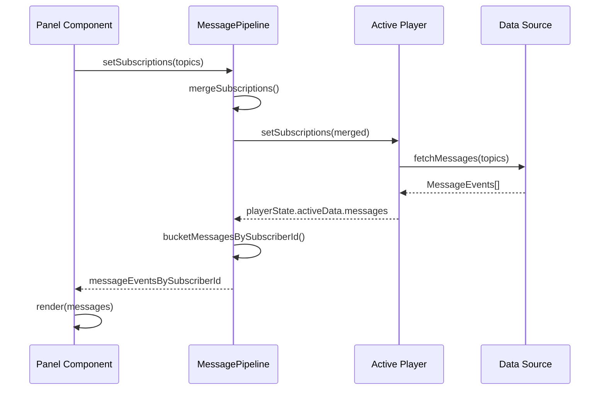

**実装詳細:**
```typescript
// MessagePipeline の購読管理
export function updateSubscriberAction(
  prevState: MessagePipelineInternalState,
  action: UpdateSubscriberAction,
): MessagePipelineInternalState {
  const subscriptionsById = new Map(prevState.subscriptionsById);
  subscriptionsById.set(action.id, action.payloads);

  // トピック別購読者IDマップの更新
  const subscriberIdsByTopic = new Map<string, string[]>();
  for (const [id, subs] of subscriptionsById) {
    for (const subscription of subs) {
      const ids = subscriberIdsByTopic.get(subscription.topic) ?? [];
      if (!ids.includes(id)) {
        ids.push(id);
      }
      subscriberIdsByTopic.set(subscription.topic, ids);
    }
  }

  return { ...prevState, subscriptionsById, subscriberIdsByTopic };
}
```

### 3. パネル購読フロー

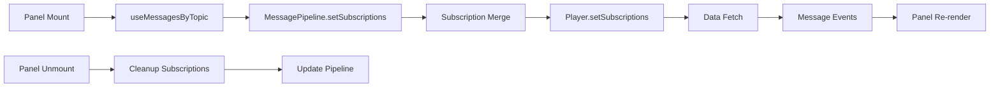

**実装詳細:**
```typescript
// Panel での購読システム
export function useMessagesByTopic(
  topics: readonly string[],
): MessagesByTopic {
  const subscribeId = useRef<string>();
  const messagePipeline = useMessagePipeline();

  useLayoutEffect(() => {
    const id = subscribeId.current ?? uuid();
    subscribeId.current = id;

    const subscriptions: SubscribePayload[] = topics.map(topic => ({ topic }));
    messagePipeline.setSubscriptions(id, subscriptions);

    return () => {
      messagePipeline.setSubscriptions(id, []);
    };
  }, [topics, messagePipeline]);

  return messagePipeline.messageEventsBySubscriberId.get(subscribeId.current!) ?? [];
}
```

## 状態管理フロー

### 1. Zustandベース状態管理（Workspace）

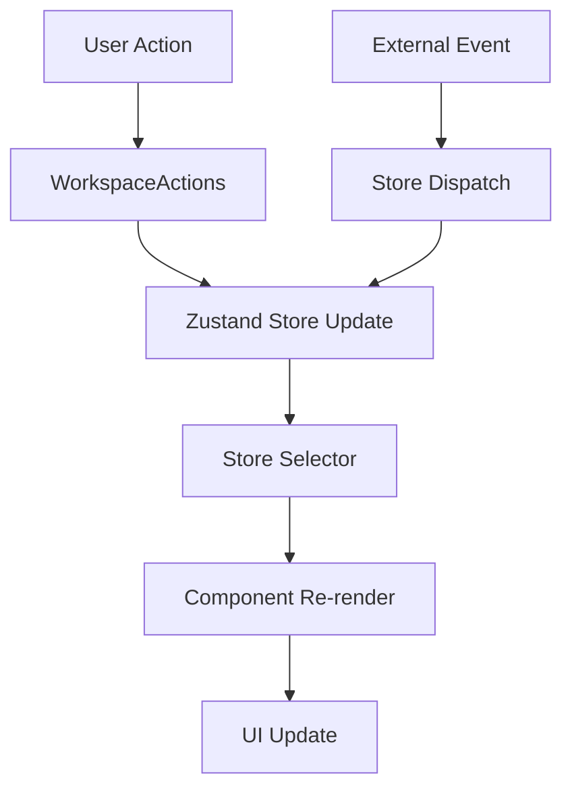

**実装詳細:**
```typescript
// Workspace状態管理
export type WorkspaceContextStore = {
  dialogs: {
    dataSource: {
      activeDataSource: undefined | IDataSourceFactory;
      item: undefined | DataSourceDialogItem;
      open: boolean;
    };
  };
  sidebars: {
    left: { item: undefined | LeftSidebarItemKey; open: boolean; size: undefined | number; };
    right: { item: undefined | RightSidebarItemKey; open: boolean; size: undefined | number; };
  };
};

// セレクター使用例
const leftSidebarOpen = useWorkspaceStore((store) => store.sidebars.left.open);
```

### 2. React Context フロー

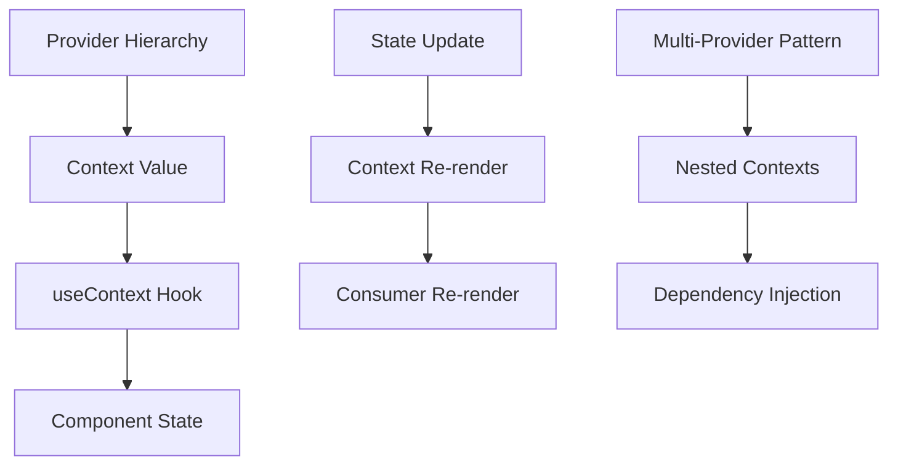

**実装詳細:**
```typescript
// MultiProvider パターン
const providers = [
  <TimelineInteractionStateProvider />,
  <UserScriptStateProvider />,
  <ExtensionMarketplaceProvider />,
  <ExtensionCatalogProvider loaders={extensionLoaders} />,
  <PlayerManager playerSources={dataSources} />,
  <EventsProvider />,
];

return (
  <MultiProvider providers={providers}>
    <Workspace />
  </MultiProvider>
);
```

### 3. Layout管理フロー

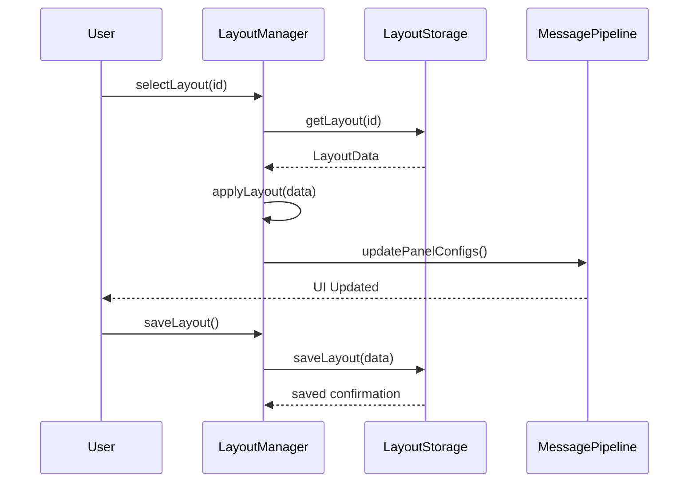

## プレイバック制御フロー

### 1. 時間同期システム

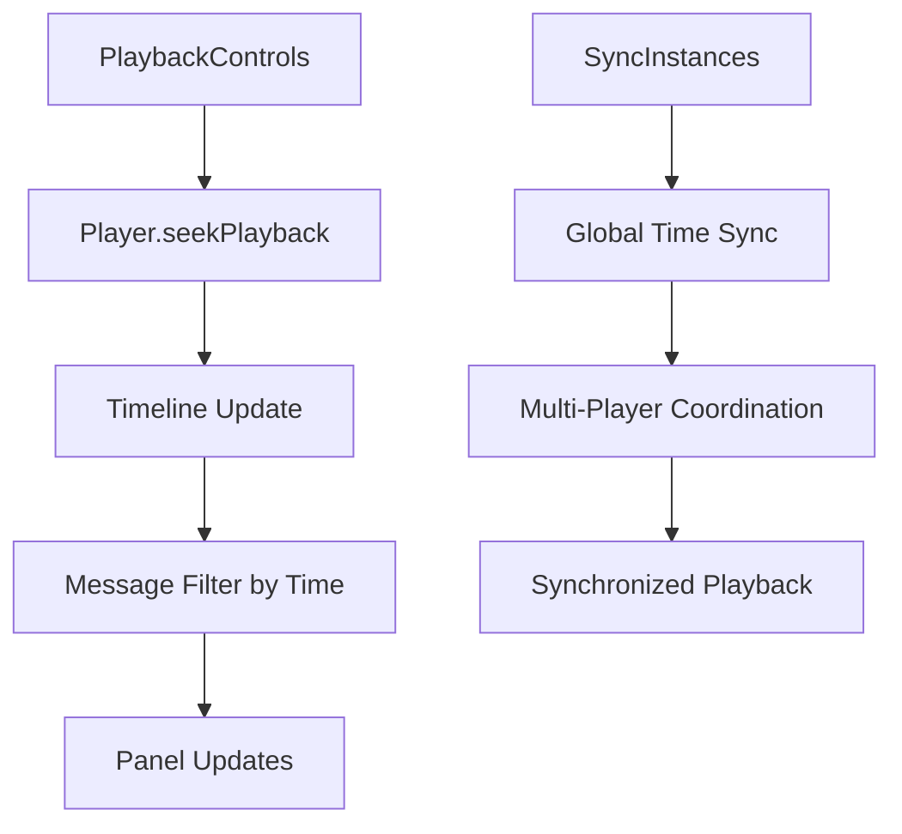

**実装詳細:**
```typescript
// プレイバック制御
export interface Player {
  startPlayback?(): void;
  pausePlayback?(): void;
  seekPlayback?(time: Time): void;
  playUntil?(time: Time): void;
  setPlaybackSpeed?(speedFraction: number): void;
}

// 時間同期
const timeline = useTimelineInteractionState();
const seekPlayback = useMessagePipeline(selectSeekPlayback);

const handleSeek = useCallback((time: number) => {
  seekPlayback?.(fromNanoSec(BigInt(time)));
  timeline.actions.setPlaybackTime(time);
}, [seekPlayback, timeline.actions]);
```

### 2. プログレストラッキング

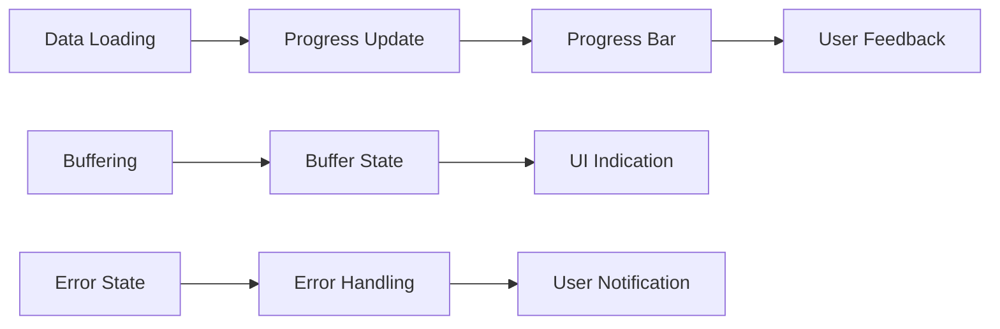

## 拡張機能フロー

### 1. パネル拡張読み込み

```mermaid
flowchart TD
    A[Extension File (.foxe)] --> B[ExtensionLoader]
    B --> C[Sandbox Environment]
    C --> D[Extension Context]
    D --> E[registerPanel()]
    E --> F[PanelCatalog Update]
    F --> G[Available in Add Panel]
    G --> H[User Creates Panel]
    H --> I[PanelExtensionAdapter]
    I --> J[Extension Execution]
```

**実装詳細:**
```typescript
// 拡張機能コンテキスト
export type ExtensionContext = {
  readonly mode: "production" | "development" | "test";
  registerPanel(params: ExtensionPanelRegistration): void;
  registerMessageConverter<Src>(args: RegisterMessageConverterArgs<Src>): void;
  registerTopicAliases(aliasFunction: TopicAliasFunction): void;
};

// パネル拡張アダプター
export function PanelExtensionAdapter({
  config,
  saveConfig,
  extensions
}: PanelExtensionAdapterProps) {
  const [context] = useState(() => createPanelExtensionContext({
    panelElement,
    initialState: config,
    layout: layoutActions,
  }));
}
```

### 2. メッセージコンバーター

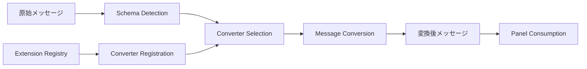

## エラーハンドリングフロー

### 1. エラーバウンダリシステム

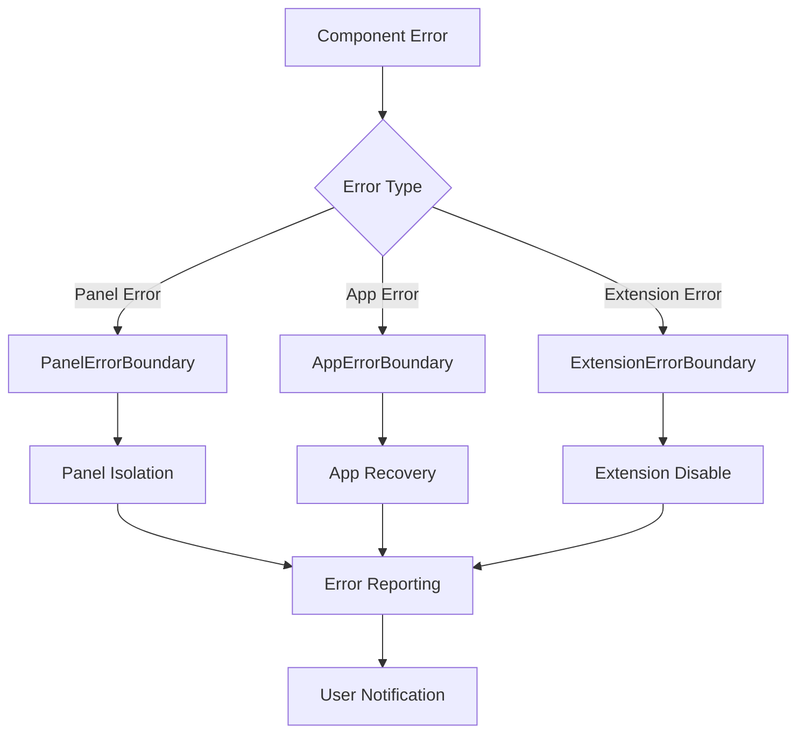

**実装詳細:**
```typescript
// エラーバウンダリ実装
export class PanelErrorBoundary extends Component<Props, State> {
  static getDerivedStateFromError(error: Error): State {
    return {
      hasError: true,
      error: error.message,
    };
  }

  componentDidCatch(error: Error, errorInfo: ErrorInfo) {
    reportError(`Panel error: ${error.message}`, error, errorInfo);
  }

  render() {
    if (this.state.hasError) {
      return <ErrorDisplay error={this.state.error} />;
    }
    return this.props.children;
  }
}
```

### 2. 非同期エラーハンドリング

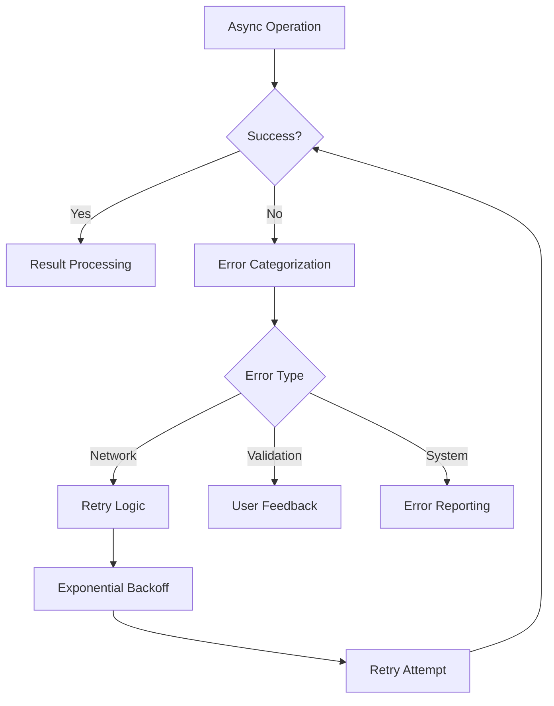

## パフォーマンス最適化フロー

### 1. メモリ管理

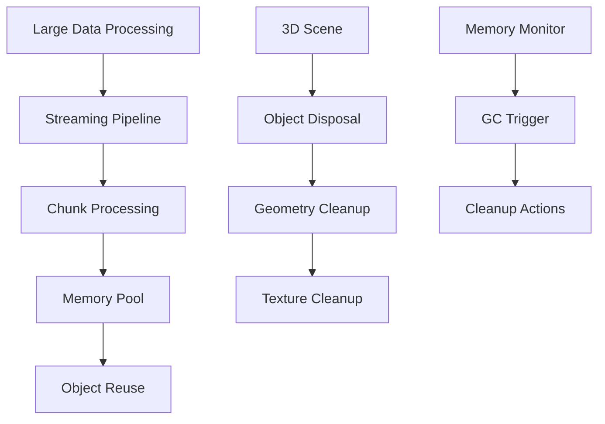

**実装詳細:**
```typescript
// オブジェクトプール
export class ObjectPool<T> {
  private _available: T[] = [];
  private _create: () => T;
  private _dispose?: (obj: T) => void;

  acquire(): T {
    return this._available.pop() ?? this._create();
  }

  release(obj: T): void {
    this._dispose?.(obj);
    this._available.push(obj);
  }
}

// Three.js オブジェクト管理
export function disposeObject3D(obj: Object3D): void {
  obj.traverse((child) => {
    if (child instanceof Mesh) {
      child.geometry.dispose();
      if (child.material instanceof Material) {
        child.material.dispose();
      }
    }
  });
}
```

### 2. レンダリング最適化

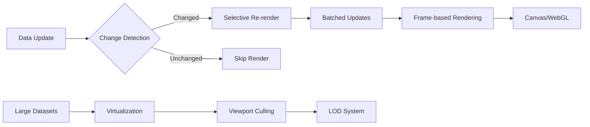

## WebWorker活用フロー

### 1. バックグラウンド処理

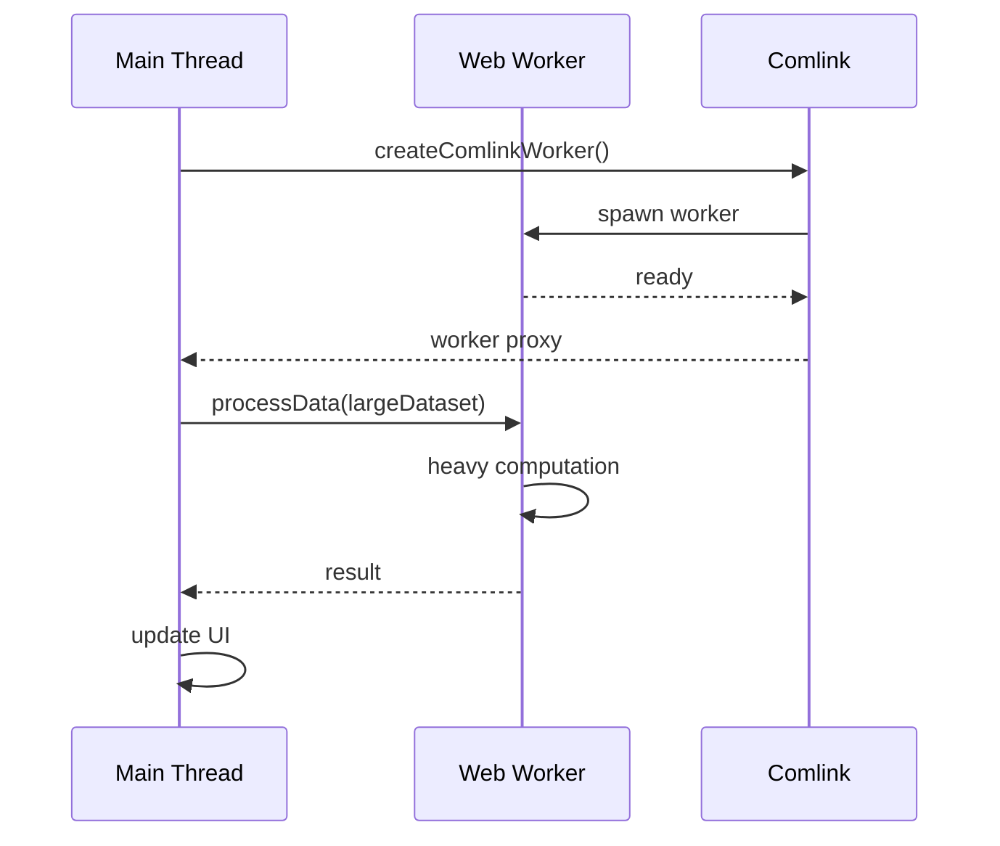

**実装詳細:**
```typescript
// Web Worker 管理
export class WebWorkerManager {
  private _workers = new Map<string, Worker>();

  createWorker(name: string, scriptUrl: string): Worker {
    if (this._workers.has(name)) {
      return this._workers.get(name)!;
    }

    const worker = new Worker(scriptUrl);
    this._workers.set(name, worker);
    return worker;
  }

  terminateWorker(name: string): void {
    const worker = this._workers.get(name);
    if (worker) {
      worker.terminate();
      this._workers.delete(name);
    }
  }
}
```

## 総括

### データフローの特徴

1. **効率的な購読システム**: トピック別購読者管理による無駄のないデータ配信
2. **リアルタイム処理**: メッセージパイプラインによる低遅延データフロー
3. **状態管理の分散**: Zustand + React Context による適切な状態分散
4. **エラー分離**: Error Boundary による障害影響範囲の限定
5. **パフォーマンス最適化**: Web Worker、Object Pool等による高速処理

### 改善推奨事項

1. **メッセージバッチング**: 大量メッセージの効率的処理
2. **キャッシュ戦略**: 計算結果の再利用による性能向上
3. **ストリーミング最適化**: 大容量ファイル処理の効率化
4. **メモリプロファイリング**: メモリリーク検出・対策の強化

Lichtblickのデータフロー設計は、**リアルタイム性、効率性、拡張性**を高次元でバランスした優れた実装です。特にロボティクスデータの特性（大容量、リアルタイム、多様性）に最適化された設計となっています。