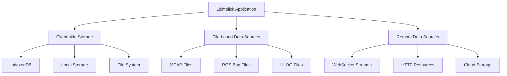

# Lichtblick データベース設計（逆生成）

## 分析日時
2025年7月31日

## データベース概要

Lichtblickは、従来的なリレーショナルデータベースを使用せず、**クライアントサイドストレージ**と**ファイルベースデータソース**を中心としたデータ管理アーキテクチャを採用しています。

### ストレージアーキテクチャ



## クライアントサイドストレージ

### 1. IndexedDB スキーマ

#### レイアウトストレージ
```typescript
// Layout Storage Schema
interface LayoutStorageSchema {
  layouts: {
    key: LayoutID;  // Primary Key: UUID string
    value: {
      id: LayoutID;
      name: string;
      data: LayoutData;
      createdAt: Date;
      updatedAt: Date;
      version: number;
    };
  };

  // レイアウト履歴
  layoutHistory: {
    key: string;  // layoutId + timestamp
    value: {
      layoutId: LayoutID;
      data: LayoutData;
      timestamp: Date;
      changeType: "create" | "update" | "delete";
    };
  };
}
```

#### 拡張機能ストレージ
```typescript
// Extension Storage Schema
interface ExtensionStorageSchema {
  extensions: {
    key: ExtensionNamespace; // Primary Key: namespace string
    value: {
      namespace: ExtensionNamespace;
      displayName: string;
      description: string;
      version: string;

      // 拡張機能バイナリデータ
      data: Uint8Array;

      // メタデータ
      manifest: ExtensionManifest;
      installDate: Date;
      enabled: boolean;
    };
  };

  // 拡張機能設定
  extensionSettings: {
    key: string; // namespace + settingKey
    value: {
      namespace: ExtensionNamespace;
      key: string;
      value: unknown;
      updatedAt: Date;
    };
  };
}
```

#### アプリケーション設定ストレージ
```typescript
// App Configuration Schema
interface AppConfigurationSchema {
  settings: {
    key: string; // Setting key
    value: {
      key: string;
      value: AppConfigurationValue; // string | number | boolean | undefined
      updatedAt: Date;
      source: "user" | "default" | "system";
    };
  };

  // 最近使用したファイル
  recentFiles: {
    key: string; // file path hash
    value: {
      path: string;
      name: string;
      type: DataSourceFactoryType;
      lastOpened: Date;
      size?: number;
      metadata?: Record<string, unknown>;
    };
  };
}
```

### 2. LocalStorage スキーマ

#### セッション状態
```typescript
// LocalStorage Keys and Types
interface LocalStorageSchema {
  // ワークスペース状態
  "lichtblick.workspace.state": WorkspaceContextStore;

  // レイアウト選択状態
  "lichtblick.layout.selected": {
    layoutId: LayoutID;
    timestamp: Date;
  };

  // ユーザー設定
  "lichtblick.user.preferences": {
    theme: "light" | "dark" | "system";
    language: string;
    debugMode: boolean;
    telemetryEnabled: boolean;
  };

  // セッション復元データ
  "lichtblick.session.restore": {
    activeDataSource?: {
      factoryId: string;
      params: Record<string, unknown>;
    };
    windowState?: {
      bounds: { width: number; height: number; x: number; y: number; };
      isMaximized: boolean;
    };
  };
}
```

## ファイルベースデータソース

### 1. MCAP ファイル構造

```
MCAP File Structure:
┌─────────────────┐
│ Magic Header    │ ← "MCAP0\0"
├─────────────────┤
│ Schema Records  │ ← Message schema definitions
├─────────────────┤
│ Channel Records │ ← Topic metadata
├─────────────────┤
│ Message Records │ ← Actual message data
├─────────────────┤
│ Attachment Recs │ ← Additional files (optional)
├─────────────────┤
│ Metadata Recs   │ ← File metadata (optional)
├─────────────────┤
│ Data End        │ ← End marker
├─────────────────┤
│ Summary Section │ ← Index data
├─────────────────┤
│ Summary Offset  │ ← Pointer to summary
├─────────────────┤
│ Magic Footer    │ ← "MCAP0\0"
└─────────────────┘
```

#### MCAP データアクセスパターン

```typescript
// MCAP Index-based Access
interface McapIndexStructure {
  // チャネル情報
  channels: Map<number, {
    id: number;
    topic: string;
    messageEncoding: string;
    metadata: Record<string, string>;
    schemaId: number;
  }>;

  // スキーマ情報
  schemas: Map<number, {
    id: number;
    name: string;
    encoding: string;
    data: Uint8Array;
  }>;

  // メッセージインデックス
  messageIndex: {
    channelId: number;
    records: Array<{
      offset: bigint;
      timestamp: bigint;
      size: number;
    }>;
  }[];

  // 統計情報
  statistics: {
    messageCount: bigint;
    schemaCount: number;
    channelCount: number;
    startTime: bigint;
    endTime: bigint;
  };
}
```

### 2. ROS Bag ファイル構造

```
ROS Bag v2.0 Structure:
┌─────────────────┐
│ Bag Header      │ ← File metadata
├─────────────────┤
│ Connection Recs │ ← Topic connection info
├─────────────────┤
│ Message Data    │ ← Interleaved messages
│ (Chronological) │
├─────────────────┤
│ Index Data      │ ← Topic/time indices
├─────────────────┤
│ Connection Recs │ ← Repeated for verification
└─────────────────┘
```

#### ROSBag データアクセス

```typescript
// ROSBag Access Pattern
interface RosBagStructure {
  // 接続情報
  connections: Map<number, {
    conn: number;
    topic: string;
    type: string;
    md5sum: string;
    messageDefinition: string;
    callerId?: string;
  }>;

  // チャンクインデックス
  chunkIndex: Array<{
    startTime: Time;
    endTime: Time;
    fileOffset: number;
    messageCount: number;
    connections: Set<number>;
  }>;

  // メッセージインデックス
  messageIndex: Map<string, Array<{
    time: Time;
    offset: number;
  }>>;
}
```

## データアクセスパターン

### 1. 時系列データアクセス

```typescript
// Time-based Data Access
interface IterableSource {
  // 時間範囲でのメッセージ取得
  messageIterator(args: {
    topics?: Set<string>;
    start?: Time;
    end?: Time;
    consumptionType?: "full" | "partial";
  }): AsyncIterableIterator<MessageEvent>;

  // メタデータ取得
  getBackfillMessages(args: {
    topics: Set<string>;
    time: Time;
    abortSignal?: AbortSignal;
  }): Promise<MessageEvent[]>;
}
```

### 2. キャッシュ戦略

```typescript
// Multi-level Caching Strategy
interface CachingStrategy {
  // L1: Memory Cache (最近アクセスしたメッセージ)
  memoryCache: LRUCache<string, MessageEvent[]>;

  // L2: IndexedDB Cache (解析済みインデックス)
  indexCache: Map<string, ParsedFileIndex>;

  // L3: File System Cache (デスクトップのみ)
  fileCache?: Map<string, CachedFileMetadata>;
}

// LRU Cache Implementation
class VirtualLRUBuffer<T> {
  private _capacity: number;
  private _items: Map<string, T>;
  private _accessOrder: string[];

  get(key: string): T | undefined {
    const item = this._items.get(key);
    if (item) {
      this._updateAccessOrder(key);
    }
    return item;
  }

  set(key: string, value: T): void {
    if (this._items.size >= this._capacity && !this._items.has(key)) {
      const oldest = this._accessOrder.shift();
      if (oldest) {
        this._items.delete(oldest);
      }
    }

    this._items.set(key, value);
    this._updateAccessOrder(key);
  }
}
```

### 3. ストリーミングデータアクセス

```typescript
// WebSocket Data Stream
interface StreamingDataSource {
  // 接続管理
  connection: {
    url: string;
    readyState: WebSocket["readyState"];
    protocols: string[];
  };

  // 購読管理
  subscriptions: Map<string, {
    topic: string;
    type?: string;
    throttleRate?: number;
    queueLength?: number;
  }>;

  // メッセージバッファ
  messageBuffer: {
    capacity: number;
    messages: MessageEvent[];
    oldestTime?: Time;
    newestTime?: Time;
  };
}
```

## データ変換・処理パイプライン

### 1. スキーマパーサー

```typescript
// Schema Parser Architecture
interface SchemaParser {
  // Protobuf スキーマ解析
  parseProtobufSchema(data: Uint8Array): {
    types: Map<string, RosDatatype>;
    rootType: string;
  };

  // JSON スキーマ解析
  parseJsonSchema(schema: JsonSchema): {
    types: Map<string, RosDatatype>;
    rootType: string;
  };

  // FlatBuffer スキーマ解析
  parseFlatbufferSchema(data: Uint8Array): {
    types: Map<string, RosDatatype>;
    rootType: string;
  };
}
```

### 2. メッセージデシリアライゼーション

```typescript
// Message Deserialization Pipeline
interface MessageDeserializer {
  // バイナリデータからオブジェクトへの変換
  deserialize(args: {
    data: Uint8Array;
    schemaName: string;
    encoding: string; // "protobuf" | "ros1" | "cdr" | "json"
  }): unknown;

  // 型安全な変換
  deserializeTyped<T>(args: {
    data: Uint8Array;
    type: TypeDefinition<T>;
  }): T;
}
```

## パフォーマンス最適化

### 1. インデックス戦略

```sql
-- IndexedDB Index Definitions (概念的SQL表現)

-- レイアウト検索用インデックス
CREATE INDEX idx_layouts_name ON layouts(name);
CREATE INDEX idx_layouts_updated ON layouts(updatedAt);

-- 拡張機能検索用インデックス
CREATE INDEX idx_extensions_enabled ON extensions(enabled);
CREATE INDEX idx_extensions_install_date ON extensions(installDate);

-- 設定検索用インデックス
CREATE INDEX idx_settings_key ON settings(key);
CREATE INDEX idx_settings_updated ON settings(updatedAt);

-- ファイル履歴用インデックス
CREATE INDEX idx_recent_files_opened ON recentFiles(lastOpened);
CREATE INDEX idx_recent_files_type ON recentFiles(type);
```

### 2. データ圧縮・バッファリング

```typescript
// Data Compression and Buffering
interface DataOptimization {
  // 圧縮アルゴリズム対応
  compressionSupport: {
    lz4: boolean;
    zstd: boolean;
    brotli: boolean;
  };

  // バッファサイズ管理
  bufferConfig: {
    messageBufferSize: number; // bytes
    indexBufferSize: number;   // entries
    cacheRetentionTime: number; // ms
  };

  // 並列処理制御
  concurrencyConfig: {
    maxWorkerThreads: number;
    chunkSize: number;
    prefetchDistance: number;
  };
}
```

### 3. メモリ管理

```typescript
// Memory Management Strategy
interface MemoryManager {
  // オブジェクトプール
  objectPools: {
    messageEvents: ObjectPool<MessageEvent>;
    uint8Arrays: ObjectPool<Uint8Array>;
    geometries: ObjectPool<BufferGeometry>; // Three.js
  };

  // ガベージコレクション制御
  gcControl: {
    maxHeapSize: number;
    cleanupThreshold: number;
    forcedCleanupInterval: number;
  };

  // メモリ使用量監視
  monitoring: {
    currentUsage: number;
    peakUsage: number;
    alertThreshold: number;
  };
}
```

## データマイグレーション

### 1. レイアウトマイグレーション

```typescript
// Layout Data Migration
interface LayoutMigration {
  migrations: Array<{
    fromVersion: number;
    toVersion: number;
    migrate: (layout: LayoutData) => LayoutData;
  }>;
}

// 例: v1 → v2 マイグレーション
const migrationV1toV2 = {
  fromVersion: 1,
  toVersion: 2,
  migrate: (layout: LayoutDataV1): LayoutDataV2 => {
    return {
      ...layout,
      version: 2,
      // 新しいフィールドの追加
      globalVariables: layout.globalVariables ?? {},
      // 廃止フィールドの削除
      configById: migrateConfigs(layout.configById),
    };
  },
};
```

### 2. 設定マイグレーション

```typescript
// App Configuration Migration
const configMigrations = [
  {
    key: "display.theme",
    migration: (oldValue: string) => {
      // "dark" | "light" → "dark" | "light" | "system"
      return oldValue === "auto" ? "system" : oldValue;
    },
  },
  {
    key: "panels.3d.rendering",
    migration: (oldConfig: any) => {
      // レンダリング設定の構造変更
      return {
        quality: oldConfig.quality ?? "medium",
        antialiasing: oldConfig.antialiasing ?? true,
        shadows: oldConfig.enableShadows ?? false,
      };
    },
  },
];
```

## データセキュリティ・整合性

### 1. データ検証

```typescript
// Data Validation Layer
interface DataValidator {
  // レイアウトデータ検証
  validateLayout(layout: unknown): layout is LayoutData;

  // 設定値検証
  validateConfigValue(key: string, value: unknown): boolean;

  // ファイル整合性検証
  validateFile(file: File, expectedType: string): Promise<boolean>;

  // スキーマ検証
  validateSchema(data: unknown, schema: JsonSchema): boolean;
}
```

### 2. データ暗号化（将来実装）

```typescript
// Future: Data Encryption Support
interface DataEncryption {
  // レイアウト暗号化（将来）
  encryptLayout?(layout: LayoutData, key: CryptoKey): Promise<ArrayBuffer>;
  decryptLayout?(data: ArrayBuffer, key: CryptoKey): Promise<LayoutData>;

  // 設定暗号化（将来）
  encryptSettings?(settings: Record<string, unknown>): Promise<ArrayBuffer>;
  decryptSettings?(data: ArrayBuffer): Promise<Record<string, unknown>>;
}
```

## 総括

### データベース設計の特徴

1. **分散ストレージ**: 中央集権的DBではなく、クライアントサイド分散ストレージ
2. **ファイルベース**: 大容量データは専用ファイル形式（MCAP、ROSBag）で効率管理
3. **階層キャッシュ**: メモリ → IndexedDB → ファイルシステムの3層キャッシュ
4. **ストリーミング**: リアルタイムデータストリームとファイルデータの統合
5. **型安全性**: TypeScriptによる型安全なデータアクセス

### パフォーマンス特性

- **高速アクセス**: インデックス化による高速データアクセス
- **メモリ効率**: オブジェクトプールとLRUキャッシュによる効率的メモリ使用
- **並列処理**: Web Worker による並列データ処理
- **圧縮対応**: 複数圧縮形式対応による容量最適化

### 改善推奨事項

1. **インデックス最適化**: より詳細なアクセスパターン分析によるインデックス改善
2. **キャッシュ戦略**: 使用パターンに基づくキャッシュ戦略の最適化
3. **データ圧縮**: より効率的な圧縮アルゴリズムの採用
4. **セキュリティ**: データ暗号化とアクセス制御の強化

Lichtblickのデータベース設計は、**ロボティクスデータの特性**（大容量、リアルタイム、多様性）に最適化された革新的なアプローチです。従来のRDBMSでは対応困難な要件を、クライアントサイド技術とファイルベースアプローチで解決しています。