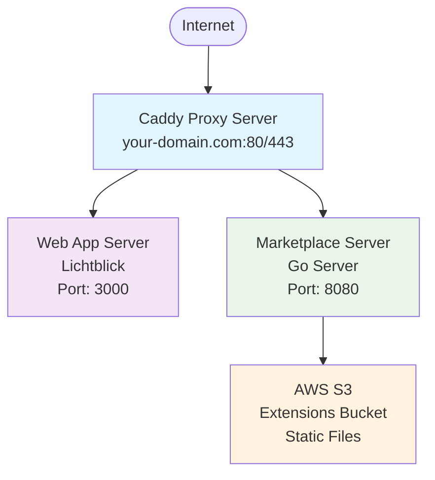
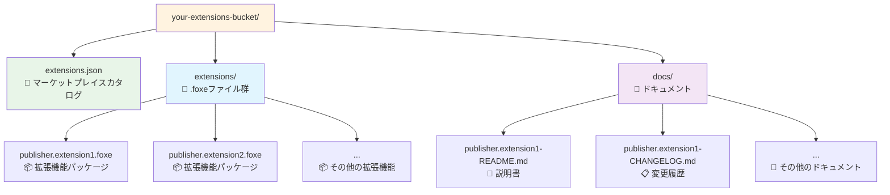
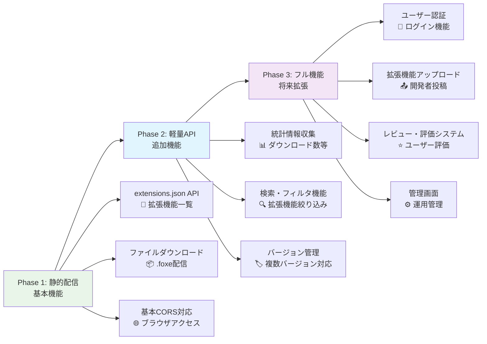

# Lichtblick拡張機能マーケットプレイス 要件・設計書

## 📋 要件定義

### 機能要件

#### 1. 基本機能

- **拡張機能一覧取得**: 利用可能な拡張機能のリストを提供
- **拡張機能詳細情報**: メタデータ、説明、バージョン情報の提供
- **ファイル配信**: `.foxe`ファイルのダウンロード機能
- **ドキュメント配信**: README、CHANGELOGファイルの提供
- **CORS対応**: ブラウザからのクロスオリジンアクセス対応

#### 2. セキュリティ要件

- **ファイル整合性**: SHA256ハッシュによる改ざん検証
- **HTTPS通信**: 全通信の暗号化
- **アクセス制御**: 必要に応じた認証・認可機能

#### 3. パフォーマンス要件

- **レスポンス時間**: API応答 < 500ms
- **キャッシュ戦略**: 適切なHTTPキャッシュヘッダー設定
- **CDN対応**: 大容量ファイルの高速配信

#### 4. 可用性要件

- **システム分離**: WebアプリとMarketplaceの独立稼働
- **メンテナンス継続**: WebAppメンテナンス中もMarketplace稼働
- **自動復旧**: サービス障害時の自動再起動

### 非機能要件

#### 1. 拡張性

- **段階的機能追加**: 静的配信→API→フル機能への移行対応
- **水平スケーリング**: 負荷増加時のスケールアウト対応
- **マルチバージョン**: 拡張機能の複数バージョン管理

#### 2. 運用性

- **低運用コスト**: 月額$15以下での運用
- **シンプル構成**: 最小限のAWSサービス使用
- **監視・ログ**: システム状態の可視化

---

## 🏗️ システム設計

### アーキテクチャ概要



### コンポーネント詳細

#### 1. Caddy Proxy Server

- **役割**: リバースプロキシ、ロードバランサー
- **機能**: 自動HTTPS、ヘルスチェック、メンテナンス対応
- **ポート**: 80 (HTTP), 443 (HTTPS)

#### 2. Web App Server

- **役割**: Lichtblickアプリケーション本体
- **技術**: React/Next.js/Vite
- **ポート**: 3000
- **メンテナンス**: 独立して停止・再起動可能

#### 3. Marketplace Server

- **役割**: 拡張機能API、ファイル配信制御
- **技術**: Go (推奨)
- **ポート**: 8080
- **特徴**: 常時稼働、軽量実装

#### 4. AWS S3

- **役割**: 拡張機能ファイルストレージ
- **構成**: シングルバケット
- **機能**: 署名付きURL、バージョニング

---

## 📊 データ仕様

### extensions.json 形式

```typescript
interface ExtensionMarketplaceDetail {
  // 基本情報
  id: string; // "publisher.extension-name"
  name: string; // "extension-name"
  displayName: string; // "Extension Display Name"
  description?: string; // "Extension description"
  publisher: string; // "Publisher Name"
  version: string; // "1.0.0"

  // メタデータ
  keywords?: string[]; // ["robotics", "visualization"]
  license?: string; // "MIT"
  homepage?: string; // "https://github.com/publisher/extension"

  // 配布情報
  foxe?: string; // ダウンロードURL
  sha256sum?: string; // セキュリティハッシュ
  time?: Record<string, string>; // バージョン別タイムスタンプ

  // ドキュメント
  readme?: string; // README.mdのURL
  changelog?: string; // CHANGELOG.mdのURL
}

// レスポンス形式
type ExtensionsResponse = ExtensionMarketplaceDetail[];
```

### S3バケット構造



---

## 🔌 API仕様

### エンドポイント一覧

| メソッド | パス                      | 説明                 | レスポンス         |
| -------- | ------------------------- | -------------------- | ------------------ |
| GET      | `/api/extensions`         | 拡張機能一覧取得     | ExtensionsResponse |
| GET      | `/marketplace/{filename}` | ファイルダウンロード | Binary/Redirect    |
| GET      | `/health`                 | ヘルスチェック       | "OK"               |

### レスポンスヘッダー

#### 拡張機能一覧API

```http
Content-Type: application/json
Access-Control-Allow-Origin: *
Cache-Control: public, max-age=300
```

#### ファイルダウンロード

```http
Content-Type: application/octet-stream
Access-Control-Allow-Origin: *
Cache-Control: public, max-age=86400
```

### エラーハンドリング

```typescript
interface APIError {
  error: string;
  message: string;
  status: number;
}

// 例
{
  "error": "NOT_FOUND",
  "message": "Extension not found",
  "status": 404
}
```

---

## ⚙️ 技術仕様

### 使用技術スタック

#### フロントエンドプロキシ

- **Caddy 2.x**: 自動HTTPS、リバースプロキシ
- **Docker**: コンテナ化

#### Marketplace Server

- **言語**: Go 1.21+
- **フレームワーク**: 標準ライブラリ + gorilla/mux
- **AWS SDK**: aws-sdk-go-v2
- **DB**: 不要（S3ベース）

#### インフラストラクチャ

- **AWS EC2**: t3.micro (1vCPU, 1GB RAM)
- **AWS S3**: Standard storage class
- **AWS Route53**: DNS管理
- **EBS**: 20GB gp3

### パフォーマンス設定

#### キャッシュ戦略

```
- extensions.json: 5分キャッシュ
- .foxeファイル: 1日キャッシュ
- ドキュメント: 1時間キャッシュ
```

#### 同時接続数

```
- Caddy: 1000+ concurrent connections
- Go server: 1000+ goroutines
- S3: 無制限
```

---

## 🔧 実装要件

### Docker構成

#### ディレクトリ構造

````
lichtblick-marketplace/
├── docker-compose.yml          # コンテナ統合設定
├── Caddyfile                   # プロキシ設定
├── webapp/                     # Webアプリケーション
│   ├── Dockerfile
│   └── src/
├── marketplace/                # マーケットプレイスAPI
│   ├── Dockerfile
│   ├── main.go
│   ├── go.mod
│   └── handlers/
├── maintenance/                # メンテナンス画面
│   └── maintenance.html
└── scripts/                    # 運用スクリプト
    └── maintenance.sh
```#### 環境変数

```bash
# Marketplace Server
AWS_REGION=ap-northeast-1
S3_BUCKET=your-extensions-bucket
AWS_ACCESS_KEY_ID=<access-key>
AWS_SECRET_ACCESS_KEY=<secret-key>

# WebApp
NODE_ENV=production
MARKETPLACE_API_URL=/api/extensions
````

### Go実装要件

#### 必須機能

```go
// 必須インターフェース
type MarketplaceServer interface {
    // 拡張機能一覧取得
    GetExtensions(w http.ResponseWriter, r *http.Request)

    // ファイルダウンロード（署名付きURL）
    GetFile(w http.ResponseWriter, r *http.Request)

    // ヘルスチェック
    Health(w http.ResponseWriter, r *http.Request)
}
```

#### パッケージ依存関係

```go
// go.mod
module marketplace-server

go 1.21

require (
    github.com/gorilla/mux v1.8.0
    github.com/aws/aws-sdk-go v1.45.0
)
```

### Caddy設定要件

#### 必須機能

- 自動HTTPS証明書取得
- ヘルスチェックベースルーティング
- メンテナンスモード対応
- アクセスログ出力
- CORS対応

#### 設定例（最小構成）

```caddy
{
    email your-email@example.com
    auto_https on
}

your-domain.com {
    handle / {
        reverse_proxy webapp:3000
    }

    handle /api/extensions/* {
        reverse_proxy marketplace:8080
    }

    handle /marketplace/* {
        reverse_proxy marketplace:8080
    }

    log {
        output file /var/log/caddy/access.log
    }
}
```

---

## 📏 制約・前提条件

### 技術的制約

- **メモリ使用量**: 各サービス < 512MB
- **ディスク使用量**: < 10GB
- **ネットワーク**: アウトバウンドのみ
- **データベース**: 使用しない（S3ベース）

### 運用制約

- **AWS Free Tier**: 可能な限り活用
- **月額コスト**: $15以下
- **メンテナンス時間**: 月1-2時間
- **SLA**: 99.5%以上（監視なし）

### 依存関係

- **Lichtblick互換性**: 既存のExtensionMarketplaceインターフェース準拠
- **ブラウザ対応**: モダンブラウザ（ES2020+）
- **HTTPS必須**: HTTP/2対応
- **CORS必須**: ブラウザアクセス対応

---

## 🔒 セキュリティ要件

### ファイル整合性

- **SHA256ハッシュ**: 全.foxeファイルの検証
- **署名付きURL**: S3アクセス制御（15分有効期限）
- **コンテンツタイプ検証**: MIMEタイプ強制

### 通信セキュリティ

- **TLS 1.2+**: 全通信の暗号化
- **HSTS**: HTTP Strict Transport Security
- **CSP**: Content Security Policyヘッダー

### アクセス制御

- **IP制限**: 管理機能への内部アクセス制限
- **レート制限**: API呼び出し頻度制御（オプション）
- **ログ記録**: 全アクセスログの保存

---

## 📈 拡張計画



この要件に基づいて実装を進めることで、段階的に機能を拡張可能な拡張機能マーケットプレイスが構築できます。
