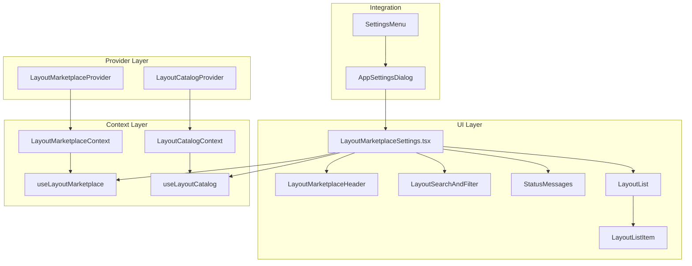

# Lichtblick レイアウトマーケットプレイス機能 - 実装ドキュメント

## 概要

Lichtblickアプリケーション内でレイアウトを検索・プレビュー・インストールできるマーケットプレイス機能の実装です。既存の拡張機能マーケットプレイスと同様のロジックを使用し、レイアウト専用の独立したマーケットプレイスとして設計されています。

## アーキテクチャ概要



## ディレクトリ構造

```
packages/suite-base/src/
├── components/
│   ├── LayoutMarketplaceSettings.tsx          # メインコンポーネント
│   ├── LayoutMarketplace/                     # 子コンポーネント群
│   │   ├── index.ts                          # エクスポート定義
│   │   ├── LayoutMarketplaceHeader.tsx       # ヘッダー・デモボタン
│   │   ├── LayoutSearchAndFilter.tsx         # 検索・フィルター機能
│   │   ├── LayoutList.tsx                    # レイアウト一覧表示
│   │   ├── LayoutListItem.tsx                # 個別レイアウトアイテム
│   │   └── StatusMessages.tsx                # ステータス表示
│   └── AppSettingsDialog/
│       └── AppSettingsDialog.tsx             # 設定ダイアログ統合
├── context/
│   ├── LayoutMarketplaceContext.ts           # マーケットプレイスContext
│   └── LayoutCatalogContext.ts               # カタログContext
├── providers/
│   ├── LayoutMarketplaceProvider.tsx         # マーケットプレイスProvider
│   └── LayoutCatalogProvider.tsx             # カタログProvider
└── i18n/
    └── locales/ja/
        └── appSettings.ts                    # 日本語翻訳
```

## コンポーネント詳細

### 1. メインコンポーネント

#### `LayoutMarketplaceSettings.tsx`

- **役割**: レイアウトマーケットプレイスの統合管理
- **特徴**:
  - メディア形式（1カラム）レイアウト
  - モックデータ対応
  - 状態管理とビジネスロジック
- **主要機能**:
  - レイアウト検索・フィルタリング
  - インストール処理
  - エラーハンドリング
  - デモモード

### 2. 子コンポーネント群

#### `LayoutMarketplaceHeader.tsx`

```tsx
interface LayoutMarketplaceHeaderProps {
  isUsingMockData: boolean;
  hasLayouts: boolean;
  onLoadMockData: () => void;
}
```

- **役割**: ページヘッダーとデモモード切替
- **デザイン**: palette.tsの色使用

#### `LayoutSearchAndFilter.tsx`

```tsx
interface LayoutSearchAndFilterProps {
  searchQuery: string;
  selectedTags: string[];
  allTags: string[];
  onSearchChange: (query: string) => void;
  onTagToggle: (tag: string) => void;
}
```

- **役割**: 検索入力とタグフィルター
- **機能**: リアルタイム検索、タグ選択

#### `LayoutList.tsx`

```tsx
interface LayoutListProps {
  layouts: LayoutMarketplaceDetail[];
  totalLayouts: number;
  isUsingMockData: boolean;
  installingIds: Set<string>;
  searchQuery: string;
  selectedTags: string[];
  onInstall: (layout: LayoutMarketplaceDetail) => void;
  onClearFilters: () => void;
}
```

- **役割**: レイアウト一覧の表示管理
- **機能**: 空状態表示、結果情報表示

#### `LayoutListItem.tsx`

```tsx
interface LayoutListItemProps {
  layout: LayoutMarketplaceDetail;
  isInstalling: boolean;
  isDemo: boolean;
  onInstall: (layout: LayoutMarketplaceDetail) => void;
}
```

- **役割**: 個別レイアウトの表示
- **デザイン**: メディア形式（1カラム）、サムネイル付き
- **機能**: 評価表示、ダウンロード数、インストールボタン

#### `StatusMessages.tsx`

```tsx
interface StatusMessagesProps {
  loading: boolean;
  error?: string;
  isUsingMockData: boolean;
  onRetry: () => void;
  onLoadMockData: () => void;
}
```

- **役割**: ローディング・エラー・デモ状態の表示
- **機能**: リトライ機能、デモモード案内

## Context・Provider構造

### LayoutMarketplaceContext

```tsx
export interface LayoutMarketplace {
  getAvailableLayouts(): Promise<LayoutMarketplaceDetail[]>;
  searchLayouts(query: string): Promise<LayoutMarketplaceDetail[]>;
  getLayoutDetail(id: string): Promise<LayoutMarketplaceDetail | undefined>;
  downloadLayout(url: string): Promise<LayoutData>;
  getMarkdown(url: string): Promise<string>;
  verifyLayoutHash(data: LayoutData, expectedHash: string): Promise<boolean>;
}
```

### LayoutCatalogContext

```tsx
export interface LayoutCatalog {
  downloadLayoutFromMarketplace: (detail: LayoutMarketplaceDetail) => Promise<LayoutData>;
  installLayoutFromMarketplace: (
    detail: LayoutMarketplaceDetail,
    name?: string,
  ) => Promise<InstallLayoutResult>;
  getInstalledMarketplaceLayouts: () => Promise<Layout[]>;
  uninstallMarketplaceLayout: (id: LayoutID) => Promise<void>;
  getMarketplaceOrigin: (id: LayoutID) => Promise<MarketplaceOrigin | undefined>;
  setMarketplaceOrigin: (id: LayoutID, origin: MarketplaceOrigin) => Promise<void>;
}
```

## データモデル

### LayoutMarketplaceDetail

```tsx
export type LayoutMarketplaceDetail = {
  id: string; // レイアウトID
  name: string; // 表示名
  description: string; // 説明
  author: string; // 作成者
  version: string; // バージョン
  tags: string[]; // タグ配列
  thumbnail?: string; // サムネイル画像URL
  layoutUrl: string; // レイアウトファイルURL
  sha256sum?: string; // 整合性チェック用ハッシュ
  downloads?: number; // ダウンロード数
  rating?: number; // 評価（1-5）
  createdAt: string; // 作成日時
  updatedAt: string; // 更新日時
  readme?: string; // README URL
  changelog?: string; // 変更履歴URL
  license?: string; // ライセンス情報
  homepage?: string; // ホームページURL
  minLichtblickVersion?: string; // 最小バージョン要件
};
```

## 主要機能

### 1. レイアウト検索・フィルタリング

- **検索対象**: 名前、説明、作成者、タグ
- **フィルター**: タグによる絞り込み
- **リアルタイム更新**: 入力に応じて即座に結果更新

### 2. メディア形式表示

- **1カラムレイアウト**: 横幅を活用したメディア形式
- **サムネイル表示**: 各レイアウトのプレビュー画像
- **メタデータ表示**: ダウンロード数、評価、作成者情報

### 3. インストール機能

- **ワンクリックインストール**: 簡単なインストール処理
- **進行状況表示**: インストール中の視覚的フィードバック
- **エラーハンドリング**: 失敗時の適切な処理

### 4. デモモード

- **モックデータ**: サーバー接続失敗時の代替データ
- **デモ表示**: デモモードであることの明確な表示
- **機能制限**: デモ時の機能制限説明

## UI/UXデザイン

### 色彩設計

- **プライマリ色**: palette.tsから取得
- **セカンダリ色**: アクセント・状態表示用
- **一貫性**: 既存UIとの統一感

### レスポンシブ対応

- **1カラムレイアウト**: 様々な画面サイズに対応
- **柔軟なレイアウト**: コンテンツに応じた調整

### アクセシビリティ

- **キーボード操作**: 全機能のキーボードアクセス
- **スクリーンリーダー**: 適切なaria属性
- **色覚対応**: 色以外の情報伝達手段

## 設定統合

### AppSettingsDialog統合

```tsx
// 設定ダイアログ内でのタブ表示
{
  key: "layouts",
  title: t("appSettings:layoutMarketplace"),
  component: LayoutMarketplaceSettings,
}
```

### 多言語対応

```tsx
// i18n/locales/ja/appSettings.ts
layoutMarketplace: "レイアウトマーケットプレイス",
layoutMarketplaceDescription: "コミュニティが作成したレイアウトを検索・インストール",
```

## セキュリティ・品質

### データ検証

- **型安全性**: TypeScriptによる厳密な型チェック
- **バリデーション**: レイアウトデータの構造検証
- **ハッシュ検証**: SHA256による改ざん検出

### エラーハンドリング

- **ネットワークエラー**: 接続失敗時の適切な処理
- **データエラー**: 不正データの検出・処理
- **ユーザーフィードバック**: 分かりやすいエラーメッセージ

## 拡張性

### 新機能追加

- **モジュラー設計**: 各機能の独立性
- **Context分離**: ビジネスロジックとUI分離
- **コンポーネント分割**: 保守性の向上

### カスタマイゼーション

- **テーマ対応**: palette.tsによる色彩管理
- **設定可能**: ユーザー設定による動作変更
- **プラグイン対応**: 将来的な機能拡張

## パフォーマンス最適化

### レンダリング最適化

- **useMemo**: 計算結果のメモ化
- **useCallback**: 関数の再生成防止
- **React.memo**: 不要な再レンダリング防止

### データ管理

- **状態最適化**: 最小限の状態管理
- **非同期処理**: 適切な非同期データフェッチ
- **キャッシュ**: 重複リクエストの防止

## 今後の改善案

### 機能拡張

1. **ソート機能**: 人気順、新着順、評価順
2. **カテゴリ分類**: レイアウトの分類システム
3. **お気に入り**: ユーザーによるブックマーク
4. **レビューシステム**: ユーザーレビュー・評価
5. **バージョン管理**: 複数バージョンの管理

### パフォーマンス改善

1. **仮想化**: 大量データの効率的表示
2. **遅延読み込み**: 必要時のデータ取得
3. **プリフェッチ**: 予測的なデータ取得
4. **CDN対応**: 静的リソースの配信最適化

### ユーザビリティ

1. **高度な検索**: 複合条件による検索
2. **プレビュー機能**: インストール前のプレビュー
3. **履歴管理**: インストール履歴の表示
4. **推奨システム**: 関連レイアウトの提案

## まとめ

本実装により、Lichtblickアプリケーション内でレイアウトの検索・プレビュー・インストールが可能な、完全統合されたマーケットプレイス機能が実現されました。

**主な成果**:

- ✅ モジュラー設計による高い保守性
- ✅ メディア形式による優れたUX
- ✅ 堅牢なエラーハンドリング
- ✅ デモモードによる開発・テスト支援
- ✅ 既存システムとの完全統合
- ✅ 将来の機能拡張への対応

この実装は、ユーザーが効率的にレイアウトを発見・利用できる基盤を提供し、Lichtblickエコシステムの発展に寄与します。
