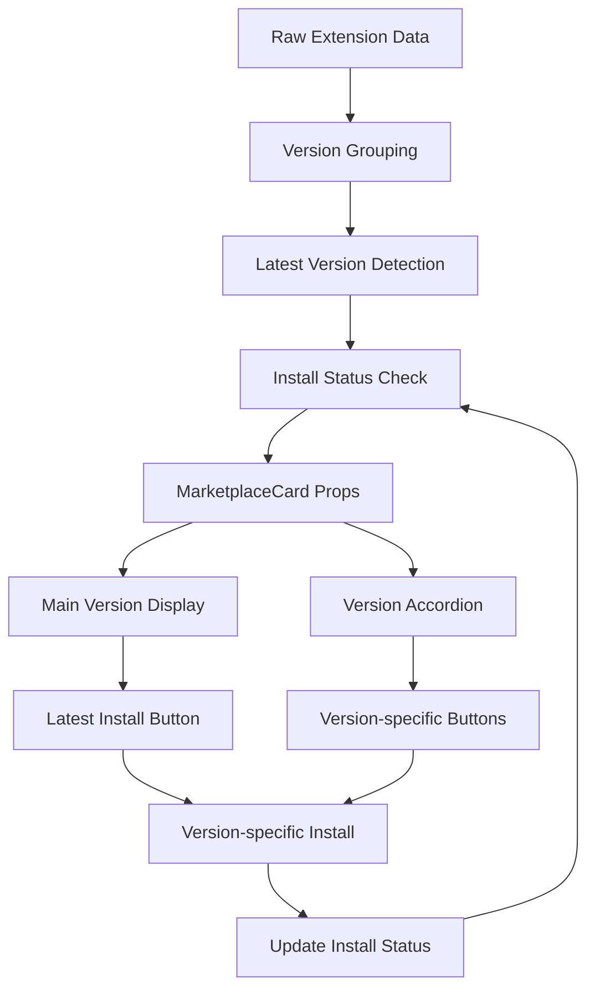

# 複数バージョン対応マーケットプレイスUI 実装計画書

## プロジェクト概要

### 目標

- Extension/Layout の複数バージョン対応UI実装
- アコーディオン形式でのバージョン一覧表示
- 改善されたカードレイアウト（サムネイル拡大、ボタン配置最適化）
- 最新バージョンインストール機能

### 対象範囲

- MarketplaceCard コンポーネントの拡張
- ExtensionsSettings のバージョン管理ロジック追加
- LayoutMarketplaceSettings のバージョン管理ロジック追加

---

## UI設計仕様

### 1. 新しいマーケットプレイスカード設計

#### 1.1 基本レイアウト

```
┌─────────────────────────────────────────────────────────────────────┐
│ ┌──────────┐  Extension Name v2.1.0 (Latest)               [Details]│
│ │          │  by Publisher • 5 versions available          [Install]│
│ │Thumbnail │  This is a description of the extension...              │
│ │ 120x120px│  Tags: [tag1] [tag2] [tag3]                            │
│ │          │                                                         │
│ └──────────┘  ▼ Show 4 more versions                                │
│                                                                      │
│ └─ Accordion (collapsed by default) ──────────────────────────────── │
│    v2.0.0 (2024-09-01) ─────────────────────────── [Details][Install]│
│    v1.9.0 (2024-08-15) ─────────────────────────── [Details][Install]│
│    v1.8.2 (2024-07-30) ─────────────────────────── [Details][Install]│
│    v1.8.1 (2024-07-20) ─────────────────────────── [Details][Install]│
└─────────────────────────────────────────────────────────────────────┘
```

#### 1.2 レイアウト詳細

- **サムネイル**: 120x120px（高さに合わせて拡大）
- **メインコンテンツ**: 中央に配置、フレックス成長
- **ボタンエリア**: 右側固定、縦配置
- **アコーディオン**: デフォルトで折りたたみ、「Show N more versions」

### 2. コンポーネント仕様

#### 2.1 MarketplaceCard 拡張仕様

```typescript
interface VersionInfo {
  version: string;
  publishedDate?: string;
  isLatest?: boolean;
  installed?: boolean;
}

interface MarketplaceCardProps {
  // 既存props
  name: string;
  version: string; // 最新バージョン
  description?: string;
  author?: string;
  tags?: string[];
  installed?: boolean;
  loading?: boolean;
  thumbnail?: string;
  icon?: ReactNode;

  // 新規追加
  versions?: VersionInfo[]; // 全バージョン一覧
  onViewDetails?: (version?: string) => void; // バージョン指定対応
  onInstall?: (version?: string) => void; // バージョン指定対応
  onUninstall?: (version?: string) => void;

  // アコーディオン制御
  defaultExpanded?: boolean;
  maxVersionsShown?: number; // デフォルト5件
}
```

#### 2.2 新規サブコンポーネント

##### VersionAccordion

```typescript
interface VersionAccordionProps {
  versions: VersionInfo[];
  onViewDetails: (version: string) => void;
  onInstall: (version: string) => void;
  onUninstall: (version: string) => void;
  maxShown?: number;
  loading?: boolean;
}
```

##### ActionButtons

```typescript
interface ActionButtonsProps {
  installed?: boolean;
  loading?: boolean;
  onViewDetails?: () => void;
  onInstall?: () => void;
  onUninstall?: () => void;
  variant?: "main" | "version"; // メイン vs バージョン行
}
```

---

## 技術実装計画

### Phase 1: MarketplaceCard拡張 (1-2日)

#### 1.1 レイアウト変更

- [ ] サムネイルサイズを120x120pxに拡大
- [ ] カードの最小高さを140pxに設定
- [ ] ボタンエリアを右側に固定配置
- [ ] フレックスレイアウトの調整

#### 1.2 アコーディオン機能実装

- [ ] MUI Accordion コンポーネント統合
- [ ] VersionAccordion サブコンポーネント作成
- [ ] 展開/折りたたみアニメーション
- [ ] 「Show N more versions」表示制御

#### 1.3 ActionButtons 分離

- [ ] ActionButtons サブコンポーネント作成
- [ ] メイン行とバージョン行の差別化
- [ ] ボタンサイズとスタイリング統一

### Phase 2: データ層拡張 (1-2日)

#### 2.1 型定義拡張

```typescript
// ExtensionMarketplaceDetail 拡張
interface ExtensionVersionDetail extends ExtensionMarketplaceDetail {
  baseId: string; // 同一拡張機能のグループID
  versions: {
    [version: string]: {
      version: string;
      publishedDate: string;
      downloadUrl: string;
      sha256sum?: string;
      changelog?: string;
      isLatest: boolean;
    };
  };
}

// LayoutMarketplaceDetail 拡張
interface LayoutVersionDetail extends LayoutMarketplaceDetail {
  baseId: string;
  versions: {
    [version: string]: {
      version: string;
      publishedDate: string;
      layoutUrl: string;
      sha256sum?: string;
      changelog?: string;
      isLatest: boolean;
    };
  };
}
```

#### 2.2 データ取得ロジック実装

- [ ] グループ化ロジック（baseId別）
- [ ] バージョンソート（セマンティックバージョニング）
- [ ] 最新バージョン検出
- [ ] インストール状態管理（バージョン別）

### Phase 3: ロジック統合 (2-3日)

#### 3.1 ExtensionsSettings 更新

```typescript
// バージョングループ化
const groupedExtensions = useMemo(() => {
  const groups = new Map<string, ExtensionVersionDetail>();

  allExtensions.forEach((ext) => {
    const baseId = ext.baseId || ext.id;
    if (!groups.has(baseId)) {
      groups.set(baseId, {
        ...ext,
        baseId,
        versions: {},
      });
    }
    groups.get(baseId)!.versions[ext.version] = {
      version: ext.version,
      publishedDate: ext.publishedDate || "",
      downloadUrl: ext.foxe || "",
      sha256sum: ext.sha256sum,
      changelog: ext.changelog,
      isLatest: ext.version === getLatestVersion(baseId),
    };
  });

  return Array.from(groups.values());
}, [allExtensions]);
```

#### 3.2 LayoutMarketplaceSettings 更新

- [ ] 同様のグループ化ロジック実装
- [ ] レイアウト固有のバージョン管理
- [ ] JSON読み込みロジックとの統合

#### 3.3 インストール処理拡張

- [ ] バージョン指定インストール
- [ ] 複数バージョン並行インストール対応
- [ ] バージョン切り替え機能
- [ ] アンインストール処理（バージョン別）

---

## UI/UXの改善点

### 1. カードサイズ調整

- **Before**: 固定80x80px サムネイル、可変高さ
- **After**: 120x120px サムネイル、最小高さ140px

### 2. ボタン配置最適化

- **Before**: 下部中央配置
- **After**: 右側縦配置、アクセスしやすい位置

### 3. 情報密度向上

- **Before**: 1バージョンのみ表示
- **After**: アコーディオンで全バージョン表示可能

### 4. アクション改善

- **Before**: Detailsボタンのみ（一部）
- **After**: Details + Install ボタン（各バージョン）

---

## データフロー設計

### 1. 新しいデータフロー



### 2. 状態管理

```typescript
// グローバル状態
interface VersionState {
  installedVersions: Record<string, string[]>; // baseId -> version[]
  loadingVersions: Set<string>; // "baseId@version"
  expandedCards: Set<string>; // baseId
}
```

---

## 実装順序

### Week 1: Phase 1 - UI実装

1. **Day 1-2**: MarketplaceCard レイアウト変更

   - サムネイル拡大
   - ボタン配置変更
   - 基本スタイリング

2. **Day 3-4**: アコーディオン機能

   - VersionAccordion コンポーネント作成
   - 展開/折りたたみ機能
   - ActionButtons 分離

3. **Day 5**: 統合テスト・調整
   - レスポンシブ対応
   - アクセシビリティ対応

### Week 2: Phase 2-3 - ロジック実装

1. **Day 1-2**: データ層拡張

   - 型定義更新
   - グループ化ロジック
   - バージョンソート

2. **Day 3-4**: ExtensionsSettings 統合

   - データフロー統合
   - インストール処理拡張

3. **Day 5**: LayoutMarketplaceSettings 統合
   - 同様のロジック適用
   - JSON読み込み統合

### Week 3: Phase 4 - 最適化・テスト

1. **Day 1-2**: パフォーマンス最適化

   - useMemo/useCallback 最適化
   - レンダリング最適化

2. **Day 3-5**: テスト・デバッグ
   - 各種シナリオテスト
   - エラーハンドリング強化
   - ドキュメント更新

---

## リスク分析と対策

### 高リスク

1. **データ複雑化**: バージョン管理の複雑さ

   - **対策**: 段階的実装、十分なテスト

2. **パフォーマンス**: 大量データの処理
   - **対策**: 仮想化、ページネーション検討

### 中リスク

1. **UI複雑化**: アコーディオン追加による複雑さ

   - **対策**: コンポーネント分離、シンプルな状態管理

2. **後方互換性**: 既存データとの互換性
   - **対策**: 段階的移行、フォールバック実装

---

## 成功指標

### 機能面

- [ ] 複数バージョン表示・切り替え
- [ ] アコーディオン展開/折りたたみ
- [ ] バージョン別インストール
- [ ] 最新バージョン識別

### パフォーマンス面

- [ ] カード描画速度 < 100ms
- [ ] アコーディオン展開速度 < 200ms
- [ ] データ取得速度 < 500ms

### UX面

- [ ] 直感的なバージョン選択
- [ ] スムーズなアニメーション
- [ ] 適切な情報密度
- [ ] モバイル対応

---

この実装計画に従って、現在のマーケットプレイスUIを拡張し、複数バージョン対応の洗練されたインターフェースを構築します。
