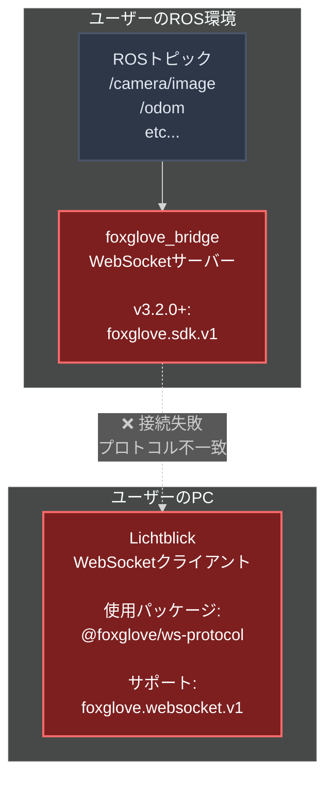
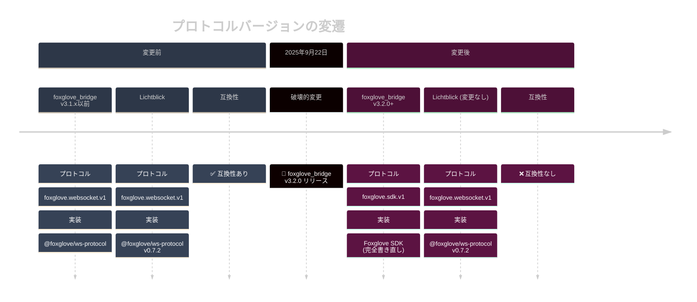
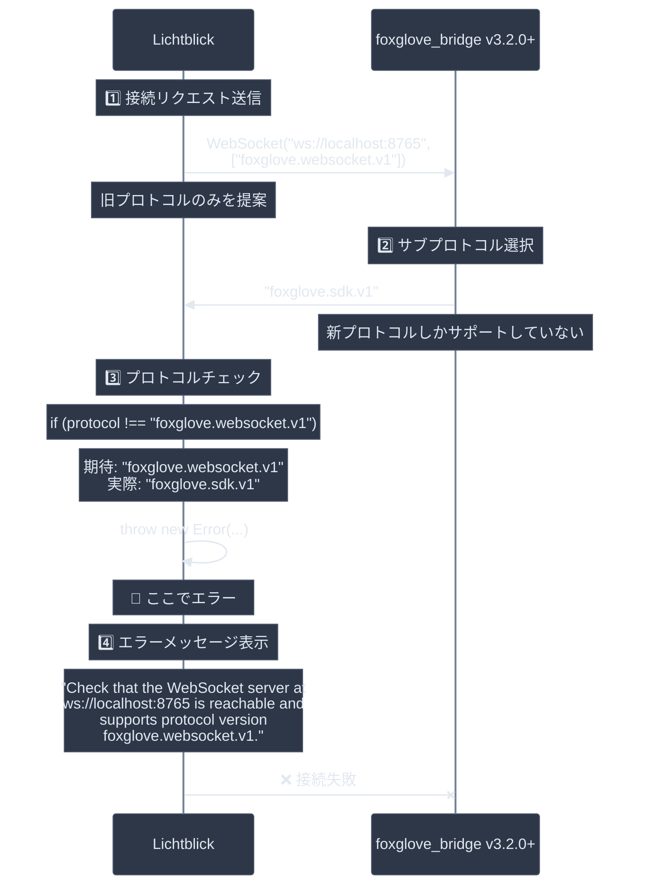
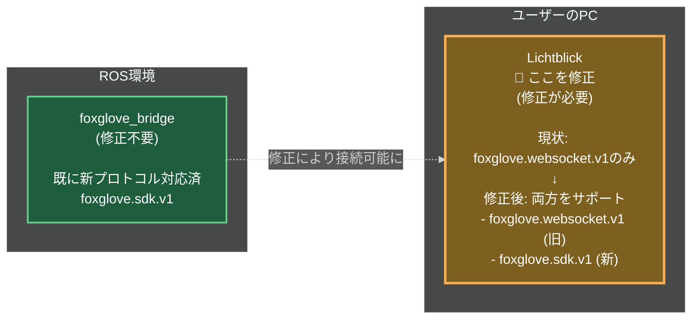
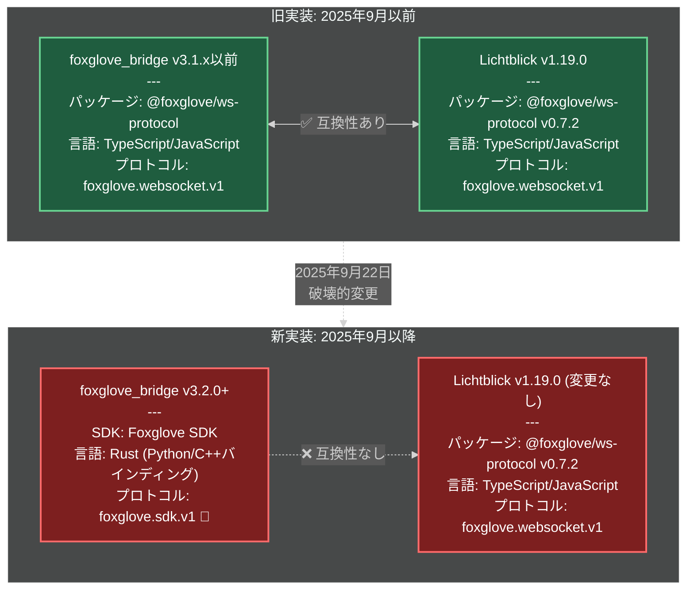

# Issue #750: Foxglove Bridge v3.2.0+ との互換性問題調査レポート

## 問題の概要

Lichtblick が foxglove_bridge v3.2.0 以降のバージョンと接続できない互換性問題。

### システム構成と問題の発生箇所



**問題の本質: プロトコルバージョンの不一致**

- foxglove_bridge v3.2.0+ → `foxglove.sdk.v1` プロトコルを使用
- Lichtblick → `foxglove.websocket.v1` プロトコルのみサポート

### エラーメッセージ

```
Check that the WebSocket server at ws://localhost:8765 is reachable
and supports protocol version foxglove.websocket.v1.
```

**関連Issue:**

- [lichtblick-suite/lichtblick#750](https://github.com/lichtblick-suite/lichtblick/issues/750) - "Incompatible with new foxglove-sdk for the foxglove bridge"
- [lichtblick-suite/lichtblick#604](https://github.com/lichtblick-suite/lichtblick/issues/604) - "Cannot connect to Lichtblick using the Foxglove WebSocket method"

**参照:** [Issue #750 コメント](https://github.com/lichtblick-suite/lichtblick/issues/750)

## 根本原因の詳細

### 概要: プロトコルバージョンの不一致

foxglove_bridge v3.2.0 で**プロトコルが変更**されたことにより、Lichtblickとの互換性が失われました。



### 1. foxglove_bridge の大規模な変更 (2025年9月22日)

**バージョン:** v3.2.0

foxglove_bridge がFoxglove SDKを使用するように**完全に書き直され**、プロトコルが変更されました。

**Changelog記載内容:**

```
## 3.2.0 (2025-09-22)
• Rewrite of foxglove_bridge to use the Foxglove SDK (various)
```

**参照:**

- [ROS Index - foxglove_bridge CHANGELOG](https://index.ros.org/p/foxglove_bridge/)
- [foxglove-sdk GitHub Repository](https://github.com/foxglove/foxglove-sdk)

**重要な変更点（破壊的変更）:**

| 項目                 | 旧版 (v3.1.x 以前)                 | 新版 (v3.2.0+)          |
| -------------------- | ---------------------------------- | ----------------------- |
| **実装基盤**         | `@foxglove/ws-protocol` パッケージ | Foxglove SDK (Rust実装) |
| **プロトコル**       | `foxglove.websocket.v1`            | `foxglove.sdk.v1`       |
| **リポジトリ**       | ros-foxglove-bridge                | foxglove-sdk            |
| **Lichtblick互換性** | ✅ 互換性あり                      | ❌ 互換性なし           |

### 2. Lichtblick の現状（未対応）

Lichtblickは2025年11月現在も旧プロトコルのみをサポートしており、foxglove_bridge v3.2.0+と互換性がありません。

**使用パッケージ:**

```json
"@foxglove/ws-protocol": "0.7.2"
```

**参照:** `packages/suite-base/package.json`

**サポートプロトコル（旧バージョンのみ）:**

```typescript
static SUPPORTED_SUBPROTOCOL = "foxglove.websocket.v1";  // 🔴 新プロトコル未対応
```

**参照:**

- `node_modules/@foxglove/ws-protocol/src/FoxgloveClient.ts`
- `packages/suite-base/src/players/FoxgloveWebSocketPlayer/index.ts` (line 8-20)

**問題のコード位置:**

`packages/suite-base/src/players/FoxgloveWebSocketPlayer/index.ts` (line 177-182):

```typescript
this.#client = new FoxgloveClient({
  ws: this.#enableWorker
    ? new WorkerSocketAdapter(this.#url, [FoxgloveClient.SUPPORTED_SUBPROTOCOL])
    : new WebSocket(this.#url, [FoxgloveClient.SUPPORTED_SUBPROTOCOL]),
});
// ↑ このコードは "foxglove.websocket.v1" のみを指定
// ↑ "foxglove.sdk.v1" を受け付けない
```

### 3. 接続失敗の流れ（プロトコル検証ロジック）

WebSocket接続時のプロトコルネゴシエーション失敗による接続拒否:



**プロトコルチェックコード:**

`node_modules/@foxglove/ws-protocol/src/FoxgloveClient.ts`:

```typescript
this.#ws.onopen = (_event) => {
  // 🔴 厳格なプロトコルチェック
  if (this.#ws.protocol !== FoxgloveClient.SUPPORTED_SUBPROTOCOL) {
    throw new Error(
      `Expected subprotocol ${FoxgloveClient.SUPPORTED_SUBPROTOCOL}, got '${this.#ws.protocol}'`,
    );
  }
  this.#emitter.emit("open");
};
```

**エラーアラート表示コード:**

`packages/suite-base/src/players/FoxgloveWebSocketPlayer/index.ts` (lines 254-262):

```typescript
this.#alerts.addAlert("ws:connection-failed", {
  severity: "error",
  message: "Connection failed",
  tip: `Check that the WebSocket server at ${
    this.#url
  } is reachable and supports protocol version ${FoxgloveClient.SUPPORTED_SUBPROTOCOL}.`,
  // ↑ このメッセージがユーザーに表示される
});
```

## 影響範囲

### 影響を受けるバージョン

| コンポーネント            | バージョン  | 状態                | 詳細                                                    |
| ------------------------- | ----------- | ------------------- | ------------------------------------------------------- |
| **foxglove_bridge**       | v3.2.0+     | 🔴 新プロトコル     | 2025年9月22日リリース、`foxglove.sdk.v1` を使用         |
| **foxglove_bridge**       | v3.1.x 以前 | ✅ 旧プロトコル     | Lichtblickと互換性あり、`foxglove.websocket.v1` を使用  |
| **Lichtblick**            | v1.19.0     | 🔴 旧プロトコルのみ | `foxglove.websocket.v1` のみサポート、v3.2.0+と接続不可 |
| **@foxglove/ws-protocol** | v0.7.2      | 🔴 旧プロトコルのみ | Lichtblickが使用中のパッケージ                          |

**実際のパッケージ情報 (Issue #750 報告):**

```bash
Package: ros-humble-foxglove-bridge
Version: 3.2.1-1jammy.20251013.153650
# ↑ 2025年10月13日ビルド、新プロトコル使用
```

**対象ROSディストリビューション:**

- ROS 2 Humble
- ROS 2 Jazzy
- ROS 2 Kilted
- ROS 2 Rolling

**参照:**

- [Issue #750](https://github.com/lichtblick-suite/lichtblick/issues/750)
- [Issue #604](https://github.com/lichtblick-suite/lichtblick/issues/604)

## 過去の経緯と開発チームの認識

### Issue #604 でのLichtblickチームの回答 (2025年8月5日)

当時からFoxglove SDKの互換性問題は認識されていました:

> "Indeed the Foxglove SDK implemented a different protocol that is not compatible with the previous ws-protocol project, which is used in Lichtblick. For now you should keep using the @foxglove/ws-protocol to stream live data to Lichtblick."
>
> "We are working in move this project to @lichtblick/ws-protocol, but we don't know yet if it is going to be compatible with foxglove-sdk."

**解釈:**

- Lichtblickチームは独自パッケージ `@lichtblick/ws-protocol` への移行を検討中
- しかし、Foxglove SDK互換性についてはまだ未定

**参照:** [Issue #604 - aneuwald-ctw コメント](https://github.com/lichtblick-suite/lichtblick/issues/604)

### コミュニティからの質問 (2025年10月)

foxglove_bridge v3.2.0 リリース後、ユーザーからの問い合わせが発生:

> "which websocket bridge package you recommend using? It looks like foxglove_bridge ROS package was recently updated to v3.2.0 (see changelog here at the bottom) and it is no longer compatible with the old protocol."

**参照:** [Issue #604 - AndBondStyle コメント](https://github.com/lichtblick-suite/lichtblick/issues/604)

### Issue #750 の報告 (2025年10月)

実際の互換性問題の報告:

> "I'm using Lichtblick 1.19.0 and I have foxglove_bridge in my ROS 2 workspace. [...] With the current version of foxglove_bridge from the last build, I can't connect to Lichtblick."

**参照:** [Issue #750](https://github.com/lichtblick-suite/lichtblick/issues/750)

## 解決策の方向性

### 重要な前提: Lichtblick側の修正が必要

foxglove_bridge v3.2.0+ が新プロトコルを使用するようになったため、**Lichtblick側（クライアント側）** で新プロトコルをサポートする必要があります。



### 短期的な回避策（エンドユーザー側の対応）

Lichtblickが修正されるまでの一時的な対応方法:

#### 方法1: 古いバージョンの foxglove_bridge を使用 ✅ 推奨

```bash
# v3.1.x 以前のバージョンを明示的にインストール
sudo apt install ros-$ROS_DISTRO-foxglove-bridge=3.1.*

# または、特定バージョンを指定
sudo apt-cache policy ros-humble-foxglove-bridge  # 利用可能なバージョンを確認
sudo apt install ros-humble-foxglove-bridge=3.1.0-*
```

**メリット:**

- ✅ Lichtblickの修正を待たずに即座に使用可能
- ✅ 確実に動作する

**デメリット:**

- ⚠️ 新しいfoxglove_bridgeの機能が使えない
- ⚠️ パッケージ更新時に注意が必要

#### 方法2: @foxglove/ws-protocol パッケージを直接使用

自前でWebSocketサーバーを実装する場合:

```bash
npx @foxglove/ws-protocol-examples@latest
```

**参照:** [Issue #604 - lubidkdh コメント](https://github.com/lichtblick-suite/lichtblick/issues/604)

### 根本的な解決策（Lichtblick開発チーム向け）

Lichtblick側で新プロトコル `foxglove.sdk.v1` をサポートする必要があります。

#### 参考実装: Flora プロジェクトの対応

**FloraプロジェクトがFoxglove SDK互換性を実現した実装例:**

- [Discussion #547 - Lichtblick compatibility with foxglove sdk](https://github.com/lichtblick-suite/lichtblick/discussions/547)
- [Flora PR #97 - Add "foxglove.sdk.v1" subprotocol](https://github.com/flora-suite/flora/pull/97/files)

**Floraのアプローチ:**

WebSocket接続時に**複数のサブプロトコル**を指定し、サーバー側が選択できるようにする:

```typescript
// 変更前（Lichtblick現状）
new WebSocket(this.#url, [
  FoxgloveClient.SUPPORTED_SUBPROTOCOL, // "foxglove.websocket.v1" のみ
]);

// 変更後（Floraの実装）
new WebSocket(this.#url, [
  FoxgloveClient.SUPPORTED_SUBPROTOCOL, // "foxglove.websocket.v1" (旧)
  "foxglove.sdk.v1", // "foxglove.sdk.v1" (新) を追加
]);
```

**メリット:**

- ✅ 旧バージョン (v3.1.x以前) との互換性維持
- ✅ 新バージョン (v3.2.0+) との互換性獲得
- ✅ 後方互換性を保ちながら前進

**実装の詳細:**

**修正箇所1:** WebSocket接続時のサブプロトコル指定

`packages/suite-base/src/players/FoxgloveWebSocketPlayer/index.ts` (line 177-182):

```typescript
// 🔴 現状（単一プロトコルのみ）
this.#client = new FoxgloveClient({
  ws: this.#enableWorker
    ? new WorkerSocketAdapter(this.#url, [FoxgloveClient.SUPPORTED_SUBPROTOCOL])
    : new WebSocket(this.#url, [FoxgloveClient.SUPPORTED_SUBPROTOCOL]),
});

// ✅ Floraの実装（複数プロトコル対応）
const SUPPORTED_SUBPROTOCOLS = [
  FoxgloveClient.SUPPORTED_SUBPROTOCOL, // "foxglove.websocket.v1"
  "foxglove.sdk.v1", // 新プロトコルを追加
];

this.#client = new FoxgloveClient({
  ws: this.#enableWorker
    ? new WorkerSocketAdapter(this.#url, SUPPORTED_SUBPROTOCOLS)
    : new WebSocket(this.#url, SUPPORTED_SUBPROTOCOLS),
});
```

**修正箇所2:** プロトコル検証ロジックの緩和

`node_modules/@foxglove/ws-protocol/src/FoxgloveClient.ts`:

```typescript
// 🔴 現状（厳格なチェック）
this.#ws.onopen = (_event) => {
  if (this.#ws.protocol !== FoxgloveClient.SUPPORTED_SUBPROTOCOL) {
    throw new Error(
      `Expected subprotocol ${FoxgloveClient.SUPPORTED_SUBPROTOCOL}, got '${this.#ws.protocol}'`,
    );
  }
  this.#emitter.emit("open");
};

// ✅ 修正案（複数プロトコル許可）
const ACCEPTED_PROTOCOLS = ["foxglove.websocket.v1", "foxglove.sdk.v1"];

this.#ws.onopen = (_event) => {
  if (!ACCEPTED_PROTOCOLS.includes(this.#ws.protocol)) {
    throw new Error(
      `Expected subprotocol ${ACCEPTED_PROTOCOLS.join(" or ")}, got '${this.#ws.protocol}'`,
    );
  }
  this.#emitter.emit("open");
};
```

**重要な注意:**

`@foxglove/ws-protocol` は `node_modules/` 内のパッケージのため、直接修正すると `npm install` 時に上書きされます。

**対応方法:**

1. **pnpm patch** を使用してパッチファイルとして管理（推奨）
2. 独自パッケージ `@lichtblick/ws-protocol` を作成
3. `@foxglove/ws-protocol` をフォークして使用

**実装の難易度と検証状況:**

| 修正箇所                                         | 難易度    | 状況                           |
| ------------------------------------------------ | --------- | ------------------------------ |
| WebSocket接続時のサブプロトコル指定              | ✅ 簡単   | Floraで実証済み                |
| `@foxglove/ws-protocol` のプロトコルチェック緩和 | ⚠️ 中程度 | パッケージの修正が必要         |
| テスト・検証                                     | ⚠️ 中程度 | 両バージョンのbridgeで検証必要 |

**検証状況:**

| プロジェクト   | 新プロトコル対応 | 状況                                |
| -------------- | ---------------- | ----------------------------------- |
| **Flora**      | ✅ 実装済み      | Foxglove SDK (v3.2.0+) との接続成功 |
| **Lichtblick** | ❌ 未実装        | 本Issue対応中                       |

### 長期的な解決策

#### 戦略1: @lichtblick/ws-protocol への移行

Issue #604 で言及されていた独自パッケージへの移行を実現:

```
現在: @foxglove/ws-protocol (v0.7.2)
  ↓
将来: @lichtblick/ws-protocol
```

**メリット:**

- ✅ Lichtblickの要件に最適化可能
- ✅ Foxgloveの変更に左右されない
- ✅ 長期的な保守性向上

**参照:**

- [Issue #604 - aneuwald-ctw コメント](https://github.com/lichtblick-suite/lichtblick/issues/604)
- https://github.com/lichtblick-suite/ws-protocol

#### 戦略2: Foxglove SDK との直接統合（不可能）

**重要な結論:**

Foxglove SDK を Lichtblick 側で直接使用することは**不可能**です。理由:

- Foxglove SDK = **WebSocketサーバー**の実装を提供（データ送信側）
- Lichtblick = **WebSocketクライアント**が必要（データ受信側）
- 役割が根本的に異なる

```
❌ 実現不可能な構成:
Lichtblick内でFoxglove SDKを使用 → サーバーとクライアントの役割が逆

✅ 正しい構成:
ROS環境でfoxglove_bridge (Foxglove SDK) → Lichtblick (@foxglove/ws-protocol)
   サーバー側                              クライアント側
```

**参照:** `docs/issue-750-investigation.md` - 重要な発見セクション

## 技術的詳細

### パッケージとプロトコルの対応関係



**Lichtblick側（クライアント）:**

| 項目                   | 内容                                    |
| ---------------------- | --------------------------------------- |
| **パッケージ**         | `@foxglove/ws-protocol`                 |
| **バージョン**         | v0.7.2                                  |
| **リポジトリ**         | https://github.com/foxglove/ws-protocol |
| **役割**               | WebSocketクライアント（データ受信）     |
| **サポートプロトコル** | `foxglove.websocket.v1` のみ            |

**foxglove_bridge v3.2.0+側（サーバー）:**

| 項目                   | 内容                                     |
| ---------------------- | ---------------------------------------- |
| **SDK**                | Foxglove SDK                             |
| **リポジトリ**         | https://github.com/foxglove/foxglove-sdk |
| **実装言語**           | Rust (Python/C++バインディング提供)      |
| **役割**               | WebSocketサーバー（データ送信）          |
| **サポートプロトコル** | `foxglove.sdk.v1` のみ                   |

**参照:** [foxglove-sdk/rust/foxglove/src/websocket/handshake.rs#L6](https://github.com/foxglove/foxglove-sdk/blob/main/rust/foxglove/src/websocket/handshake.rs#L6)

### プロトコル互換性マトリックス

| Lichtblick Version         | foxglove_bridge Version | プロトコル            | 互換性 | 備考                       |
| -------------------------- | ----------------------- | --------------------- | ------ | -------------------------- |
| v1.19.0（未パッチ）        | < v3.2.0                | foxglove.websocket.v1 | ✅     | @foxglove/ws-protocol 使用 |
| v1.19.0（未パッチ）        | >= v3.2.0               | foxglove.sdk.v1       | ❌     | プロトコル不一致           |
| v1.19.0（Floraパッチ適用） | >= v3.2.0               | foxglove.sdk.v1       | ✅     | 複数プロトコル対応         |
| Flora                      | >= v3.2.0               | foxglove.sdk.v1       | ✅     | PR #97で対応済み           |

**プロトコルバージョンの違い:**

- `foxglove.websocket.v1`: 旧 @foxglove/ws-protocol が使用
- `foxglove.sdk.v1`: 新 Foxglove SDK が使用

**参照:** [Discussion #547](https://github.com/lichtblick-suite/lichtblick/discussions/547)

## 関連リンク

### 公式ドキュメント・リポジトリ

- [Foxglove SDK Documentation](https://docs.foxglove.dev/sdk)
- [Foxglove SDK GitHub](https://github.com/foxglove/foxglove-sdk)
- [@foxglove/ws-protocol npm](https://www.npmjs.com/package/@foxglove/ws-protocol)
- [ROS Index - foxglove_bridge](https://index.ros.org/p/foxglove_bridge/)

### 解決策の参考資料

- [Discussion #547 - Lichtblick compatibility with foxglove sdk](https://github.com/lichtblick-suite/lichtblick/discussions/547)
- [Flora PR #97 - feat: Add "foxglove.sdk.v1" subprotocol](https://github.com/flora-suite/flora/pull/97/files)
- [Foxglove SDK WebSocket Handshake実装](https://github.com/foxglove/foxglove-sdk/blob/main/rust/foxglove/src/websocket/handshake.rs#L6)

## 実装ガイド（Floraパッチの適用）

### ステップ1: WebSocket接続部分の変更

**ファイル:** `packages/suite-base/src/players/FoxgloveWebSocketPlayer/index.ts`

**変更箇所:** 約176-180行目のWebSocket/WorkerSocketAdapter初期化部分

```typescript
// 変更前
this.#client = new FoxgloveClient({
  ws:
    typeof Worker !== "undefined"
      ? new WorkerSocketAdapter(this.#url, [FoxgloveClient.SUPPORTED_SUBPROTOCOL])
      : new WebSocket(this.#url, [FoxgloveClient.SUPPORTED_SUBPROTOCOL]),
});

// 変更後
this.#client = new FoxgloveClient({
  ws:
    typeof Worker !== "undefined"
      ? new WorkerSocketAdapter(this.#url, [
          FoxgloveClient.SUPPORTED_SUBPROTOCOL,
          "foxglove.sdk.v1",
        ])
      : new WebSocket(this.#url, [FoxgloveClient.SUPPORTED_SUBPROTOCOL, "foxglove.sdk.v1"]),
});
```

### ステップ2: プロトコル検証の緩和（必要な場合）

**問題:** `@foxglove/ws-protocol`のFoxgloveClientは厳密にプロトコルをチェックします。

**オプション1: パッケージのフォーク**

1. `@foxglove/ws-protocol`をフォーク
2. プロトコルチェックを修正
3. ローカルパッケージとして使用

**オプション2: パッチパッケージの使用**

```bash
# patch-packageを使用
npm install patch-package --save-dev
```

`node_modules/@foxglove/ws-protocol/src/FoxgloveClient.ts`を編集:

```typescript
// 変更前
if (this.#ws.protocol !== FoxgloveClient.SUPPORTED_SUBPROTOCOL) {
  throw new Error(
    `Expected subprotocol ${FoxgloveClient.SUPPORTED_SUBPROTOCOL}, got '${this.#ws.protocol}'`,
  );
}

// 変更後
const supportedProtocols = [FoxgloveClient.SUPPORTED_SUBPROTOCOL, "foxglove.sdk.v1"];
if (!supportedProtocols.includes(this.#ws.protocol)) {
  throw new Error(
    `Expected subprotocol ${supportedProtocols.join(" or ")}, got '${this.#ws.protocol}'`,
  );
}
```

パッチを生成:

```bash
npx patch-package @foxglove/ws-protocol
```

**オプション3: Lichtblick側でラップ**
FoxgloveClientをラップしてプロトコルチェックを迂回（推奨度: 低）

### ステップ3: ビルドとテスト

```bash
# 依存関係のインストール
npm install

# ビルド
npm run build

# テスト（foxglove_bridge v3.2.0+で確認）
# ROS側でfoxglove_bridgeを起動
ros2 launch foxglove_bridge foxglove_bridge_launch.xml port:=8765

# Lichtblickで接続
# URL: ws://localhost:8765
```

### 期待される動作

1. WebSocketハンドシェイク時に両方のプロトコルを提案
2. foxglove_bridge（Foxglove SDK）が`foxglove.sdk.v1`を選択
3. 接続成功
4. データストリーミング開始

### トラブルシューティング

**接続失敗時のチェックポイント:**

1. ブラウザの開発者ツールでWebSocketプロトコルを確認
2. Lichtblickのアラートメッセージを確認
3. foxglove_bridgeのログを確認

**デバッグ方法:**

```typescript
// FoxgloveWebSocketPlayer/index.ts に追加
this.#client.on("open", () => {
  console.log("WebSocket protocol:", this.#client.ws?.protocol);
  // 続きの処理...
});
```

## 重要な追加調査: Foxglove SDK はクライアント実装を含まない

**調査日**: 2025年11月6日

### 調査結果

Foxglove SDKのリポジトリを詳細に調査した結果、以下が判明：

1. **Foxglove SDK の実装範囲**

   - ✅ **WebSocketサーバー実装**: Rust, Python, C++ で提供
   - ❌ **WebSocketクライアント実装**: 提供されていない
   - 📝 **テスト用クライアント**: テストコードに最小限の実装のみ

2. **提供されている実装**

```rust
// rust/foxglove/src/websocket_server.rs
pub struct WebSocketServer {
    // サーバー実装
}

// rust/foxglove/src/websocket_client.rs
// ⚠️ テスト専用の実装（内部使用、非公開API）
#[doc(hidden)]
pub struct WebSocketClient {
    stream: WebSocketStream<MaybeTlsStream<TcpStream>>,
}
```

3. **Lichtblick側での使用可能性**

| アプローチ                    | 可能性    | 理由                                       |
| ----------------------------- | --------- | ------------------------------------------ |
| Foxglove SDK を直接使用       | ❌ 不可能 | クライアント実装が公開されていない         |
| Foxglove SDK の内部実装を流用 | ⚠️ 困難   | `#[doc(hidden)]` でテスト専用、APIが不安定 |
| Foxglove SDK を参考に実装     | ✅ 可能   | プロトコル実装は参考になる                 |

### 結論

**Foxglove SDK をそのまま使用することは不可能**

理由：

- Foxglove SDK は**サーバー側（データ送信側）**の実装
- Lichtblick は**クライアント側（データ受信側）**なので、SDK の対象外
- SDK内のテスト用クライアントは非公開APIで、本番使用を意図していない

### 推奨される対応

1. **短期的**: `@foxglove/ws-protocol` へのパッチ適用（案3）を継続
2. **中期的**: Foxglove SDK のプロトコル実装を参考に、Lichtblick独自のクライアント実装を検討
3. **長期的**: `@lichtblick/ws-protocol` として完全な独自実装

### 参考情報

**Foxglove SDKの役割**:

- ROSノードやPythonアプリケーションから**Foxgloveアプリへデータを送信**するためのツール
- foxglove_bridge も内部でこのSDKを使用

**アーキテクチャ**:

```
[ROSノード] → [Foxglove SDK (Server)] → WebSocket → [Foxglove/Lichtblick (Client)]
           ↑ SDKが提供              ↑ プロトコル  ↑ 自前で実装が必要
```

**参照**:

- [Foxglove SDK GitHub](https://github.com/foxglove/foxglove-sdk)
- [Foxglove SDK Docs](https://docs.foxglove.dev/sdk)
- WebSocketクライアント実装: `rust/foxglove/src/websocket_client.rs` (テスト専用)

---

## 調査日

2025年10月30日（初版）
2025年11月6日（追加調査）

## 調査実施者

GitHub Copilot (調査支援)

---

## まとめ

### 問題の本質

Foxglove SDKが新しいサブプロトコル`foxglove.sdk.v1`を使用しているのに対し、Lichtblickは従来の`foxglove.websocket.v1`のみをサポートしている。

### 推奨される対応

1. **即座の対応:** Floraの実装を参考に、複数プロトコル対応を実装
2. **完全な対応:** `@foxglove/ws-protocol`のプロトコルチェックも修正
3. **長期的対応:** Lichtblick独自のプロトコル実装への移行

### 参考実装

Floraプロジェクトで既に実装・検証済みのため、コードの移植は比較的容易です。

---

**注意事項:**

- この問題は現在進行中であり、Lichtblickチームによる対応が必要です
- 最新の状況は上記のGitHub Issueを参照してください
- 本ドキュメントの情報は調査時点のものです
- Floraパッチの適用は自己責任で行ってください
