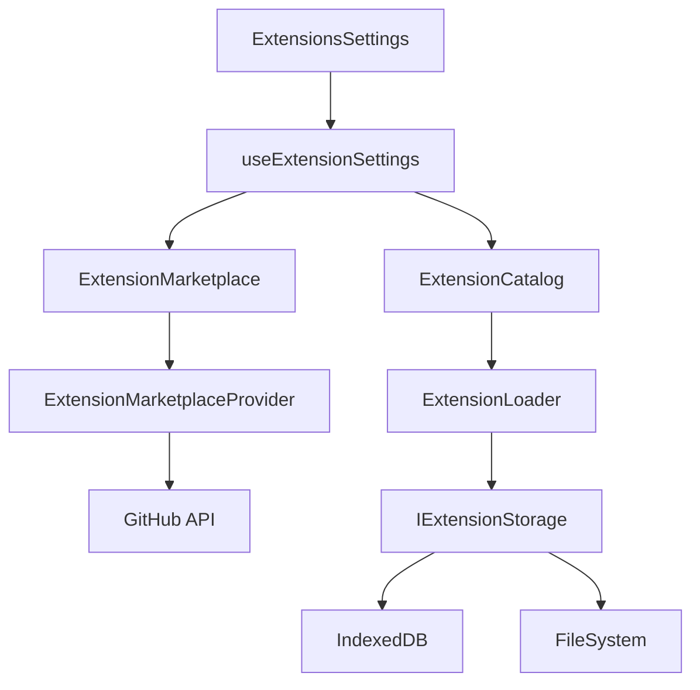

# Lichtblick マーケットプレイス機能 詳細調査レポート

> **注意**: 本ドキュメントは2025年1月における Lichtblick Suite v1.x の実装を基に作成されています。

## 概要

Lichtblickは拡張機能（Extension）の配布と管理のため、包括的なマーケットプレイス機能を実装しています。これにより、開発者は自作の拡張機能を配布し、ユーザーは必要な拡張機能を簡単に発見・インストールできます。

## 1. 実装されている機能

### 1.1 拡張機能マーケットプレイス

#### 基本機能

- **拡張機能カタログ**: 利用可能な拡張機能の一覧表示
- **検索・フィルタリング**: キーワード検索とカテゴリフィルタ
- **詳細情報表示**: README、CHANGELOG、メタデータの表示
- **インストール・アンインストール**: ワンクリックでの拡張機能管理

#### セキュリティ機能

- **ハッシュ検証**: SHA256による改ざん検出
- **署名検証**: デジタル署名による正当性確認（計画中）
- **バージョン検証**: 公式バージョンとの整合性チェック

#### 名前空間管理

```typescript
export type ExtensionNamespace =
  | "local" // ローカルインストール拡張機能
  | "org"; // 組織管理拡張機能
```

### 1.2 拡張機能配布システム

#### 配布形式

- **ファイル形式**: `.foxe` (ZIP圧縮ファイル)
- **必須ファイル**:
  - `dist/extension.js` - 拡張機能本体
  - `package.json` - メタデータ
  - `README.md` - ドキュメント（オプション）
  - `CHANGELOG.md` - 変更履歴（オプション）

#### ストレージシステム

**Desktop版**:

```bash
~/.lichtblick-suite/extensions/
├── local/          # ローカルインストール拡張機能
└── org/            # 組織管理拡張機能
```

**Web版**:

```
IndexedDB
├── foxglove-extensions-local    # ローカル拡張機能
└── foxglove-extensions-org      # 組織管理拡張機能
```

## 2. ユーザーインターフェース（UI）

### 2.1 拡張機能設定画面

**主要コンポーネント**:

- `ExtensionsSettings` - メイン設定画面
- `ExtensionList` - 拡張機能一覧表示
- `ExtensionDetails` - 拡張機能詳細ページ
- `SearchBar` - 検索バー

**主な機能**:

- **検索機能**: リアルタイム検索（50msデバウンス）
- **カテゴリ表示**: 名前空間別グループ化
- **インストール状態表示**: インストール済み/未インストール の視覚的区別

### 2.2 拡張機能詳細ページ

**表示情報**:

- 基本情報（名前、バージョン、作成者、ライセンス）
- 説明文とキーワード
- README・CHANGELOG（タブ切り替え）
- インストール・アンインストールボタン

**操作機能**:

- **インストール**: Desktop版のみ対応
- **アンインストール**: 組織管理拡張機能は除く
- **ドキュメント表示**: Markdown対応

### 2.3 UX設計

**エラーハンドリング**:

- ネットワークエラー時のリトライ機能
- インストール失敗時の詳細エラーメッセージ
- 操作状態のローディング表示

**パフォーマンス最適化**:

- 浅い比較によるメモ化（`useShallowMemo`）
- デバウンスによる検索最適化
- 非同期処理による応答性確保

## 3. 必要なサーバー要件

### 3.1 現在の実装

**データソース**:

```typescript
const MARKETPLACE_URL =
  "https://raw.githubusercontent.com/foxglove/studio-extension-marketplace/main/extensions.json";
```

**APIエンドポイント**:

- `GET /extensions.json` - 拡張機能一覧取得
- 各拡張機能のREADME/CHANGELOGファイル（Markdown）
- `.foxe`ファイルの直接ダウンロード

### 3.2 API仕様

#### 拡張機能リスト API

```typescript
interface ExtensionMarketplaceDetail {
  // 基本情報
  id: string;
  name: string;
  displayName: string;
  description?: string;
  publisher: string;
  version: string;

  // メタデータ
  keywords?: string[];
  license?: string;
  homepage?: string;

  // 配布情報
  foxe?: string; // .foxeファイルのURL
  sha256sum?: string; // セキュリティハッシュ
  time?: Record<string, string>; // バージョン別タイムスタンプ

  // ドキュメント
  readme?: string; // README.mdのURL
  changelog?: string; // CHANGELOG.mdのURL
}
```

### 3.3 企業内配布システム要件

**拡張機能管理機能**:

- `.foxe`ファイルのアップロード
- メタデータの自動抽出（package.json）
- バージョン重複チェック
- ファイル整合性検証（SHA256ハッシュ）

**配布機能**:

- 認証されたユーザーへの配布
- バージョン指定ダウンロード
- 自動更新通知
- 配布制御（ユーザーグループ単位）

**セキュリティ要件**:

- HTTPS/TLS 1.3以上
- 社内認証システム統合（Active Directory/LDAP）
- MFA（多要素認証）対応
- マルウェアスキャン

**パフォーマンス要件**:

- API応答時間: 95%ile < 500ms
- ダウンロード速度: 10MB/s以上
- 同時接続数: 1000ユーザー以上
- 稼働率: 99.9%以上

## 4. アーキテクチャ

### 4.1 コンポーネント構成



### 4.2 データフロー

1. **初期化**: ExtensionMarketplaceProvider がマーケットプレイスAPI接続を初期化
2. **拡張機能一覧取得**: GitHub上のextensions.jsonを取得
3. **インストール済み確認**: ExtensionCatalogから既存拡張機能を取得
4. **UI表示**: 統合されたデータを設定画面に表示
5. **インストール**: ユーザー操作でExtensionLoaderが拡張機能をダウンロード・インストール

### 4.3 ストレージシステム

**Web版（IndexedDB）**:

```typescript
interface ExtensionsDB extends IDB.DBSchema {
  metadata: {
    key: string;
    value: ExtensionInfo;
  };
  extensions: {
    key: string;
    value: StoredExtension;
  };
}
```

**Desktop版（ファイルシステム）**:

- IPCを通じたファイル操作
- ExtensionsHandlerクラスによる管理
- 各拡張機能が独自ディレクトリを持つ

## 5. 推奨される技術構成

### 5.1 企業内マーケットプレイス構築オプション

#### Option A: GitHub Enterprise + Actions

**メリット**:

- 既存Gitワークフローとの統合
- GitHub Actionsによる自動化
- 組織のプライベートリポジトリ管理

#### Option B: AWS S3 + CloudFront + Lambda

**メリット**:

- 高可用性とスケーラビリティ
- CloudFrontによるグローバル配信
- AWS IAMによる細かいアクセス制御

#### Option C: Azure Blob + Azure AD

**メリット**:

- Azure ADとのネイティブ統合
- エンタープライズグレードのセキュリティ

#### Option D: Kubernetes + MinIO/Harbor

**メリット**:

- 完全な社内管理
- カスタマイズ性が高い
- エアギャップ環境対応

### 5.2 推奨構成

**GitHub Enterprise + AWS S3/CloudFront のハイブリッド**

**理由**:

1. 開発効率: 既存Gitワークフローを活用
2. セキュリティ: エンタープライズグレードの認証・認可
3. スケーラビリティ: AWSの自動スケーリング
4. コスト効率: 必要に応じた課金モデル

## 6. 実装フェーズ

### Phase 1: MVP（1-2ヶ月）

- 基本的なアップロード/ダウンロード機能
- 簡単な認証機能
- 手動でのバージョン管理

### Phase 2: 認証・セキュリティ強化（2-3ヶ月）

- 社内認証システム統合
- アクセス制御実装
- 監査ログ機能

### Phase 3: 自動化・最適化（2-3ヶ月）

- CI/CD統合
- 自動更新機能
- パフォーマンス最適化

### Phase 4: 高度な機能（3-4ヶ月）

- A/Bテスト機能
- 分析ダッシュボード
- 高可用性対応

## 7. 開発ガイドライン

### 7.1 拡張機能開発フロー

```bash
# 1. 環境準備
npm init lichtblick-extension@latest my-extension
cd my-extension
npm install

# 2. 開発
npm run build:watch
npm run local-install

# 3. パッケージング
npm run package
```

### 7.2 品質保証

**必須要件**:

- TypeScript strict mode
- JSDoc による適切なドキュメント化
- テストカバレッジ 80%以上
- ESLint/Prettier による統一されたコードスタイル

**セキュリティ考慮事項**:

- 制限されたrequire関数（React、ReactDOMのみ）
- 独立したモジュールスコープ
- エラーの隔離

## 8. トラブルシューティング

### 8.1 一般的な問題

**インストールエラー**:

- Desktop版でのみマーケットプレイス拡張機能をサポート
- ネットワーク接続の確認
- `.foxe`ファイルの破損チェック

**パフォーマンス問題**:

- IndexedDBの容量制限（Web版）
- 大量の拡張機能インストール時の遅延

### 8.2 デバッグ方法

```typescript
// ログレベルの設定
import Log from "@lichtblick/log";
const log = Log.getLogger(__filename);
log.debug("Extension operation started");
```

## 9. 結論

Lichtblickのマーケットプレイス機能は、拡張機能のライフサイクル全体をカバーする包括的なシステムです。現在はGitHub経由での配布を基本としていますが、企業内での独自配布システム構築にも対応できる柔軟な設計となっています。

セキュリティ、パフォーマンス、ユーザビリティを重視した実装により、開発者とエンドユーザー双方にとって使いやすいエコシステムを提供しています。

---

_本レポートは2025年1月時点のLichtblick実装を基に作成されました。最新の仕様については公式ドキュメントを参照してください。_
