# 依存関係ダイアグラム自動生成ツール

**対象:** 全開発者
**最終更新:** 2025-10-22

---

## 概要

このドキュメントは、依存関係を自動的に可視化・ダイアグラム化するツールを比較・解説します。

軽量版（ファイルコメント）で日々の開発を実施しつつ、定期的に自動ツールでプロジェクト全体の依存関係を可視化することで、以下を実現：

✅ デッドコード検出
✅ 循環依存の発見
✅ モジュール境界の検証
✅ マイクロアーキテクチャの改善提案

---

## 推奨ツール比較表

| ツール                  | 言語対応 | グラフ出力   | 循環依存検出 | CLI | 統合難度 | 推奨度     |
| ----------------------- | -------- | ------------ | ------------ | --- | -------- | ---------- |
| **Madge**               | TS/JS    | SVG/PNG/HTML | ✅           | ✅  | 低       | ⭐⭐⭐⭐⭐ |
| **Dependency Cruiser**  | TS/JS    | SVG/HTML     | ✅           | ✅  | 中       | ⭐⭐⭐⭐⭐ |
| **depcheck**            | TS/JS    | テキスト     | ❌           | ✅  | 低       | ⭐⭐⭐     |
| **Graphviz**            | 全言語   | DOT/SVG/PDF  | -            | ✅  | 中       | ⭐⭐⭐⭐   |
| **TypeScript Compiler** | TS       | JSON         | ✅           | ✅  | 高       | ⭐⭐⭐     |

---

## 🥇 Best Choice: Madge

### 概要

```
依存関係グラフの自動解析・可視化ツール
Node.js で実装、npm で提供
複数の出力形式をサポート
```

### インストール

```bash
npm install --save-dev madge
```

### 基本的な使用方法

#### 1. **依存グラフを SVG で生成**

```bash
# 単一ファイルの依存関係
npx madge src/components/Button/Button.tsx

# ディレクトリ全体
npx madge src/components/

# ダイアグラムを画像で生成
npx madge src/components/ --image deps-graph.svg

# PNG 形式
npx madge src/components/ --image deps-graph.png
```

#### 2. **循環依存を検出**

```bash
# 循環依存のみを表示
npx madge src/ --circular

# 詳細情報を表示
npx madge src/ --circular --verbose
```

#### 3. **HTML レポート生成**

```bash
npx madge src/ --image graph.html --html
```

### 設定ファイル

`.madgerc` または `madge.config.js` で詳細設定：

```javascript
// madge.config.js
module.exports = {
  // 対象ファイル
  src: ["src/"],

  // 除外パターン
  excludePattern: ["node_modules", "**/*.test.ts", "**/*.spec.ts"],

  // モジュール解析方式
  baseDir: process.cwd(),

  // 出力形式
  format: "esm", // esm, cjs, auto

  // 拡張子
  extensions: ["ts", "tsx", "js", "jsx"],

  // オプション
  includeNpm: false, // node_modules を含めるか
  ignorePattern: [],
};
```

### 実行例

```bash
# プロジェクト全体の依存グラフを生成
npx madge src/ --image dist/dependencies.svg

# 循環依存を検出・修正
npx madge src/ --circular --exit 1

# 特定ファイルの依存を表示
npx madge src/components/Button/Button.tsx --no-color

# ファイルサイズを含める
npx madge src/ --stats
```

### 出力例

#### **テキスト出力（Console）**

```
src/components/Button/Button.tsx
├── src/hooks/useClickHandler.ts
├── src/utils/classNameBuilder.ts
└── Button.module.css

src/hooks/useClickHandler.ts
├── src/services/AuthService.ts
└── src/utils/logger.ts
```

#### **SVG ダイアグラム出力**

```
┌─────────────────────────────────────────────┐
│          Dependency Graph                    │
├─────────────────────────────────────────────┤
│                                             │
│  Button.tsx ──→ useClickHandler.ts         │
│      │               │                      │
│      ├──→ styles.css │                     │
│      └──→ classNameBuilder.ts  └──→ Logger │
│                                             │
└─────────────────────────────────────────────┘
```

### Madge を CI パイプラインに統合

#### GitHub Actions

```yaml
# .github/workflows/dependency-check.yml
name: Dependency Analysis

on: [push, pull_request]

jobs:
  check-dependencies:
    runs-on: ubuntu-latest
    steps:
      - uses: actions/checkout@v3

      - name: Setup Node.js
        uses: actions/setup-node@v3
        with:
          node-version: "18"

      - name: Install dependencies
        run: npm install

      - name: Check for circular dependencies
        run: npx madge src/ --circular --exit 1

      - name: Generate dependency graph
        run: npx madge src/ --image graph.svg

      - name: Upload graph artifact
        uses: actions/upload-artifact@v3
        with:
          name: dependency-graph
          path: graph.svg
```

#### npm scripts に追加

```json
{
  "scripts": {
    "analyze:deps": "madge src/",
    "analyze:circular": "madge src/ --circular",
    "analyze:graph": "madge src/ --image dist/dependencies.svg",
    "analyze:all": "npm run analyze:deps && npm run analyze:circular && npm run analyze:graph"
  }
}
```

---

## 🥈 Second Choice: Dependency Cruiser

### 概要

```
より高度な依存関係分析ツール
ルールエンジン搭載
チーム規約の実装・検証に適している
```

### インストール

```bash
npm install --save-dev depcruiser
```

### 基本的な使用方法

#### 1. **初期セットアップ**

```bash
npx depcruiser --init
```

自動生成されるファイル: `.depcruiserrc.js`

#### 2. **依存関係を検証**

```bash
# デフォルトルールで検証
npx depcruiser src/

# SVG で可視化
npx depcruiser src/ --output-type dot | dot -T svg > dependencies.svg

# HTML レポート
npx depcruiser src/ --output-type html > report.html
```

#### 3. **カスタムルール定義**

```javascript
// .depcruiserrc.js
module.exports = {
  forbidden: [
    // components は services に依存してはいけない
    {
      name: "components should not use services directly",
      severity: "error",
      from: { path: "src/components" },
      to: { path: "src/services" },
    },

    // hooks は components に依存してはいけない
    {
      name: "hooks should not import components",
      severity: "error",
      from: { path: "src/hooks" },
      to: { path: "src/components" },
    },

    // 循環依存を禁止
    {
      name: "no circular dependencies",
      severity: "error",
      type: "circular",
    },
  ],

  options: {
    doNotFollow: "node_modules",
    extensions: [".ts", ".tsx", ".js", ".jsx"],
  },
};
```

#### 4. **出力形式の詳細設定**

```bash
# Graphviz DOT 形式
npx depcruiser src/ --output-type dot > deps.dot

# HTML インタラクティブ
npx depcruiser src/ --output-type html > deps.html

# JSON（プログラム処理用）
npx depcruiser src/ --output-type json > deps.json

# テキスト形式
npx depcruiser src/ --output-type text
```

### SVG ダイアグラム生成

```bash
# Step 1: DOT ファイル生成
npx depcruiser src/ --output-type dot > dependencies.dot

# Step 2: Graphviz で SVG 変換
dot -T svg dependencies.dot > dependencies.svg

# Step 3: ワンライナー
npx depcruiser src/ --output-type dot | dot -T svg > dependencies.svg
```

### npm scripts に追加

```json
{
  "scripts": {
    "validate:deps": "depcruiser src/",
    "validate:strict": "depcruiser src/ --fail violations",
    "visualize:deps": "depcruiser src/ --output-type dot | dot -T svg > dist/dependencies.svg",
    "report:deps": "depcruiser src/ --output-type html > dist/report.html"
  }
}
```

---

## 🥉 Third Choice: depcheck

### 概要

```
未使用の依存関係を検出
package.json の依存関係が実際に使われているか検証
```

### インストール

```bash
npm install --save-dev depcheck
```

### 使用方法

```bash
# 未使用の依存関係を検出
npx depcheck

# 未使用の npm パッケージを表示
npx depcheck --json

# 詳細レポート
npx depcheck --detailed
```

### 出力例

```
Unused dependencies
  * @types/jest
  * old-library

Missing dependencies
  * lodash (used in src/utils/helper.ts)

Unused devDependencies
  * jest-watch-typeahead
```

---

## 🛠️ Graphviz を使った手動ダイアグラム生成

### 概要

```
言語非依存のグラフ作画ツール
DOT 言語で依存関係を記述
複数の出力形式をサポート（SVG, PNG, PDF 等）
```

### インストール（macOS）

```bash
brew install graphviz
```

### 基本的な使用方法

#### 1. **DOT ファイル作成**



#### 2. **SVG に変換**

```bash
# SVG 出力
dot -T svg dependencies.dot > dependencies.svg

# PNG 出力
dot -T png dependencies.dot > dependencies.png

# PDF 出力
dot -T pdf dependencies.dot > dependencies.pdf
```

#### 3. **ビジュアル確認**

```bash
# ブラウザで表示（macOS）
open dependencies.svg

# Linux
xdg-open dependencies.svg
```

---

## 📊 複合ツールスタック（推奨）

複数のツールを組み合わせた包括的な依存関係管理：

### セットアップ

```json
{
  "devDependencies": {
    "madge": "^6.0.0",
    "depcruiser": "^16.0.0",
    "depcheck": "^1.4.0",
    "graphviz": "^0.0.9"
  },
  "scripts": {
    "analyze": "npm run analyze:madge && npm run analyze:depcheck && npm run analyze:depcruiser",
    "analyze:madge": "madge src/ --image dist/dependencies-madge.svg",
    "analyze:depcheck": "depcheck --json > dist/depcheck-report.json",
    "analyze:depcruiser": "depcruiser src/ --output-type dot | dot -T svg > dist/dependencies-depcruiser.svg",
    "check:circular": "madge src/ --circular --exit 1",
    "check:violations": "depcruiser src/ --fail violations"
  }
}
```

### 実行フロー

```bash
# 1. 円形依存をチェック（開発時）
npm run check:circular

# 2. アーキテクチャルール違反をチェック（PR 時）
npm run check:violations

# 3. 完全な依存関係分析（定期的）
npm run analyze
```

---

## 🎯 ツール選択ガイド

### **Madge を選ぶべき場合**

✅ シンプルで素早く依存グラフを可視化したい
✅ 循環依存をさっと検出したい
✅ CI パイプラインに軽量に統合したい
✅ チーム全体で使いやすいツールが必要

**推奨**: このプロジェクトでは **Madge を採用**

---

### **Dependency Cruiser を選ぶべき場合**

✅ 詳細なルールエンジンが必要
✅ アーキテクチャ違反を自動検出したい
✅ HTML レポートで可視化したい
✅ 大規模プロジェクトで複雑なルール管理が必要

**推奨**: 規模が大きくなったら Cruiser への移行を検討

---

### **depcheck を選ぶべき場合**

✅ 未使用の npm パッケージを検出したい
✅ package.json の依存関係の整理が必要
✅ デッドコード検出を自動化したい

**推奨**: Madge と併用（定期的に実行）

---

## 🚀 Madge 導入計画（実装例）

### ステップ 1: インストール

```bash
npm install --save-dev madge
```

### ステップ 2: 設定ファイルを作成

```javascript
// madge.config.js
module.exports = {
  src: ["src/"],
  excludePattern: ["node_modules", "**/*.test.ts", "**/*.spec.ts", "**/*.stories.ts"],
  baseDir: process.cwd(),
  format: "esm",
  extensions: ["ts", "tsx", "js", "jsx"],
  includeNpm: false,
};
```

### ステップ 3: npm scripts に追加

```json
{
  "scripts": {
    "analyze:deps": "madge src/",
    "analyze:circular": "madge src/ --circular",
    "analyze:stats": "madge src/ --stats",
    "visualize:deps": "madge src/ --image dist/dependencies.svg",
    "check:deps": "npm run analyze:circular -- --exit 1"
  }
}
```

### ステップ 4: GitHub Actions 統合

```yaml
# .github/workflows/dependency-analysis.yml
name: Dependency Analysis

on:
  schedule:
    - cron: "0 0 * * 0" # 週 1 回（日曜日）
  push:
    branches: [main, develop]
  pull_request:

jobs:
  analyze:
    runs-on: ubuntu-latest
    steps:
      - uses: actions/checkout@v3

      - name: Setup Node.js
        uses: actions/setup-node@v3
        with:
          node-version: "18"

      - name: Install dependencies
        run: npm ci

      - name: Check circular dependencies
        run: npm run check:deps

      - name: Generate dependency graph
        run: npm run visualize:deps

      - name: Print dependency stats
        run: npm run analyze:stats

      - name: Upload artifacts
        if: always()
        uses: actions/upload-artifact@v3
        with:
          name: dependency-analysis
          path: dist/
          retention-days: 30
```

### ステップ 5: 定期実行スケジュール

```bash
# 毎週日曜日 0:00 UTC に実行
# グラフを生成して dist/ に保存
# PR時は循環依存チェックのみ
```

---

## 📈 ダイアグラム解釈ガイド

### **出力ファイルの見方**

```
dependencies.svg（Madge 出力）

ノード（箱）: ファイルまたはモジュール
矢印: 依存関係（A → B は「A が B に依存」）
色:
  - 青: コンポーネント
  - 緑: Hook / ユーティリティ
  - 黄: サービス / API
  - 赤: スタイル / 設定
```

### **問題パターンの認識**

| パターン       | 意味               | 対応                              |
| -------------- | ------------------ | --------------------------------- |
| 循環矢印       | 循環依存           | 🔴 即座に修正                     |
| 長い鎖         | 深すぎる依存       | ⚠️ リファクタリング検討           |
| 複数入力       | 多く使用されている | ✅ 重要なファイル（注意深く修正） |
| 孤立したノード | 未使用             | 🗑️ 削除候補                       |

---

## 🔧 トラブルシューティング

### **Q: グラフが生成されない**

```bash
# 診断
npx madge src/ --no-color

# 詳細ログ
DEBUG=* npx madge src/

# 拡張子を確認
npx madge src/ --extensions ts,tsx,js,jsx
```

### **Q: 循環依存の検出がおかしい**

```bash
# 詳細情報を表示
npx madge src/ --circular --verbose

# 特定ファイルを除外
npx madge src/ --excludePattern '**/*.stories.ts'
```

### **Q: パフォーマンスが遅い**

```bash
# 分析範囲を限定
npx madge src/components/ --image graph.svg

# node_modules を除外
npx madge src/ --ignore node_modules
```

---

## 📊 推奨する実行スケジュール

| 実行タイミング     | ツール               | 目的                             |
| ------------------ | -------------------- | -------------------------------- |
| **開発時**（毎回） | 軽量版 コメント      | ファイルレベルの確認             |
| **コミット前**     | `madge --circular`   | 循環依存チェック                 |
| **PR時**           | `depcruiser` + Madge | ルール違反・循環依存チェック     |
| **週 1 回**        | Madge 全グラフ       | プロジェクト全体のヘルスチェック |
| **月 1 回**        | depcheck + 分析      | 未使用パッケージの整理           |
| **四半期ごと**     | 完全分析             | アーキテクチャレビュー           |

---

## 🔗 関連ドキュメント

- [依存関係追跡ガイド](./dependency-mapping.md)
- [コード品質基準](./code-quality-standards.md)
- [命名規則](./naming-conventions.md)

### 外部リンク

- [Madge GitHub](https://github.com/pahen/madge)
- [Dependency Cruiser](https://github.com/sverweij/dependency-cruiser)
- [depcheck GitHub](https://github.com/depcheck/depcheck)
- [Graphviz 公式](https://graphviz.org/)

---

## 📝 ベストプラクティス

✅ **毎週グラフを生成** → プロジェクトの健全性を監視
✅ **循環依存は即座に修正** → 技術的負債を蓄積させない
✅ **ルール違反を CI で検出** → 新規コードが基準を外さない
✅ **月 1 回レビュー** → デッドコードを削除
✅ **ドキュメント（軽量版）も同時に更新** → グラフと同期

---

**最終更新:** 2025-10-22
**作成者:** AI (Grok Code Fast 1)
