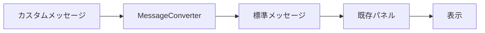

# MessageConverter 詳細ガイド

MessageConverterは、Lichtblick拡張機能システムの重要な機能の一つで、データ形式を変換して既存パネルで表示可能にする仕組みです。

## 📖 目次

- [概要](#概要)
- [基本的な仕組み](#基本的な仕組み)
- [実装方法](#実装方法)
- [実用例](#実用例)
- [制限事項](#制限事項)
- [トラブルシューティング](#トラブルシューティング)

## 🎯 概要

### MessageConverterとは

MessageConverterは、カスタムメッセージ形式を標準的なROS/Lichtblickメッセージ形式に変換する機能です。これにより、既存のパネル（Plot、3D、Imageなど）でカスタムデータを表示できるようになります。

### 利用シナリオ

1. **既存パネルの間接的拡張**

   - カスタムデータを既存パネルで表示
   - 既存パネルのコードを変更せずに機能追加

2. **データ形式の統一**

   - 異なるソースからのデータを統一形式に変換
   - レガシーシステムとの互換性確保

3. **プリセット機能の実現**
   - 設定情報から実際のデータを生成
   - テンプレートベースのデータ作成

## 🔧 基本的な仕組み

### データフロー



### アーキテクチャ

```
┌─────────────────────────────────────────┐
│ データソース                            │
│ ├─ ROSトピック                          │
│ ├─ WebSocket                            │
│ └─ その他のソース                       │
└─────────────────────────────────────────┘
                 ↓
┌─────────────────────────────────────────┐
│ MessagePipeline                         │
│ ├─ メッセージ受信                       │
│ ├─ スキーマ検証                         │
│ └─ Converter実行                        │
└─────────────────────────────────────────┘
                 ↓
┌─────────────────────────────────────────┐
│ MessageConverter (拡張機能)             │
│ ├─ 入力スキーマ検証                     │
│ ├─ データ変換処理                       │
│ └─ 出力スキーマ生成                     │
└─────────────────────────────────────────┘
                 ↓
┌─────────────────────────────────────────┐
│ 既存パネル                              │
│ ├─ Plot Panel                           │
│ ├─ 3D Panel                             │
│ ├─ Image Panel                          │
│ └─ その他                               │
└─────────────────────────────────────────┘
```

## 💻 実装方法

### 1. 基本的な実装

```typescript
// src/index.ts
import { ExtensionContext } from "@lichtblick/suite";

export function activate(extensionContext: ExtensionContext): void {
  extensionContext.registerMessageConverter({
    fromSchemaName: "custom_msgs/SensorData",
    toSchemaName: "sensor_msgs/Temperature",
    converter: convertSensorData,
  });
}

// 変換関数
async function convertSensorData(input: CustomSensorData): Promise<TemperatureMessage> {
  return {
    header: {
      stamp: input.timestamp,
      frame_id: input.sensor_id,
    },
    temperature: input.temp_celsius,
    variance: input.temp_variance || 0,
  };
}

// 型定義
interface CustomSensorData {
  timestamp: { sec: number; nanosec: number };
  sensor_id: string;
  temp_celsius: number;
  temp_variance?: number;
}

interface TemperatureMessage {
  header: {
    stamp: { sec: number; nanosec: number };
    frame_id: string;
  };
  temperature: number;
  variance: number;
}
```

### 2. 複雑な変換処理

```typescript
// 複数の入力を統合する例
import { ExtensionContext, RegisterMessageConverterArgs } from "@lichtblick/suite";

interface RobotConfig {
  robot_id: string;
  model_type: "industrial" | "mobile" | "humanoid";
  position: { x: number; y: number; z: number };
  orientation: { x: number; y: number; z: number; w: number };
}

interface UrdfMessage {
  data: string; // URDF XML content
}

export function activate(extensionContext: ExtensionContext): void {
  const converter = new RobotConfigConverter();

  extensionContext.registerMessageConverter(converter.getConverterConfig());
}

class RobotConfigConverter {
  private urdfCache = new Map<string, string>();
  private readonly cacheExpiration = 5 * 60 * 1000; // 5分

  getConverterConfig(): RegisterMessageConverterArgs<RobotConfig> {
    return {
      fromSchemaName: "custom_robot/RobotConfig",
      toSchemaName: "std_msgs/String",
      converter: this.convert.bind(this),
    };
  }

  async convert(config: RobotConfig): Promise<UrdfMessage> {
    try {
      // キャッシュチェック
      const cacheKey = `${config.robot_id}_${config.model_type}`;
      let urdfContent = this.urdfCache.get(cacheKey);

      if (!urdfContent) {
        // URDFコンテンツを生成または取得
        urdfContent = await this.generateUrdfContent(config);
        this.urdfCache.set(cacheKey, urdfContent);

        // キャッシュの自動削除
        setTimeout(() => {
          this.urdfCache.delete(cacheKey);
        }, this.cacheExpiration);
      }

      // 位置・姿勢情報を適用
      const processedUrdf = this.applyTransformation(urdfContent, config);

      return { data: processedUrdf };
    } catch (error) {
      console.error("URDF conversion failed:", error);
      // フォールバック: デフォルトロボットモデル
      return { data: this.getDefaultUrdf() };
    }
  }

  private async generateUrdfContent(config: RobotConfig): Promise<string> {
    // プリセットモデルから選択
    const modelTemplates = {
      industrial: "path/to/industrial_robot.urdf",
      mobile: "path/to/mobile_robot.urdf",
      humanoid: "path/to/humanoid_robot.urdf",
    };

    const templatePath = modelTemplates[config.model_type];

    // 実際の実装では、HTTPリクエストやアセット読み込み
    const response = await fetch(templatePath);
    return await response.text();
  }

  private applyTransformation(urdf: string, config: RobotConfig): string {
    // URDF XMLにフレームID変換を適用
    const frameId = `${config.robot_id}_base_link`;
    return urdf.replace(/base_link/g, frameId);
  }

  private getDefaultUrdf(): string {
    return `<?xml version="1.0"?>
      <robot name="default_robot">
        <link name="base_link">
          <visual>
            <geometry>
              <box size="1 1 1"/>
            </geometry>
          </visual>
        </link>
      </robot>`;
  }
}
```

### 3. 非同期処理とエラーハンドリング

```typescript
interface WeatherData {
  location: string;
  timestamp: number;
  conditions: string;
}

interface VisualizationMarker {
  header: { frame_id: string; stamp: { sec: number; nanosec: number } };
  text: string;
  position: { x: number; y: number; z: number };
  color: { r: number; g: number; b: number; a: number };
}

async function convertWeatherToMarker(weather: WeatherData): Promise<VisualizationMarker> {
  try {
    // 外部APIから詳細情報を取得（タイムアウト付き）
    const enrichedData = await Promise.race([
      enrichWeatherData(weather),
      new Promise((_, reject) => setTimeout(() => reject(new Error("Timeout")), 5000)),
    ]);

    return {
      header: {
        frame_id: "map",
        stamp: {
          sec: Math.floor(weather.timestamp / 1000),
          nanosec: (weather.timestamp % 1000) * 1000000,
        },
      },
      text: `${weather.location}: ${weather.conditions}`,
      position: await getLocationPosition(weather.location),
      color: getConditionColor(weather.conditions),
    };
  } catch (error) {
    console.warn("Weather enrichment failed, using basic data:", error);

    // フォールバック処理
    return {
      header: {
        frame_id: "map",
        stamp: {
          sec: Math.floor(weather.timestamp / 1000),
          nanosec: (weather.timestamp % 1000) * 1000000,
        },
      },
      text: `${weather.location}: ${weather.conditions}`,
      position: { x: 0, y: 0, z: 0 }, // デフォルト位置
      color: { r: 1, g: 1, b: 1, a: 1 }, // 白色
    };
  }
}

async function enrichWeatherData(weather: WeatherData): Promise<any> {
  // 外部API呼び出しの模擬実装
  const response = await fetch(`/api/weather/${weather.location}`);
  return await response.json();
}

async function getLocationPosition(location: string): Promise<{ x: number; y: number; z: number }> {
  // ジオコーディングAPIの呼び出し例
  // 実際の実装では適切なAPIを使用
  return { x: 0, y: 0, z: 0 };
}

function getConditionColor(conditions: string): { r: number; g: number; b: number; a: number } {
  const colorMap: Record<string, [number, number, number]> = {
    sunny: [1, 1, 0], // 黄色
    cloudy: [0.7, 0.7, 0.7], // 灰色
    rainy: [0, 0, 1], // 青色
    snowy: [1, 1, 1], // 白色
  };

  const [r, g, b] = colorMap[conditions.toLowerCase()] || [1, 0, 0]; // デフォルト赤色
  return { r, g, b, a: 1 };
}
```

## 🎯 実用例

### 1. URDF Preset Extension（既存の実装例）

```typescript
// カスタムロボット設定からURDFを生成
export function activate(extensionContext: ExtensionContext): void {
  const converter = new UrdfPresetConverter();
  extensionContext.registerMessageConverter(converter.getConverterConfig());
}

class UrdfPresetConverter {
  getConverterConfig(): RegisterMessageConverterArgs<RobotConfig> {
    return {
      fromSchemaName: "custom_robot/RobotConfig",
      toSchemaName: "std_msgs/String",
      converter: this.convert.bind(this),
    };
  }

  async convert(config: RobotConfig): Promise<{ data: string }> {
    // プリセットモデルの選択
    const modelType = this.determineModelType(config);

    // URDFコンテンツの読み込み
    const urdfContent = await this.loadModel(modelType);

    // フレームID変換の適用
    const processedUrdf = this.applyFrameTransformations(urdfContent, config.frame_id);

    return { data: processedUrdf };
  }
}
```

### 2. センサーデータの可視化

```typescript
// カスタムセンサーデータをPlotパネル用に変換
interface CustomSensorReading {
  sensor_id: string;
  readings: Array<{
    type: "temperature" | "humidity" | "pressure";
    value: number;
    unit: string;
  }>;
  timestamp: { sec: number; nanosec: number };
}

async function convertSensorToPlotData(sensor: CustomSensorReading): Promise<any> {
  // 複数の系列データに分割
  const plotData = sensor.readings.map((reading) => ({
    header: {
      stamp: sensor.timestamp,
      frame_id: sensor.sensor_id,
    },
    data: reading.value,
    label: `${reading.type} (${reading.unit})`,
  }));

  return {
    series: plotData,
    timestamp: sensor.timestamp,
  };
}
```

### 3. 画像データの変換

```typescript
// カスタム画像形式をsensor_msgs/Imageに変換
interface CustomImageData {
  format: "base64" | "url" | "raw";
  data: string | Uint8Array;
  width: number;
  height: number;
  encoding: string;
}

async function convertCustomImage(custom: CustomImageData): Promise<any> {
  let imageData: Uint8Array;

  switch (custom.format) {
    case "base64":
      imageData = new Uint8Array(
        atob(custom.data as string)
          .split("")
          .map((c) => c.charCodeAt(0)),
      );
      break;

    case "url":
      const response = await fetch(custom.data as string);
      const arrayBuffer = await response.arrayBuffer();
      imageData = new Uint8Array(arrayBuffer);
      break;

    case "raw":
      imageData = custom.data as Uint8Array;
      break;
  }

  return {
    header: {
      stamp: { sec: Math.floor(Date.now() / 1000), nanosec: 0 },
      frame_id: "camera",
    },
    height: custom.height,
    width: custom.width,
    encoding: custom.encoding,
    step: custom.width * getBytesPerPixel(custom.encoding),
    data: imageData,
  };
}

function getBytesPerPixel(encoding: string): number {
  const encodingMap: Record<string, number> = {
    rgb8: 3,
    rgba8: 4,
    bgr8: 3,
    bgra8: 4,
    mono8: 1,
    mono16: 2,
  };
  return encodingMap[encoding] || 1;
}
```

## ⚠️ 制限事項

### 技術的制限

#### 1. 同期処理の制限

```typescript
// ❌ 同期的なファイル読み込みは不可
function badConverter(input: any): any {
  const fs = require("fs"); // Node.js APIは使用不可
  return fs.readFileSync("./data.json"); // エラー
}

// ✅ 非同期処理を使用
async function goodConverter(input: any): Promise<any> {
  const response = await fetch("/api/data");
  return await response.json();
}
```

#### 2. リソースアクセスの制限

```typescript
// ❌ 直接的なファイルシステムアクセス不可
const localFile = "./assets/model.urdf"; // アクセス不可

// ✅ HTTPリクエストやassetsを使用
const modelUrl = "https://example.com/model.urdf";
const response = await fetch(modelUrl);
```

#### 3. パフォーマンス制限

```typescript
// ❌ 重い処理は避ける
async function heavyConverter(input: any): Promise<any> {
  // 巨大なデータの同期処理
  const result = processLargeDataset(input.data); // ブロッキング
  return result;
}

// ✅ 非同期・分割処理
async function optimizedConverter(input: any): Promise<any> {
  // ワーカーやチャンクに分割
  return await processInChunks(input.data);
}
```

### 設計的制限

#### 1. スキーマの互換性

- 出力スキーマは既存のパネルが理解できる形式である必要
- カスタムスキーマは他のパネルでは使用不可

#### 2. エラー伝播

- Converterでのエラーは元のメッセージ全体に影響
- フォールバック処理の実装が重要

#### 3. 順序保証

- メッセージの順序が変更される可能性
- タイムスタンプベースの処理が推奨

## 🔧 トラブルシューティング

### 1. 変換が実行されない

**症状**: MessageConverterが登録されているが、変換が実行されない

**確認点**:

```typescript
// 1. スキーマ名の確認
console.log("Registered converter:", {
  from: "custom_robot/RobotConfig", // 正確なスキーマ名か？
  to: "std_msgs/String",
});

// 2. メッセージの形式確認
context.onRender = (renderState, done) => {
  console.log("Available topics:", renderState.topics);
  console.log("Messages:", renderState.currentFrame);
  done();
};
```

**解決策**:

- スキーマ名の正確性を確認
- 入力メッセージが期待した形式かチェック
- 開発者コンソールでエラーログを確認

### 2. 変換エラー

**症状**: 変換処理中にエラーが発生

**デバッグ方法**:

```typescript
async function debugConverter(input: any): Promise<any> {
  try {
    console.log("Input message:", input);

    // バリデーション
    if (!input || typeof input !== "object") {
      throw new Error("Invalid input format");
    }

    const result = await processMessage(input);
    console.log("Conversion result:", result);

    return result;
  } catch (error) {
    console.error("Conversion error:", error);

    // フォールバック
    return getDefaultMessage();
  }
}
```

### 3. パフォーマンスの問題

**症状**: 変換処理が遅い、UIがブロックされる

**最適化手法**:

```typescript
class OptimizedConverter {
  private cache = new Map();
  private processingQueue = new Set();

  async convert(input: any): Promise<any> {
    const key = this.getCacheKey(input);

    // キャッシュチェック
    if (this.cache.has(key)) {
      return this.cache.get(key);
    }

    // 重複処理の防止
    if (this.processingQueue.has(key)) {
      await this.waitForProcessing(key);
      return this.cache.get(key);
    }

    // 処理実行
    this.processingQueue.add(key);
    try {
      const result = await this.processMessage(input);
      this.cache.set(key, result);
      return result;
    } finally {
      this.processingQueue.delete(key);
    }
  }
}
```

### 4. メモリリーク

**症状**: 長時間使用後にメモリ使用量が増加

**対策**:

```typescript
class MemoryEfficientConverter {
  private cache = new Map();
  private readonly maxCacheSize = 100;
  private readonly cacheExpiration = 5 * 60 * 1000; // 5分

  async convert(input: any): Promise<any> {
    // キャッシュサイズ制限
    if (this.cache.size >= this.maxCacheSize) {
      this.evictOldestEntries();
    }

    const key = this.getCacheKey(input);
    const cached = this.cache.get(key);

    if (cached && Date.now() - cached.timestamp < this.cacheExpiration) {
      return cached.data;
    }

    const result = await this.processMessage(input);
    this.cache.set(key, {
      data: result,
      timestamp: Date.now(),
    });

    return result;
  }

  private evictOldestEntries(): void {
    const entries = Array.from(this.cache.entries());
    entries.sort((a, b) => a[1].timestamp - b[1].timestamp);

    // 古いエントリの削除
    const toRemove = entries.slice(0, Math.floor(this.maxCacheSize / 2));
    toRemove.forEach(([key]) => this.cache.delete(key));
  }
}
```

## 🔗 関連リソース

- [拡張機能開発ガイド](./extension-development.md)
- [パネル拡張性について](./panel-extensibility.md)
- [@lichtblick/suite API Reference](https://github.com/Lichtblick-Suite/lichtblick/tree/main/packages/suite)
- [ROS Message Specifications](http://wiki.ros.org/msg)
- [Lichtblick Message Schemas](https://github.com/foxglove/schemas)
