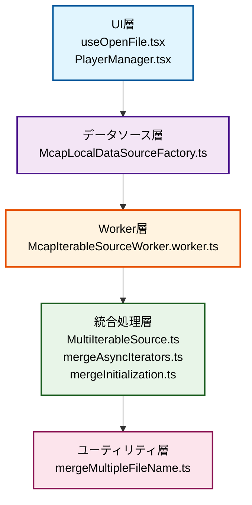

# 複数MCAPファイル再生機能 - 実装詳細ドキュメント

## 概要

LichtBlickでは複数のMCAPファイルを同時に読み込み、時系列順に統合して単一のデータソースとして再生する機能が実装されています。この機能により、分散して保存されたセンサーデータを効率的に可視化・分析できます。

## 対象となるファイル一覧

このドキュメントで詳細に解説している実装ファイルの一覧です。

### UI・フロントエンド層

- **`packages/suite-base/src/context/Workspace/useOpenFile.tsx`**

  - 役割: ファイル選択制御
  - 機能: 複数ファイル選択の制限・検証

- **`packages/suite-base/src/components/PlayerManager.tsx`**
  - 役割: プレイヤー管理
  - 機能: 複数ファイル対応の判定・初期化

### データソース・ファクトリー層

- **`packages/suite-base/src/dataSources/McapLocalDataSourceFactory.ts`**
  - 役割: MCAPデータソース
  - 機能: 複数ファイルサポート宣言・プレイヤー初期化

### Worker・非同期処理層

- **`packages/suite-base/src/players/IterablePlayer/Mcap/McapIterableSourceWorker.worker.ts`**
  - 役割: Web Worker初期化
  - 機能: 複数ファイル・URL処理の分岐

### コア統合処理層

- **`packages/suite-base/src/players/IterablePlayer/shared/MultiIterableSource.ts`** ⭐

  - 役割: マルチソース統合
  - 機能: 複数ソースの統合・初期化データマージ

- **`packages/suite-base/src/players/IterablePlayer/shared/utils/mergeAsyncIterators.ts`** ⭐

  - 役割: 時系列マージ
  - 機能: ヒープソートによる効率的なメッセージ統合

- **`packages/suite-base/src/players/IterablePlayer/shared/utils/mergeInitialization.ts`** ⭐
  - 役割: メタデータ統合
  - 機能: 時刻範囲・トピック統計の統合

### ユーティリティ層

- **`packages/suite-base/src/util/mergeMultipleFileName.ts`**
  - 役割: ファイル名統合
  - 機能: 複数ファイル名の結合表示

### アーキテクチャ階層



## UI操作方法

### 複数MCAPファイルの選択手順

1. **ファイル選択ダイアログを開く**

   - メニューバーから「ファイルを開く」を選択
   - またはキーボードショートカット（Ctrl+O / Cmd+O）を使用

2. **複数MCAPファイルを選択**

   - ファイル選択ダイアログで複数の`.mcap`ファイルを選択
   - Ctrl/Cmd + クリックで複数選択
   - Shift + クリックで範囲選択

3. **自動統合と再生**
   - 選択されたファイルが自動的に時系列順に統合される
   - 統合されたデータが単一のタイムラインとして表示される
   - ファイル名は「file1.mcap, file2.mcap, file3.mcap」のように表示される

### 制限事項

- 現在、複数ファイル選択は**MCAPファイルのみ**サポート
- 他の形式（.bag、.foxeなど）では複数ファイル選択は無効

## 実装アーキテクチャ

### 全体フロー


## 詳細実装

### 1. UI層でのファイル選択制御

#### ファイル: `packages/suite-base/src/context/Workspace/useOpenFile.tsx`

**行159-164: 複数ファイル選択の制限**

```typescript
/**
 * Should be removed when implement the rest of extensions.
 */
if (extension !== ".mcap" && processedFiles.length > 1) {
  throwErrorAndSnackbar(`The application only support multiple files for MCAP extension.`);
}
```

**行166-171: データソース選択**

```typescript
// 選択されたファイルでデータソースを選択
selectSource(matchingSources[0]!.id, {
  type: "file",
  handles: filesHandle,
});
```

### 2. プレイヤー管理での複数ファイル処理

#### ファイル: `packages/suite-base/src/components/PlayerManager.tsx`

**行464-474: 複数ファイル対応の判定と初期化**

```typescript
// 複数ファイル対応の判定
const multiFile = foundSource.supportsMultiFile === true && fileList.length > 1;

const newPlayer = foundSource.initialize({
  file: multiFile ? undefined : file,
  files: multiFile ? fileList : undefined,
  metricsCollector,
});
```

**行491-512: FileSystemFileHandleの処理**

```typescript
// 全ハンドルからファイルを取得
const filesHandled = await Promise.all(handles.map(async (f) => await f.getFile()));

const newPlayer = foundSource.initialize({
  files: filesHandled,
  metricsCollector,
});

// FileSystemFileHandleは最近使用したファイルに追加
addRecent({
  type: "file",
  title: mergeMultipleFileNames(handles.map((h) => h.name)),
  sourceId: foundSource.id,
  handles,
});
```

### 3. MCAPデータソースファクトリー

#### ファイル: `packages/suite-base/src/dataSources/McapLocalDataSourceFactory.ts`

**行24: 複数ファイルサポートの宣言**

```typescript
public supportsMultiFile = true;
```

**行26-56: プレイヤー初期化処理**

```typescript
public initialize(args: DataSourceFactoryInitializeArgs): Player | undefined {
  const files = args.files ?? [];

  if (args.file) {
    files.push(args.file);
  }
  if (files.length === 0) {
    return;
  }

  const source = new WorkerSerializedIterableSource({
    initWorker: () => {
      return new Worker(
        new URL(
          "@lichtblick/suite-base/players/IterablePlayer/Mcap/McapIterableSourceWorker.worker",
          import.meta.url,
        ),
      );
    },
    initArgs: { files },
  });

  return new IterablePlayer({
    metricsCollector: args.metricsCollector,
    source,
    name: mergeMultipleFileNames(files.map((file) => file.name)),
    sourceId: this.id,
    readAheadDuration: { sec: 120, nsec: 0 },
  });
}
```

### 4. Web Worker での複数ソース初期化

#### ファイル: `packages/suite-base/src/players/IterablePlayer/Mcap/McapIterableSourceWorker.worker.ts`

**行22-28: 複数ファイル処理の分岐**

```typescript
} else if (args.files) {
  const source = new MultiIterableSource(
    { type: "files", files: args.files },
    McapIterableSource,
  );
  const wrapped = new WorkerSerializedIterableSourceWorker(source);
  return Comlink.proxy(wrapped);
```

**行33-36: 複数URL処理の分岐**

```typescript
} else if (args.urls) {
  const source = new MultiIterableSource({ type: "urls", urls: args.urls }, McapIterableSource);
  const wrapped = new WorkerSerializedIterableSourceWorker(source);
  return Comlink.proxy(wrapped);
```

### 5. マルチソース統合の核心実装

#### ファイル: `packages/suite-base/src/players/IterablePlayer/shared/MultiIterableSource.ts`

**行44-61: 複数ソースの読み込み**

```typescript
private async loadMultipleSources(): Promise<Initialization[]> {
  const { type } = this.dataSource;

  const sources: IIterableSource<Uint8Array>[] =
    type === "files"
      ? this.dataSource.files.map(
          (file) => new this.SourceConstructor({ type: "file", file } as P),
        )
      : this.dataSource.urls.map((url) => new this.SourceConstructor({ type: "url", url } as P));

  this.sourceImpl.push(...sources);

  const initializations: Initialization[] = await Promise.all(
    sources.map(async (source) => await source.initialize()),
  );

  return initializations;
}
```

**行63-71: 初期化の統合**

```typescript
public async initialize(): Promise<Initialization> {
  const initializations: Initialization[] = await this.loadMultipleSources();

  const resultInit: Initialization = this.mergeInitializations(initializations);

  this.sourceImpl.sort((a, b) => compare(a.getStart!()!, b.getStart!()!));

  return resultInit;
}
```

**行73-78: メッセージイテレーターの統合**

```typescript
public async *messageIterator(
  opt: MessageIteratorArgs,
): AsyncIterableIterator<Readonly<IteratorResult<Uint8Array>>> {
  const iterators = this.sourceImpl.map((source) => source.messageIterator(opt));
  yield* mergeAsyncIterators(iterators);
}
```

**行89-119: 初期化データの統合処理**

```typescript
private mergeInitializations(initializations: Initialization[]): Initialization {
  const resultInit: Initialization = {
    start: { sec: Number.MAX_SAFE_INTEGER, nsec: Number.MAX_SAFE_INTEGER },
    end: { sec: Number.MIN_SAFE_INTEGER, nsec: Number.MIN_SAFE_INTEGER },
    datatypes: new Map(),
    metadata: [],
    alerts: [],
    profile: "",
    publishersByTopic: new Map(),
    topics: [],
    topicStats: new Map(),
  };

  for (const init of initializations) {
    resultInit.start = setStartTime(resultInit.start, init.start);
    resultInit.end = setEndTime(resultInit.end, init.end);

    resultInit.profile = init.profile ?? resultInit.profile;
    resultInit.publishersByTopic = accumulateMap(
      resultInit.publishersByTopic,
      init.publishersByTopic,
    );
    resultInit.topicStats = mergeTopicStats(resultInit.topicStats, init.topicStats);
    resultInit.metadata = mergeMetadata(resultInit.metadata, init.metadata);
    resultInit.alerts.push(...init.alerts);
    validateAndAddNewDatatypes(resultInit, init);
    validateAndAddNewTopics(resultInit, init);
  }
  return resultInit;
}
```

### 6. 時系列メッセージマージアルゴリズム

#### ファイル: `packages/suite-base/src/players/IterablePlayer/shared/utils/mergeAsyncIterators.ts`

**行9-34: ヒープソートによる時系列マージ**

```typescript
export async function* mergeAsyncIterators<T extends IteratorResult>(
  iterators: AsyncIterableIterator<T>[],
): AsyncIterableIterator<T> {
  const heap = new Heap<{ value: T; iterator: AsyncIterableIterator<T> }>(
    (a, b) => getTime(a.value) - getTime(b.value),
  );

  await Promise.all(
    iterators.map(async (iterator) => {
      const result = await iterator.next();
      if (!(result.done ?? false)) {
        heap.push({ value: result.value, iterator });
      }
    }),
  );

  while (!heap.isEmpty()) {
    const node = heap.pop()!;
    yield node.value;

    const nextResult = await node.iterator.next();
    if (!(nextResult.done ?? false)) {
      heap.push({ value: nextResult.value, iterator: node.iterator });
    }
  }
}
```

**行36-44: 時刻取得関数**

```typescript
function getTime(event: IteratorResult): number {
  if (event.type === "message-event") {
    return toMillis(event.msgEvent.receiveTime);
  }
  if (event.type === "stamp") {
    return toMillis(event.stamp);
  }
  return Number.MAX_SAFE_INTEGER;
}
```

### 7. 初期化データマージユーティリティ

#### ファイル: `packages/suite-base/src/players/IterablePlayer/shared/utils/mergeInitialization.ts`

**行10-16: 時刻範囲の統合**

```typescript
export const setStartTime = (accumulated: Time, current: Time): Time => {
  return compare(current, accumulated) < 0 ? current : accumulated;
};

export const setEndTime = (accumulated: Time, current: Time): Time => {
  return compare(current, accumulated) > 0 ? current : accumulated;
};
```

**行29-57: トピック統計の統合**

```typescript
export const mergeTopicStats = (
  accumulated: InitTopicStatsMap,
  current: InitTopicStatsMap,
): InitTopicStatsMap => {
  for (const [topic, stats] of current) {
    if (!accumulated.has(topic)) {
      accumulated.set(topic, { numMessages: 0 });
    }
    const accStats = accumulated.get(topic)!;

    accStats.numMessages += stats.numMessages;
    // Keep the earliest firstMessageTime
    if (
      stats.firstMessageTime &&
      (!accStats.firstMessageTime || compare(stats.firstMessageTime, accStats.firstMessageTime) < 0)
    ) {
      accStats.firstMessageTime = stats.firstMessageTime;
    }

    // Keep the latest lastMessageTime
    if (
      stats.lastMessageTime &&
      (!accStats.lastMessageTime || compare(stats.lastMessageTime, accStats.lastMessageTime) > 0)
    ) {
      accStats.lastMessageTime = stats.lastMessageTime;
    }
  }
  return accumulated;
};
```

### 8. ファイル名統合ユーティリティ

#### ファイル: `packages/suite-base/src/util/mergeMultipleFileName.ts`

**行4-14: 複数ファイル名の結合**

```typescript
export const mergeMultipleFileNames = (names: string[]): string => {
  if (names.length === 0) {
    return "";
  }

  if (names.length === 1) {
    return names[0]!;
  }

  return names.join(", ");
};
```

## 技術的特徴

### 1. 効率的な時系列マージ

- **ヒープソート**を使用して複数のメッセージストリームを効率的に統合
- メッセージの`receiveTime`を基準に正確な時系列順序を保持

### 2. メタデータの包括的統合

- **開始時刻**: 全ファイル中の最も早い時刻
- **終了時刻**: 全ファイル中の最も遅い時刻
- **トピック**: 重複排除して統合
- **データタイプ**: 重複排除して統合
- **統計情報**: 累積計算

### 3. Web Worker活用

- メインUIスレッドをブロックしない非同期処理
- 大きなMCAPファイルでもパフォーマンスを維持

### 4. バックフィル対応

- 複数ファイルからのバックフィルメッセージを適切に統合
- パネルの初期表示で必要なデータを効率的に取得

## 使用例

### 自動運転データの分析

```
sensor_data.mcap    (カメラ、LiDAR、レーダーデータ)
ground_truth.mcap   (3Dオブジェクト、車線マーキング)
vehicle_state.mcap  (速度、加速度、GPS軌跡)
```

これらのファイルを同時選択することで、全てのデータが時系列で統合され、包括的な分析が可能になります。

## 今後の拡張予定

GitHubのdiscussion #280で言及されている将来の機能：

- WebSocket経由のリアルタイムストリーミングとの組み合わせ
- 時刻制御コマンドの外部ソフトウェアへの送信
- 他のファイル形式での複数ファイル対応

## 関連ファイル一覧

- **UI制御**: `packages/suite-base/src/context/Workspace/useOpenFile.tsx`
- **プレイヤー管理**: `packages/suite-base/src/components/PlayerManager.tsx`
- **データソース**: `packages/suite-base/src/dataSources/McapLocalDataSourceFactory.ts`
- **Worker**: `packages/suite-base/src/players/IterablePlayer/Mcap/McapIterableSourceWorker.worker.ts`
- **マルチソース**: `packages/suite-base/src/players/IterablePlayer/shared/MultiIterableSource.ts`
- **メッセージマージ**: `packages/suite-base/src/players/IterablePlayer/shared/utils/mergeAsyncIterators.ts`
- **初期化マージ**: `packages/suite-base/src/players/IterablePlayer/shared/utils/mergeInitialization.ts`
- **ユーティリティ**: `packages/suite-base/src/util/mergeMultipleFileName.ts`
