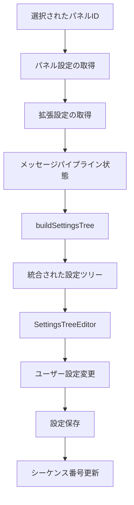

# PanelSettings Directory - パネル設定管理システム

## 📋 概要

`PanelSettings/`ディレクトリは、Lichtblickアプリケーションにおけるパネル設定の管理・表示を担当する中核システムです。選択されたパネルの設定を動的に構築し、設定の変更・共有・リセット機能を提供します。

## 🏗️ アーキテクチャ

```
PanelSettings/
├── index.tsx              # メインコンポーネント（249行）
├── types.ts               # 型定義（26行）
├── settingsTree.ts        # 設定ツリー構築ロジック（53行）
├── ActionMenu.tsx         # アクションメニュー（78行）
├── ActionMenu.style.ts    # スタイル定義（12行）
├── EmptyWrapper.tsx       # 空状態表示（33行）
└── README.md             # このファイル
```

## 🎯 主要機能

### 1. 動的設定ツリー構築

- パネル固有の設定と拡張機能設定を統合
- メッセージパイプラインとの連携によるトピック別設定
- リアルタイム設定反映

### 2. 設定管理機能

- JSON形式での設定インポート/エクスポート
- デフォルト値へのリセット機能
- 設定変更の即座反映

### 3. UI適応性

- 新旧TopNavUIの切り替え対応
- 単一/複数パネル選択の自動判別
- 空状態の適切な表示

## 📁 ファイル詳細

### 🔥 `index.tsx` - メインコンポーネント

**役割**: パネル設定管理の中核コンポーネント

**主要機能**:

- パネル選択状態の管理
- 設定ツリーの動的構築
- 設定の変更・共有・リセット
- 空状態の適切な表示

**重要な特徴**:

```typescript
// 単一パネルの自動選択
useEffect(() => {
  if (selectedPanelIds.length === 0 && singlePanelId != undefined) {
    selectAllPanels();
  }
}, [selectAllPanels, selectedPanelIds, singlePanelId]);

// 設定ツリーの動的構築
const settingsTree = useMemo(
  () =>
    buildSettingsTree({
      config,
      extensionSettings,
      messagePipelineState,
      panelType,
      selectedPanelId,
      settingsTrees: storedSettingsTrees,
    }),
  [
    config,
    extensionSettings,
    messagePipelineState,
    panelType,
    selectedPanelId,
    storedSettingsTrees,
  ],
);
```

### 🔧 `settingsTree.ts` - 設定ツリー構築

**役割**: パネル設定のツリー構造を動的に構築

**主要機能**:

- 基本設定と拡張設定の統合
- トピック固有設定の自動適用
- メッセージパイプラインとの連携

**コア実装**:

```typescript
export const buildSettingsTree = ({
  config,
  extensionSettings,
  messagePipelineState,
  panelType,
  selectedPanelId,
  settingsTrees,
}: BuildSettingsTreeProps): Immutable<SettingsTree> | undefined => {
  // メッセージパイプラインからトピック→スキーマ名のマッピングを取得
  const topicToSchemaNameMap = getTopicToSchemaNameMap(messagePipelineState());

  // 各トピックに対する設定ノードを構築
  const topicsSettings = topics.reduce<Record<string, SettingsTreeNode | undefined>>(
    (acc, topic) => {
      const schemaName = topicToSchemaNameMap[topic];
      if (schemaName != undefined) {
        acc[topic] = extensionSettings[panelType]?.[schemaName]?.settings(topicsConfig?.[topic]);
      }
      return acc;
    },
    {},
  );

  // 基本設定ツリーと拡張設定を統合
  return {
    ...set,
    nodes: {
      ...set.nodes,
      topics: {
        ...set.nodes.topics,
        children: _.merge({}, set.nodes.topics?.children, topicsSettings),
      },
    },
  };
};
```

### 🎛️ `ActionMenu.tsx` - アクションメニュー

**役割**: パネル設定のアクションメニュー

**主要機能**:

- 設定の共有（インポート/エクスポート）
- デフォルト値へのリセット
- アクセシビリティ対応

**使用例**:

```typescript
<ActionMenu
  allowShare={panelType !== TAB_PANEL_TYPE}
  onReset={resetToDefaults}
  onShare={() => setShowShareModal(true)}
  fontSize="small"
/>
```

### 🏮 `EmptyWrapper.tsx` - 空状態表示

**役割**: パネル未選択時の空状態表示

**主要機能**:

- 新旧TopNavUIの切り替え対応
- 適切な空状態メッセージの表示
- 一貫したUI体験の提供

**実装パターン**:

```typescript
export const EmptyWrapper = ({ children, enableNewTopNav }: EmptyWrapperProps) => {
  const { t } = useTranslation("panelSettings");

  // 新しいTopNavUIが有効な場合は、EmptyStateコンポーネントを使用
  if (enableNewTopNav) {
    return <EmptyState>{children}</EmptyState>;
  }

  // 従来のUIの場合は、SidebarContentコンポーネントを使用
  return (
    <SidebarContent title={t("panelSettings")}>
      <Typography variant="body2" color="text.secondary">
        {children}
      </Typography>
    </SidebarContent>
  );
};
```

### 🎨 `ActionMenu.style.ts` - スタイル定義

**役割**: ActionMenuコンポーネントのスタイル定義

**主要機能**:

- 小さなアイコンボタンの最適化
- 一貫したUI体験の提供
- 高密度UIレイアウトへの対応

### 📋 `types.ts` - 型定義

**役割**: PanelSettings関連の型定義

**定義される型**:

- `ExtensionSettings`: 拡張機能設定管理
- `BuildSettingsTreeProps`: 設定ツリー構築プロパティ
- `ActionMenuProps`: アクションメニュープロパティ

## 🔄 データフロー



## 🚀 使用方法

### 基本的な使用

```typescript
import PanelSettings from "@lichtblick/suite-base/components/PanelSettings";

function MyApp() {
  return (
    <PanelSettings
      disableToolbar={false}
    />
  );
}
```

### テスト用の使用

```typescript
import PanelSettings from "@lichtblick/suite-base/components/PanelSettings";

function TestComponent() {
  return (
    <PanelSettings
      disableToolbar={true}
      selectedPanelIdsForTests={["test-panel-1"]}
    />
  );
}
```

## 🎯 パフォーマンス最適化

### 1. メモ化の活用

```typescript
// 設定ツリーの構築をメモ化
const settingsTree = useMemo(() => buildSettingsTree({...}), [dependencies]);

// 共有モーダルをメモ化
const shareModal = useMemo(() => <ShareJsonModal {...} />, [dependencies]);
```

### 2. コールバックの最適化

```typescript
// 設定リセット機能をメモ化
const resetToDefaults = useCallback(() => {
  if (selectedPanelId) {
    savePanelConfigs({
      configs: [{ id: selectedPanelId, config: {}, override: true }],
    });
    incrementSequenceNumber(selectedPanelId);
  }
}, [incrementSequenceNumber, savePanelConfigs, selectedPanelId]);
```

### 3. 状態管理の最適化

```typescript
// 設定ツリーの参照安定性を確保
const storedSettingsTrees = usePanelStateStore(({ settingsTrees }) => settingsTrees);
```

## 🔗 関連コンポーネント

### 依存関係

- `SettingsTreeEditor`: 設定ツリーの編集UI
- `ShareJsonModal`: 設定のJSON共有モーダル
- `SidebarContent`: サイドバーコンテンツ
- `EmptyState`: 空状態表示

### 使用するContext

- `CurrentLayoutContext`: レイアウト管理
- `PanelCatalogContext`: パネルカタログ
- `PanelStateContext`: パネル状態管理
- `MessagePipeline`: メッセージパイプライン

## 📊 統計情報

- **総ファイル数**: 6個
- **総行数**: 451行
- **平均ファイルサイズ**: 約75行
- **最大ファイル**: `index.tsx`（249行）
- **最小ファイル**: `ActionMenu.style.ts`（12行）

## 🛠️ 開発ガイドライン

### 1. 新機能追加時の注意点

- 設定ツリーの構築ロジックは`settingsTree.ts`に集約
- UI状態の管理は`index.tsx`で統一
- 型定義は`types.ts`で管理

### 2. パフォーマンス考慮事項

- `useMemo`と`useCallback`の適切な使用
- 不要な再レンダリングの回避
- 参照安定性の確保

### 3. テスト時の注意点

- `selectedPanelIdsForTests`プロパティの活用
- モックデータの適切な設定
- 非同期処理の考慮

## 🎨 UI/UXの特徴

### 1. レスポンシブデザイン

- 新旧TopNavUIの切り替え対応
- 異なる画面サイズへの適応
- 一貫したUI体験

### 2. アクセシビリティ

- 適切なARIA属性の設定
- キーボードナビゲーション対応
- スクリーンリーダー対応

### 3. 国際化対応

- `react-i18next`による多言語対応
- 設定項目の適切な翻訳
- 文化的な表示差異の考慮

---

**最終更新**: 2025-01-02
**作成者**: AI Assistant
**バージョン**: 1.0.0

> **注意**: このREADMEは、PanelSettingsディレクトリの理解を深めるための包括的なドキュメントです。実装の詳細については、各ファイルのJSDocコメントを参照してください。
