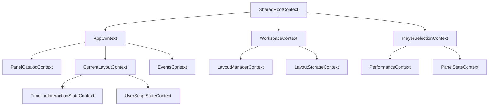

# Context Directory Overview

## 📋 概要

`context/`ディレクトリは、Lichtblick Suiteアプリケーション全体で使用されるReact Contextの定義を管理しています。これらのContextは、アプリケーションの状態管理、コンポーネント間の通信、およびグローバルな機能へのアクセスを提供します。

## 🏗️ アーキテクチャ概要

### Context階層構造

```
SharedRootContext (最上位)
├── AppContext (アプリケーション設定)
├── WorkspaceContext (ワークスペース状態)
├── CurrentLayoutContext (レイアウト管理)
├── PlayerSelectionContext (データソース選択)
├── PanelCatalogContext (パネル管理)
├── EventsContext (イベント管理)
└── その他の機能別Context
```

## 📁 ディレクトリ構造

### 📂 ルートレベルファイル (25個)

#### 🔥 コアContext (最重要)

| ファイル                    | 役割                             | 重要度     |
| --------------------------- | -------------------------------- | ---------- |
| `SharedRootContext.ts`      | 最上位のルートコンテキスト       | ⭐⭐⭐⭐⭐ |
| `AppContext.ts`             | アプリケーション全体の設定と機能 | ⭐⭐⭐⭐⭐ |
| `PlayerSelectionContext.ts` | データソース選択とプレイヤー管理 | ⭐⭐⭐⭐⭐ |
| `PanelCatalogContext.ts`    | パネル一覧とパネル管理           | ⭐⭐⭐⭐   |

#### ⚡ 状態管理Context

| ファイル                     | 役割                       | 重要度   |
| ---------------------------- | -------------------------- | -------- |
| `EventsContext.ts`           | イベント管理とタイムライン | ⭐⭐⭐⭐ |
| `PanelStateContext.ts`       | パネル状態管理             | ⭐⭐⭐   |
| `PerformanceContext.ts`      | パフォーマンス監視         | ⭐⭐⭐   |
| `UserScriptStateContext.tsx` | ユーザースクリプト状態     | ⭐⭐⭐   |

#### 🚀 UI・レイアウト Context

| ファイル                              | 役割                   | 重要度 |
| ------------------------------------- | ---------------------- | ------ |
| `LayoutManagerContext.ts`             | レイアウト管理         | ⭐⭐⭐ |
| `LayoutStorageContext.ts`             | レイアウト保存         | ⭐⭐⭐ |
| `RemoteLayoutStorageContext.ts`       | リモートレイアウト保存 | ⭐⭐   |
| `TimelineInteractionStateContext.tsx` | タイムライン操作状態   | ⭐⭐⭐ |

#### 📦 設定・拡張Context

| ファイル                         | 役割                       | 重要度 |
| -------------------------------- | -------------------------- | ------ |
| `AppConfigurationContext.ts`     | アプリケーション設定       | ⭐⭐⭐ |
| `AppParametersContext.ts`        | アプリケーションパラメータ | ⭐⭐   |
| `ExtensionCatalogContext.ts`     | 拡張機能カタログ           | ⭐⭐⭐ |
| `ExtensionMarketplaceContext.ts` | 拡張機能マーケットプレイス | ⭐⭐   |

#### 🔧 システム・プラットフォームContext

| ファイル                  | 役割                     | 重要度 |
| ------------------------- | ------------------------ | ------ |
| `NativeAppMenuContext.ts` | ネイティブアプリメニュー | ⭐⭐   |
| `NativeWindowContext.ts`  | ネイティブウィンドウ制御 | ⭐⭐   |
| `LinkHandlerContext.ts`   | リンクハンドリング       | ⭐     |

#### 👤 ユーザー管理Context

| ファイル                       | 役割                     | 重要度 |
| ------------------------------ | ------------------------ | ------ |
| `CurrentUserContext.ts`        | 現在のユーザー情報       | ⭐⭐⭐ |
| `BaseUserContext.ts`           | ベースユーザー情報       | ⭐⭐   |
| `UserProfileStorageContext.ts` | ユーザープロファイル保存 | ⭐⭐   |

#### 🧪 その他Context

| ファイル                       | 役割           | 重要度 |
| ------------------------------ | -------------- | ------ |
| `AnalyticsContext.ts`          | アナリティクス | ⭐⭐   |
| `AlertsContext.ts`             | アラート管理   | ⭐⭐   |
| `StudioLogsSettingsContext.ts` | ログ設定       | ⭐⭐   |

### 📂 サブディレクトリ

#### `CurrentLayoutContext/` (3ファイル)

- `index.ts` - メインのレイアウトコンテキスト実装
- `actions.ts` - レイアウト操作のアクション定義
- `useCurrentLayoutSelector.test.tsx` - テストファイル

#### `Workspace/` (6ファイル)

- `WorkspaceContext.ts` - ワークスペース状態管理
- `useWorkspaceActions.ts` - ワークスペース操作
- `useOpenFile.tsx` - ファイルオープン機能
- `migrations.ts` - データ移行処理
- `constants.ts` - 定数定義
- `useOpenFile.test.tsx` - テストファイル

## 🔄 Context間の依存関係

### 依存関係図



## 🎯 主要Contextの詳細

### 1. SharedRootContext

**役割**: アプリケーション全体の最上位コンテキスト

- データソースファクトリー管理
- 拡張機能ローダー
- ネイティブアプリ機能の統合
- プラットフォーム固有の機能提供

### 2. AppContext

**役割**: アプリケーション機能の統合ポイント

- カスタムコンポーネント注入
- 機能フラグ管理
- プレイヤーラッパー機能
- アプリバー・サイドバーのカスタマイズ

### 3. PlayerSelectionContext

**役割**: データソース選択とプレイヤー管理

- データソースファクトリーの管理
- 最近使用したソースの追跡
- ファイル・コネクション選択の抽象化

### 4. CurrentLayoutContext

**役割**: レイアウト状態の管理

- パネル配置の管理
- レイアウトの保存・読み込み
- パネル間の状態共有
- ドラッグ&ドロップ操作

### 5. WorkspaceContext (Zustand Store)

**役割**: ワークスペース状態管理

- サイドバーの開閉状態
- ダイアログの状態管理
- 再生コントロール設定
- 機能ツアー管理

### 6. EventsContext (Zustand Store)

**役割**: イベント管理

- タイムライン上のイベント表示
- イベントフィルタリング
- イベント選択状態
- デバイス管理

## 🛠️ 使用方法

### 基本的な使用パターン

```typescript
// Context値の取得
import { useAppContext } from "@lichtblick/suite-base/context/AppContext";

function MyComponent() {
  const appContext = useAppContext();
  // appContextを使用...
}
```

### Zustand Storeの使用

```typescript
// Workspace Store
import { useWorkspaceStore } from "@lichtblick/suite-base/context/Workspace/WorkspaceContext";

function MyComponent() {
  const leftSidebarOpen = useWorkspaceStore((state) => state.sidebars.left.open);
  // 状態を使用...
}
```

### Selector付きContext

```typescript
// Layout Selector
import { useCurrentLayoutSelector } from "@lichtblick/suite-base/context/CurrentLayoutContext";

function MyComponent() {
  const panelIds = useCurrentLayoutSelector((state) =>
    state.selectedLayout?.data?.layout ? getLeaves(state.selectedLayout.data.layout) : [],
  );
}
```

## 🔍 設計パターン

### 1. Context + Hook パターン

```typescript
const MyContext = createContext<MyContextType | undefined>(undefined);

export function useMyContext(): MyContextType {
  const context = useContext(MyContext);
  if (!context) {
    throw new Error("useMyContext must be used within MyContextProvider");
  }
  return context;
}
```

### 2. Zustand Store パターン

```typescript
export const MyContext = createContext<StoreApi<MyStore> | undefined>(undefined);

export function useMyStore<T>(selector: (store: MyStore) => T): T {
  const context = useGuaranteedContext(MyContext);
  return useStore(context, selector);
}
```

### 3. Factory パターン

```typescript
export interface IMyFactory {
  id: string;
  create: () => MyType;
}

export interface IMyContext {
  factories: readonly IMyFactory[];
  selectFactory: (id: string) => void;
}
```

## 🎨 ベストプラクティス

### ✅ 推奨事項

1. **型安全性**: すべてのContextで厳密な型定義を使用
2. **エラーハンドリング**: useGuaranteedContextでundefinedチェック
3. **パフォーマンス**: selectorを使用して不要な再レンダリングを防止
4. **分離**: 責任に応じてContextを分割
5. **テスト**: 重要なContextにはテストを追加

### ❌ 避けるべき事項

1. **巨大なContext**: 一つのContextに多すぎる責任を持たせない
2. **深いネスト**: Context Providerの深いネストを避ける
3. **頻繁な更新**: 高頻度で更新されるデータをContextに入れない
4. **直接的な依存**: Context間の直接的な依存関係を避ける

## 📊 メトリクス

- **総Context数**: 25個
- **サブディレクトリ**: 2個
- **Zustand Store**: 2個 (WorkspaceContext, EventsContext)
- **テストファイル**: 2個
- **平均ファイルサイズ**: 約1.8KB

## 🔗 関連ドキュメント

- [ARCHITECTURE_GUIDE.md](../ARCHITECTURE_GUIDE.md) - アーキテクチャ全体の解説
- [DIRECTORY_INVESTIGATION_PLAN.md](../DIRECTORY_INVESTIGATION_PLAN.md) - 調査計画書
- [providers/README.md](../providers/README.md) - Provider実装の詳細

## 🚀 次のステップ

1. **providers/ディレクトリ**: Context実装の詳細を調査
2. **types/ディレクトリ**: 型定義の詳細を理解
3. **hooks/ディレクトリ**: カスタムフックとの連携を調査

---

**更新日**: 2024-01-XX
**調査者**: Phase 1 - Context Architecture Investigation
**ステータス**: ✅ 完了
